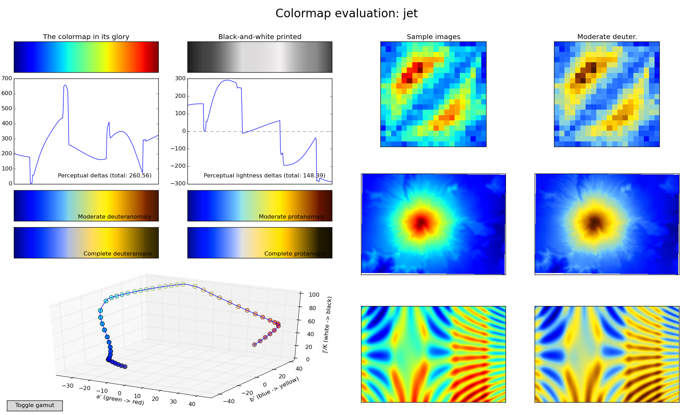
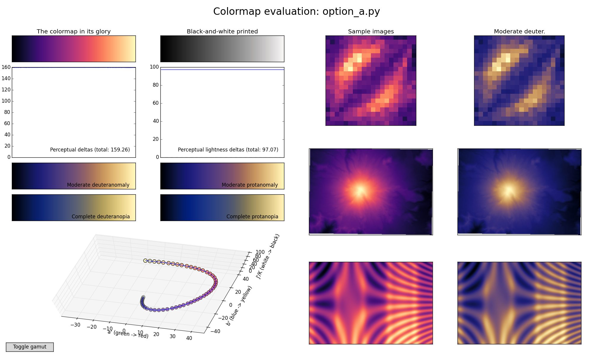
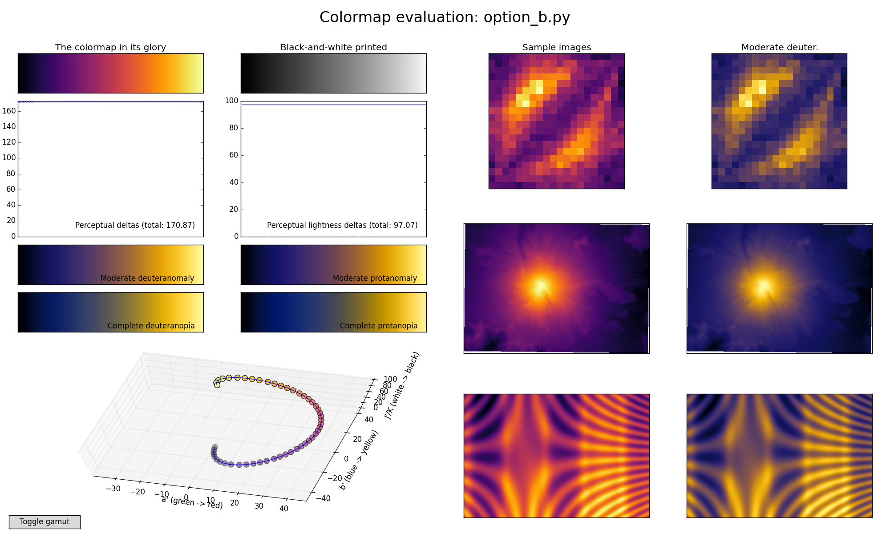
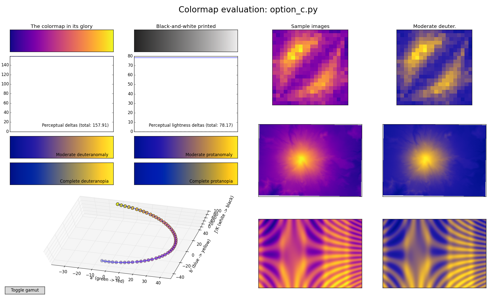
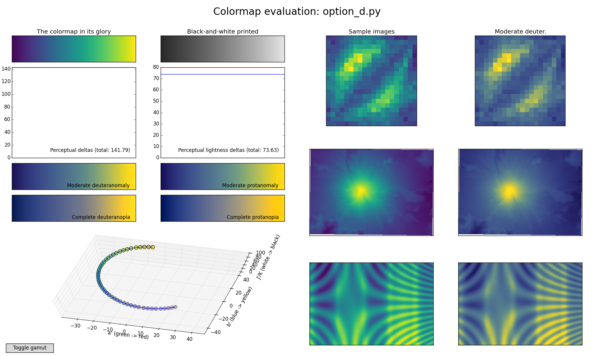

+++
author = "Yuichi Yazaki"
title = "How Matplotlib Moved from jet to Viridis"
slug = "matplotlib-colorscheme"
date = "2025-11-11"
categories = [
    "consume"
]
tags = [
    "Python,色",
]
image = "images/option_d.png"
+++

For many years, Matplotlib's default colormap was `jet`. Its perceptual unevenness and poor support for color-vision diversity were increasingly criticized, and the Matplotlib community eventually introduced a new set of perceptually uniform colormaps centered on Viridis. This article traces that change through primary sources and related discussions.

<!--more-->

## The MATLAB Legacy of jet

Matplotlib was originally designed to feel familiar to researchers and engineers moving from MATLAB to Python. MATLAB had long used rainbow-like colormaps, especially `jet`, and Matplotlib followed that convention.

The problem is that rainbow colormaps have serious perceptual weaknesses. Their brightness changes are not uniform, so flat data can appear to contain false edges. Yellow and green regions can attract attention even when they do not correspond to meaningful extremes. They also degrade poorly in grayscale and for many color-vision-diverse readers.

Visualization researchers had criticized these problems for years. Matplotlib's own documentation now notes that rainbow colormaps are generally poor choices for quantitative scalar data.

## The Turning Point: Issue #875

In 2012, the Matplotlib GitHub issue "Replace 'jet' as the default colormap" made the problem explicit. The discussion argued that rainbow colormaps can confuse viewers, obscure data through uncontrolled luminance variation, and introduce gradients that are not present in the data.

This issue gave the community a concrete design question: if `jet` should no longer be the default, what should replace it?

## Designing the New Colormaps

In 2015, Nathaniel J. Smith and Stéfan van der Walt designed four candidate colormaps: Magma, Inferno, Plasma, and Viridis.

The candidates were designed around several principles: perceptual uniformity, monotonically increasing luminance, readability in grayscale, and better behavior for color-vision diversity. "Option D" became Viridis and was selected as the new default for Matplotlib 2.0.

## Why Viridis Works Better

Viridis is a sequential colormap with a controlled progression of lightness. This means equal steps in data are more likely to look like equal perceptual steps. It remains interpretable in grayscale and avoids the false boundaries that rainbow maps often create.

The change was not merely aesthetic. It was a shift from tradition-driven defaults to perception-driven design.

## Design Lessons

- Default choices matter because many users never change them.
- Sequential quantitative data should use perceptually ordered colormaps.
- Luminance is as important as hue.
- Accessibility should be part of the default, not an optional refinement.
- Scientific visualization should avoid color schemes that create non-data artifacts.

## Summary

Matplotlib's move from `jet` to Viridis is one of the clearest examples of visualization practice absorbing findings from perception research. The new default made ordinary plots more accurate, accessible, and less misleading without requiring users to become color experts.
