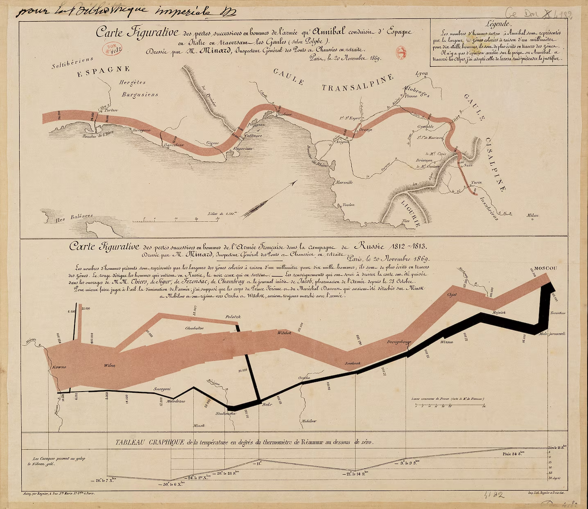

+++
author = "Yuichi Yazaki"
title = "Minard's Map of Napoleon's March to Moscow"
slug = "minard-napoleon-march-to-moscow"
date = "2025-10-06"
description = ""
categories = [
    "consume"
]
tags = [
    "複数チャートの組み合わせ"
]
image = "images/cover.png"
+++

In 1869, the French engineer and visualization pioneer **Charles Joseph Minard** published *Carte Figurative des pertes successives en hommes de l'Armee Francaise dans la campagne de Russie 1812-1813*, a diagram of Napoleon's disastrous Russian campaign.

The work is widely regarded as one of the great achievements of information graphics. Edward R. Tufte famously praised it as a masterpiece of statistical design.

<!--more-->

## How to Read It

The diagram combines troop strength, movement route, temperature, time, and geography in one view.

1. **Tan band: advance**  
   The tan band shows the route of the French army as it advanced toward Moscow. The width of the band represents the number of soldiers, scaled by units of 10,000 men.

2. **Black band: retreat**  
   The black band shows the winter retreat. It becomes dramatically thinner as soldiers die from cold, hunger, battle, and exhaustion. The army began with roughly 422,000 men and returned with fewer than 10,000.

3. **Temperature chart**  
   The line graph below the map shows temperature during the retreat. The values are in the Reaumur scale, used in France at the time. One degree Reaumur equals 1.25 degrees Celsius.

4. **Place names and rivers**  
   Cities such as Smolensk and Moscow, along with rivers such as the Niemen, anchor the diagram in geographic space.

## Historical Context

In 1812, Napoleon's army invaded Russia with an enormous force. The campaign collapsed under the pressure of Russian scorched-earth tactics, long supply lines, extreme cold, hunger, and disease.

Minard's diagram compresses the tragedy into a single visual argument: as distance and time pass, the army disappears.

## Minard's Contribution

Minard produced many *cartes figuratives*, or diagrammatic maps, drawing on his background as a civil engineer. This Russian campaign map is particularly influential because it integrates:

- multivariate data
- geography and time
- quantitative precision
- emotional force

Its logic continues to influence modern data visualization, from editorial graphics to interactive tools built with Tableau, D3.js, and mapping libraries.

## Summary

Minard's map of Napoleon's Russian campaign is not merely a map. It is a visual narrative of loss, combining space, time, number, temperature, and historical catastrophe into one coherent design.

## References

- [Carte figurative of Napoleon's Russian campaign — Wikipedia](https://en.wikipedia.org/wiki/Charles_Joseph_Minard#Napoleon's_Russian_campaign)
- [Edward Tufte — Napoleon's March](https://www.edwardtufte.com/product/napoleons-march/)
