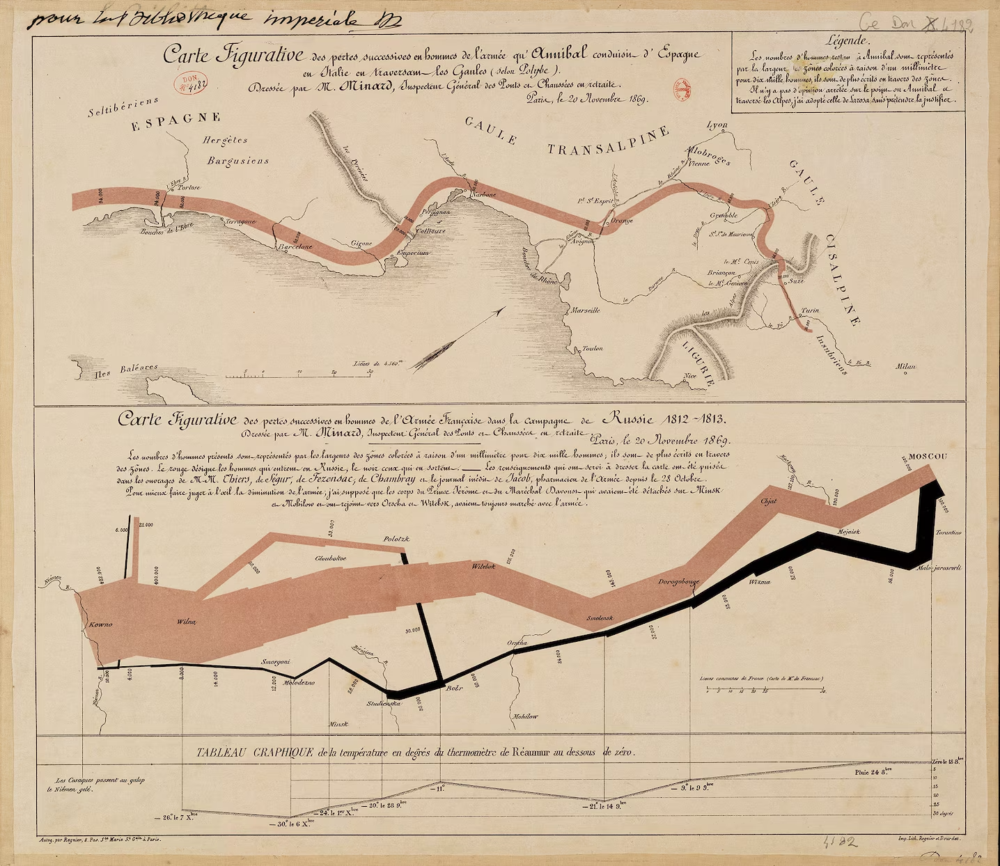

+++
author = "Yuichi Yazaki"
title = "ナポレオンのロシア遠征を描いたミナールの「損耗の地図」"
slug = "minard-napoleon-march-to-moscow"
date = "2025-10-06"
description = ""
categories = [
    "consume"
]
tags = [
    ""
]
image = "images/cover.png"
+++

フランスの技師であり情報可視化の先駆者、シャルル・ジョゼフ・ミナール（Charles Joseph Minard）は1869年、ナポレオン軍のロシア遠征をテーマにした図「Carte Figurative des pertes successives en hommes de l’Armée Française dans la campagne de Russie 1812–1813」を発表しました。

この図は **史上最も優れたインフォグラフィックスの一つ** とされ、エドワード・タフティ（Edward R. Tufte）によって「データ情報デザインの至宝」と評されています。

<!--more-->

## 図解の見方

この図は **軍の人数・移動経路・気温・地理的位置を同時に示す** 多変量データの可視化です。  
以下のように読み解くことができます。

1. **ベージュの帯（進軍）**  
   - フランス軍がロシアへ進軍するルートを示しています。  
   - 帯の幅は「兵士の人数」を表し、10,000人あたりのスケールで描かれています。
   - モスクワに近づくにつれて帯が細くなり、兵の損耗が視覚的に伝わります。

2. **黒の帯（退却）**  
   - 冬期の帰還ルートを示します。
   - 気温の低下や戦闘、飢餓、凍死によって、退却時の軍勢が壊滅的に減っていく様子が描かれています。
   - 出発時42万2,000人いた軍が、帰還時には1万人未満まで減少したことが分かります。

3. **下部の折れ線グラフ（気温の推移）**  
   - 横軸は退却経路における日付・経度、縦軸は温度（Réaumur温度計での零下温度）です。
   - 例えば「–30°C」（Réaumurで–22°）など、極寒がどれほど兵を苦しめたかを数値で表現しています。
   - 折れ線の位置は地図上の経路と連動しています。

4. **地名と川の線**  
   - 「Smolensk」「Moskau（Moscow）」など主要都市の位置を示し、実際の地理的な進軍経路との対応関係が理解できます。
   - 川（Niemenなど）は、軍の行軍の地理的境界を示す要素です。

※ 図中の温度（°Ré）は、18世紀フランスで用いられたレオミュール温度計による値です（1°Ré＝1.25°C）。

## 背景知識

1812年、ナポレオン率いるフランス軍はロシア遠征を開始し、当初は42万人もの兵を擁していました。  
しかし、ロシア軍の焦土戦略・補給線の断絶・冬季の厳寒などが重なり、帰還時には壊滅的な損害を受けました。

ミナールの図は、この遠征の **「人数の推移」「地理的距離」「時間経過」「気温変化」** を一枚の図で統合的に表現したものです。

彼はこれを「視覚で理解する統計の力」として設計し、文章よりも雄弁に史実を語る図として評価されています。

## ミナールの功績と影響

ミナールは鉄道技師として培った統計的・地理的知識をもとに、多数の「Cartes Figuratives（図解地図）」を制作しました。
特にこのロシア遠征図は、

- 多変量データをひとつの図に統合した先駆例  
- 情報量と明快さの両立  
- 美的デザインと数量的正確性の融合  

の点で、後世のデータビジュアライゼーションに多大な影響を与えています。

現代では、TableauやD3.js、Mapboxなどのツールを用いた可視化にも通じる設計思想として、多くのデータデザイナーが再解釈を試みています。

## まとめ

ミナールの「ナポレオンのロシア遠征図」は、単なる地図ではなく、**時間・空間・数量・温度・悲劇** が一体化した叙事詩的な情報デザインです。

視覚表現によって「データが語る歴史」を体現したこの作品は、現代のインフォグラフィックス教育においても不可欠な教材となっています。

## 参考・出典

- [Carte figurative des pertes successives en hommes de l’armée française dans la campagne de Russie 1812–1813 (Wikipedia)](https://en.wikipedia.org/wiki/Charles_Joseph_Minard#Napoleon's_Russian_campaign)
- [Edward Tufte – Napoleon’s March](https://www.edwardtufte.com/product/napoleons-march/)