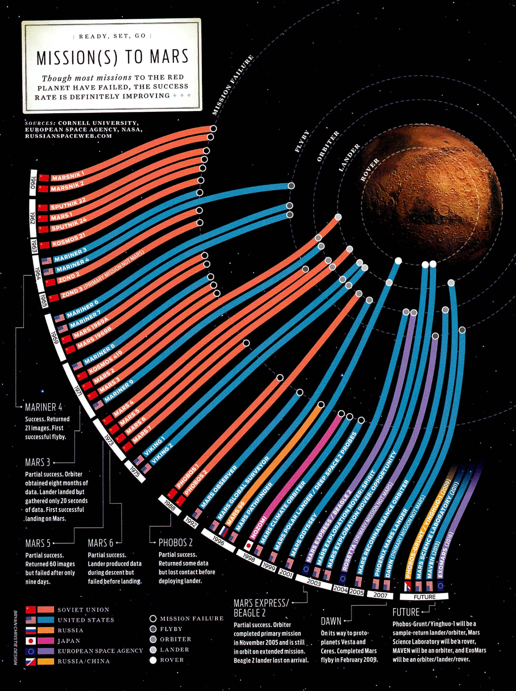

+++
author = "Yuichi Yazaki"
title = "Mission(s) to Mars: Visualizing Challenge and Progress in Mars Exploration"
slug = "mission-to-mars"
date = "2025-10-02"
categories = [
    "consume"
]
tags = [
    "オリジナルのビジュアル変換",
]
image = "images/cover.jpeg"
+++

Mars has long been one of humanity's closest and most compelling planetary targets. Since the 1960s, space agencies have launched many missions to Mars, but the history is marked by repeated failure as well as progress.

**Mission(s) to Mars**, by **Bryan Christie Design**, condenses that history into one infographic. Originally published in *IEEE Spectrum*, it redesigns a mission list into an intuitive visual story.

<!--more-->

## How to Read It

The graphic is organized around a central question: did each mission reach Mars?

- **Overall structure**: Mars sits at the center, while time runs from left to right.
- **Bars**: each band represents a mission's result and level of arrival. If it stops early, the mission failed. If it reaches Mars, it succeeded. If it landed or operated a rover, the band extends farther.
- **Color**: identifies country or agency, such as the Soviet Union, the United States, Japan, ESA, or Russia.
- **Symbols**: indicate mission type, including flyby, orbiter, lander, and rover.

The design layers time, nation, method, and outcome.

## Reading the History

- **1960s**: the Soviet Union and United States launched many attempts, most of them unsuccessful.
- **1965, Mariner 4**: the first successful Mars flyby, returning 21 images.
- **1971, Mars 3**: the first soft landing, though communication lasted only about 20 seconds.
- **1976, Viking 1 and 2**: stable landings and long-term exploration marked a turning point.
- **2000s onward**: NASA rovers and ESA missions expanded the scientific record.

## What the Graphic Communicates

The image is not just a timeline. It shows Mars exploration as an accumulation of attempts. Broken bands show failure; bands reaching the planet show hard-won progress.

## Summary

"Mission(s) to Mars" makes the history of planetary exploration legible through success, failure, agency, and mission type. It shows that today's Mars science rests on decades of partial attempts and technical learning.

## References

- [NASA: Mars Express mission overview](https://science.nasa.gov/mission/mars-express/)
- [ESA: Mars Express](https://www.esa.int/Science_Exploration/Space_Science/Mars_Express)
- [ESA / PDS: Mars Express data archive](https://pds-geosciences.wustl.edu/missions/mars_express/default.htm)
- [Wikipedia: Mars Express](https://en.wikipedia.org/wiki/Mars_Express)
