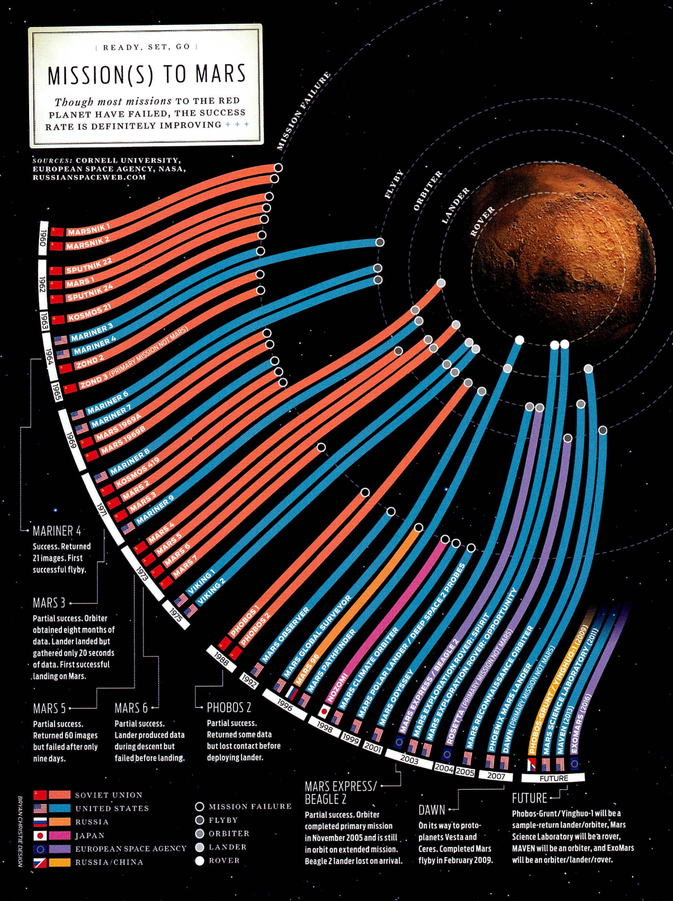

+++
author = "Yuichi Yazaki"
title = "火星探査の「挑戦」と「進歩」を描いたインフォグラフィックス"
slug = "mission-to-mars"
date = "2025-10-02"
categories = [
    "consume"
]
tags = [
    "オリジナルのビジュアル変換",
]
image = "images/cover.jpeg"
+++

人類にとって火星は、もっとも近い「他の惑星」として、長いあいだ夢と挑戦の対象であり続けてきました。1960年代から今日まで、各国の宇宙機関は数多くの火星探査ミッションを打ち上げてきましたが、その道のりは決して平坦ではありません。むしろ初期のころは、失敗の連続だったのです。

そんな挑戦の歴史を一枚の図に凝縮したのが、Bryan Christie Design によるインフォグラフィックス「Mission(s) to Mars」です。もともとはテクノロジー雑誌 IEEE Spectrum に掲載された作品で、従来は表やリストで示されることが多かった「ミッション一覧」を、直感的に理解できるようにデザインし直しています。

<!--more-->

## 図の読み解き方

この図の魅力は、情報が「火星に届くかどうか」という一点を中心に再構成されていることです。

- **全体構成** 中央には火星があり、左から右へ時間が流れます。1960年代から現代までのミッションが放射状に並び、時代の移り変わりを直感的にたどることができます。
- **バー（帯）の意味** ミッションの「結果」と「到達度合い」を表現しています。途中で終わっていれば失敗、火星に届けば成功。さらに、着陸やローバー運用まで進めば、バーは火星の表面にまで伸びています。
- **色分け（国別）** 赤はソビエト連邦、青はアメリカ、紫は日本、水色はESA、オレンジはロシアといった具合に、国や機関ごとの挑戦を区別しています。
- **記号（探査タイプ）**
    - ○ フライバイ
    - ◐ オービター
    - ◑ ランダー
    - ◎ ローバー

と記号が整理され、帯の終点を見ればどんな探査を目指したのかが分かります。

このように **「時間・国・方法・成果」** という4つの要素が一つのデザインの中で重ね合わせられています。

## 歴史の流れを図から読む

- **1960年代** ：ソ連とアメリカが競うように打ち上げるが、ほとんどが失敗。
- **1965年 Mariner 4（米）** ：初めて火星接近に成功、21枚の画像を送信。
- **1971年 Mars 3（ソ連）** ：世界初の着陸成功。しかし20秒で通信途絶。
- **1976年 Viking 1 & 2（米）** ：安定した着陸と長期探査に成功。火星探査の大きな転換点。
- **2000年代以降** ：NASAのローバー（Spirit, Opportunity）や欧州の Mars Express が次々成功。長期間データを収集し、科学成果を拡大。

図の読み方を踏まえて眺めると、当初は「失敗の連続」だった火星探査が、21世紀に入ると「成功の蓄積」へと変化していった様子が一目で分かります。

## この図が伝えること

「Mission(s) to Mars」は、単なる年表や数字の羅列ではなく、人類の挑戦の歴史をひと目で物語るビジュアルです。火星まで伸びる青や水色の帯は希望の軌跡であり、途中で途切れる赤い帯は試行錯誤の痕跡です。

そして、現在も未来の計画が描かれ続けているように、この物語はまだ終わっていません。失敗の積み重ねがあったからこそ、いま私たちは火星の表面をローバーで走り回り、未来の有人探査へとつながる知識を手にしているのです。

## 参考・出典

- [NASA: Mars Express mission overview](https://science.nasa.gov/mission/mars-express/)  
- [ESA: Mars Express (European Space Agency)](https://www.esa.int/Science_Exploration/Space_Science/Mars_Express)  
- [ESA / PDS: Mars Express data archive](https://pds-geosciences.wustl.edu/missions/mars_express/default.htm)  
- [Wikipedia: Mars Express](https://en.wikipedia.org/wiki/Mars_Express)  