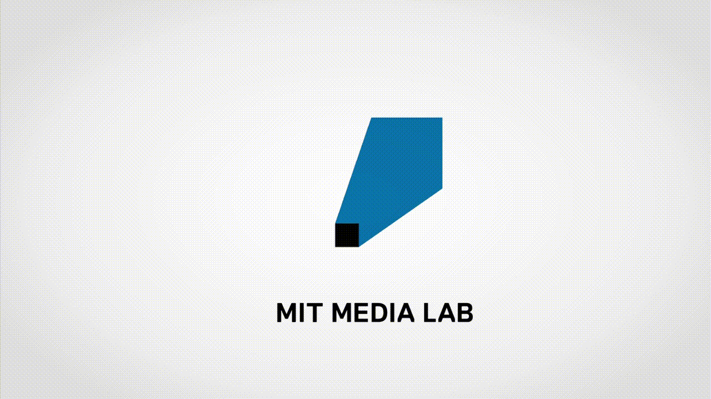
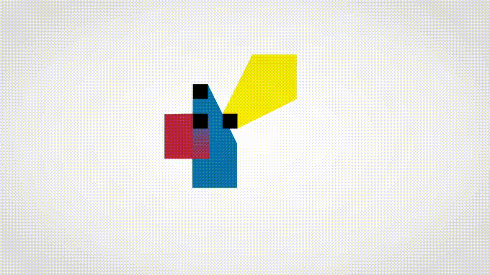
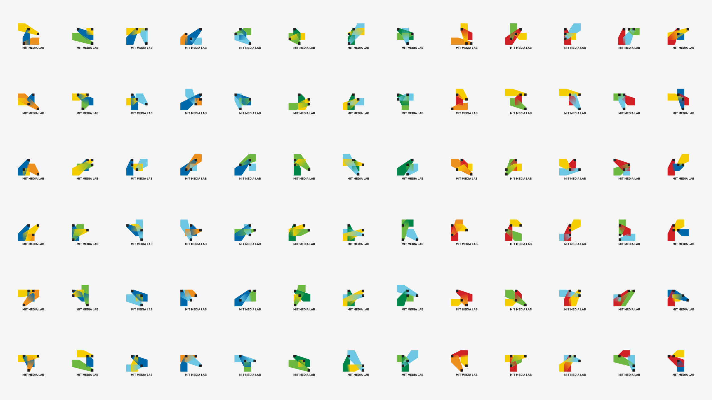
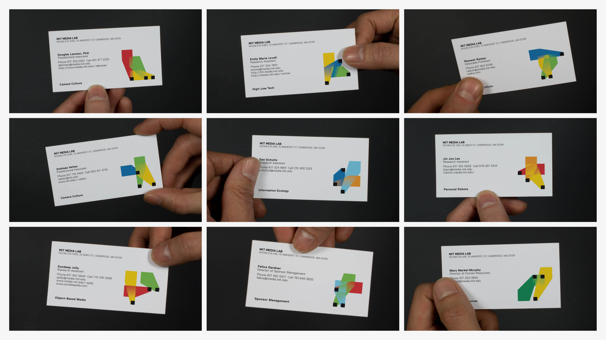
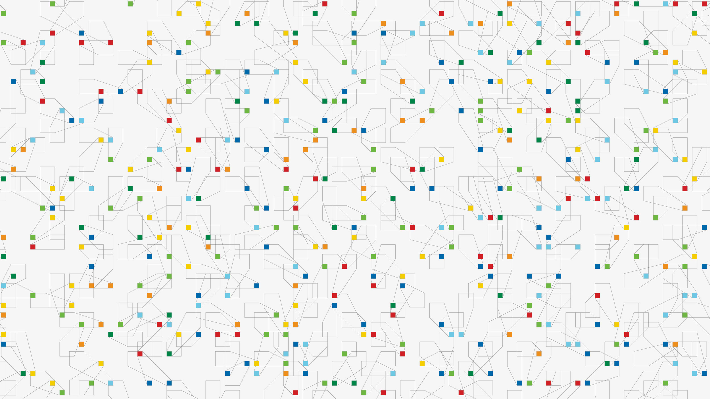

+++
author = "Yuichi Yazaki"
title = "MIT Media Lab 2011年ロゴ ― アルゴリズムでつくる「交差のデザイン」"
slug = "mit-media-lab-logo-2011"
date = "2025-09-24"
description = ""
categories = [
    "consume"
]
tags = [
    "",
]
image = "images/mit_logocolorvariations_logomain_014.jpg"
+++

2011年、MIT Media Lab は創立25周年を記念し、ロゴを刷新しました。これを手掛けたのは E. Roon Kang と Richard The、そしてデザインスタジオ TheGreenEyl。
従来は Jaqueline Casey が1984年にデザインしたアイデンティティ要素が使われていましたが、明確な「ロゴ」は存在しませんでした。そこで新たに導入されたのが、アルゴリズムによって生成されるロゴシステムです。

<!--more-->

## コンセプト ― 「交差」が形を生む

- 各ロゴは 3つのコーン状の形（cones）で構成されます。
- それぞれのコーンは、ラボに集まる 個人（エンジニア、科学者、アーティスト、デザイナーなど） を象徴しています。
- これらが交差することで新しい形が生まれる。まさに「異なるバックグラウンドを持つ人々が交わり、協働し、インスパイアし合う」Media Lab の特質を可視化しています。
- この交差部こそがロゴの象徴的なアウトプットであり、「成果」を表します。

## 生成ルール

CreativeApplications.Net の記事によると、ロゴ生成には Processing が用いられました（Processing 自体も MIT Media Lab で Casey Reas と Ben Fry によって開発された背景を持ちます）。

グリッド構造

- 4×4 のスクエアグリッドを基盤に配置されます。
- グリッドは可視化されませんが、学術的・物理的・知的な環境としての Media Lab を象徴しています。

コーン（3形）の挙動ルール

- 各コーンはグリッド内で移動可能。
- 一定の美的ルールセットが適用されます：
- 境界に到達しなければならない
- 他の形と交差しなければならない
- この制約により「非常に小さな形」「交わらない形」は排除され、必ず交差による複雑な形態が生まれます。

色の組み合わせ

- 12通りのカラーコンビネーションが用意されていました。
- 40,000種の形態 × 12色 ＝ 約48万通り のバリエーションが生成可能だったとされています。

技術的プロセス

- Processing アプリケーションでロゴを生成。
- SVG をエクスポートし、Illustrator のスクリプトで CMYK PDF に変換。

## 割り当て方式 ― 自動ではなく「選択」

重要なのは、このロゴが 社員番号やIDで自動割り当てされたわけではない という点です。

- Web インターフェースを通じて、各メンバーはあらかじめ生成された候補の中から自分のロゴを選ぶことができました。
- つまり、ランダムでも一方的な割当でもなく、本人が「自分のロゴ」を選び取るプロセスが重視されていました。
- この仕組みによって、多様性の中に自ら関与して形を持つという Media Lab らしい文化が表現されていたのです。

## グリッド構造に関する注釈

ロゴの設計に「グリッド」が使われたことは一致した情報ですが、そのマス数については出典によって食い違いがあります。

- CreativeApplications.Net（2011年の記事）...“4×4 のスクエアグリッド” と明記。
- Pentagram（2014年の後継ロゴ公式解説）...「前ロゴは 7×7 グリッドに基づいていた」と記述。
- 「25周年だから 5×5 では？」という説...一部の解説記事やブログで見られますが、公式な裏付けは確認できません。

## 2011年ロゴの意義

- 固定の一枚絵ではなく、システムとしてのロゴ。
- 3つのコーン＝3人の個人の貢献が交差して成果を生むという比喩。
- 4×4グリッド上のルールが共通基盤を与え、そこから数十万の多様な表現が立ち上がる。
- 個人ごとにユニークなロゴを持てることで、組織の多様性を強調。
- そして、本人が選ぶ行為そのものがアイデンティティの一部だったのです。

## 参考・出典

- [Richard The: MIT Media Lab Identity](https://richardthe.com/projects/medialab?utm_source=chatgpt.com)
- [E. Roon Kang: MIT Media Lab Identity](https://eroonkang.com/feature/mit-media-lab-identity?utm_source=chatgpt.com)
- [TheGreenEyl: MIT Media Lab](https://www.thegreeneyl.com/MIT-Media-Lab?utm_source=chatgpt.com)
- [Pentagram: MIT Media Lab Identity (2014, 後継プロジェクト解説)](https://www.pentagram.com/work/mit-media-lab?utm_source=chatgpt.com)
- [CreativeApplications.Net: MIT Media Lab Identity [Processing]](https://www.creativeapplications.net/project/mit-media-lab-identity-processing/)