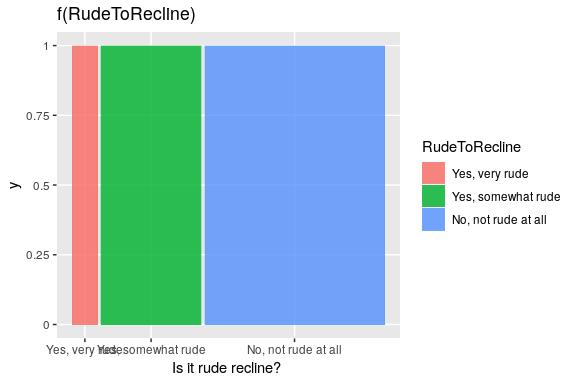

+++
author = "Yuichi Yazaki"
title = "モザイク・プロット（Mosaic Plot）の事例"
slug = "mosaic-plot-example"
date = "2020-08-03"
description = ""
categories = [
    "chart"
]
tags = [
    ""
]
image = "images/image-27.png"
+++

「モザイク・プロット」が利用されている事例を紹介します。

<!--more-->

## 作例

### 1904年ドイツ帝国統計局による農業統計図

この図は、1904年にドイツ帝国統計局（Kaiserliches Statistisches Amt）が刊行した『ドイツ帝国統計季報』に掲載されたもので、各州における 耕作面積・単位面積あたり収量・総収穫量 を同時に示した農業統計図です。対象となっているのは冬ライ麦・燕麦・夏大麦・冬小麦・ジャガイモといった主要作物で、それぞれ別の棒グラフとして描かれています。

- **横軸（棒の幅）** ：各州の耕作面積（ヘクタール単位）
- **縦軸（棒の高さ）** ：1ヘクタールあたりの収量（収穫効率）
- **長方形の面積** ：総収穫量（幅 × 高さ）

さらに、各州の値だけでなく、ドイツ全体の平均収量（実線） と 直前5年間（1899〜1903年）の平均収量（点線） も示されており、比較が容易になるよう工夫されています。色分けによって作物ごとに区別され、視覚的にも分かりやすく構成されています。

### タイタニック犠牲者と生存者の統計図（1912年、『The Sphere』誌）

1912年4月のタイタニック号沈没事故の直後、イギリスの挿絵週刊誌『The Sphere』は、犠牲者と生存者の内訳を示す統計図を誌面に掲載しました。この図は、事故の全体像を一般読者に直感的に理解させるための、初期の「統計的インフォグラフィック」として位置づけられます。

図の構成はきわめてシンプルです。黒は犠牲者、白は生存者を示し、区分は一等・二等・三等の各船室階級と乗組員に分けられています。さらに男性・女性・子どもごとに帯を分割することで、どの集団がどの程度救われたのかを一目で比較できるようになっています。

注目すべきは、帯の縦幅そのものが区分ごとの人数規模を表している点です。一等船客の帯は細く、三等船客の帯は太く描かれており、横方向の黒白の分割（生死の比率）と組み合わさって、各集団の絶対数と相対的な生存率を同時に可視化しています。これは現代の統計学でいう **モザイクプロット（Mosaic Plot）** と同じ構造を持っており、その先駆的な事例とみなすことができます。

この可視化によって浮かび上がるのは、明確な社会的格差です。一等船客の女性・子どもの生存率は非常に高かった一方で、三等船客や男性乗組員の犠牲率は圧倒的に高いものでした。「女性と子どもを優先する」という原則がどのように実際に適用されたかを、社会階級ごとに鋭く伝える図となっています。

現代的な可視化の観点からすれば、棒グラフのルール（幅を一定にする）から外れ、面積効果による視覚的強調を含むため必ずしも「正統」ではありません。しかし、歴史的背景を考えれば、これは当時の新聞・雑誌が持つ表現上の工夫であり、社会に衝撃を与えた大事故を伝える強い視覚的メッセージとなっていたといえるでしょう。

### タイタニック犠牲者（Rによる作例）

[Data Visualization with R](https://rkabacoff.github.io/datavis/Models.html)

### ggplot2による作例

[https://cran.r-project.org/web/packages/ggmosaic/vignettes/ggmosaic.html](https://cran.r-project.org/web/packages/ggmosaic/vignettes/ggmosaic.html)

### 識別テストへの回答結果

[(PDF) Effect of Product Involvement on Panels’ Vocabulary Generation, Attribute Identification, and Sample Configurations in Beer](https://www.researchgate.net/publication/336517849_Effect_of_Product_Involvement_on_Panels%27_Vocabulary_Generation_Attribute_Identification_and_Sample_Configurations_in_Beer/figures?lo=1)

### Hair and Eye Color of Statistics Students

[http://www.sthda.com/english/articles/32-r-graphics-essentials/129-visualizing-multivariate-categorical-data/](http://www.sthda.com/english/articles/32-r-graphics-essentials/129-visualizing-multivariate-categorical-data/)

