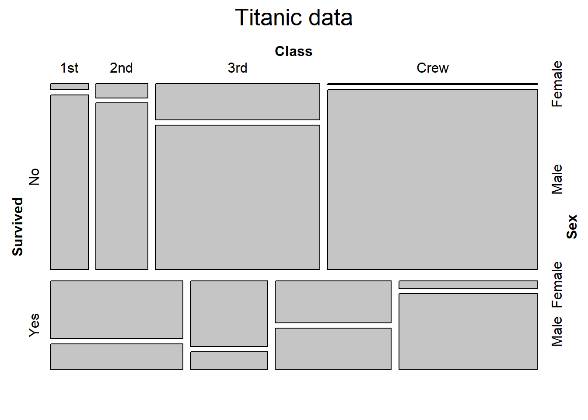

+++
author = "Yuichi Yazaki"
title = "モザイク・プロット（Mosaic Plot）"
slug = "mosaic-plot"
date = "2020-08-03"
description = ""
categories = [
    "chart"
]
tags = [
    "",
]
image = "images/image-27.png"
+++

二つ以上のカテゴリーデータ（質的変数）を可視化するチャートです。表示エリアの長方形を、再帰的に垂直・水平に分割によって作成されたタイルで構成されます。

<!--more-->

この一つひとつのタイルの高さと幅は、それぞれ別のカテゴリーデータの属性ごとの集計値を示しています。これによって、カテゴリーデータ間の関係を示すことが可能となります。タイルの色は、カテゴリーデータ間の関係の大きさを示すことも可能です。

ツリーマップとの違いとしては、モザイク・プロットは一階層のみのデータとなることと、縦横にカテゴリーデータの属性値を取ることがあげられます。

## 作例

### タイタニック号で事故に遭遇した人たち

[Data Visualization with R](https://rkabacoff.github.io/datavis/Models.html)

### ggplot2による作例

[https://cran.r-project.org/web/packages/ggmosaic/vignettes/ggmosaic.html](https://cran.r-project.org/web/packages/ggmosaic/vignettes/ggmosaic.html)

### 識別テストへの回答結果

[(PDF) Effect of Product Involvement on Panels’ Vocabulary Generation, Attribute Identification, and Sample Configurations in Beer](https://www.researchgate.net/publication/336517849_Effect_of_Product_Involvement_on_Panels%27_Vocabulary_Generation_Attribute_Identification_and_Sample_Configurations_in_Beer/figures?lo=1)

### Hair and Eye Color of Statistics Students

[http://www.sthda.com/english/articles/32-r-graphics-essentials/129-visualizing-multivariate-categorical-data/](http://www.sthda.com/english/articles/32-r-graphics-essentials/129-visualizing-multivariate-categorical-data/)

## 他の呼び名

モザイク・グラフ（Mosaic Graph）やマリメッコ・プロット（Marimekko Plot）と呼ばれることもあります。

## 参考文献

- [A Brief History of the Mosaic Display](https://www.researchgate.net/publication/2533471_A_Brief_History_of_the_Mosaic_Display)
- [User’s Guide for MOSAICS](http://datavis.ca/mosaics/mosaics.pdf)
