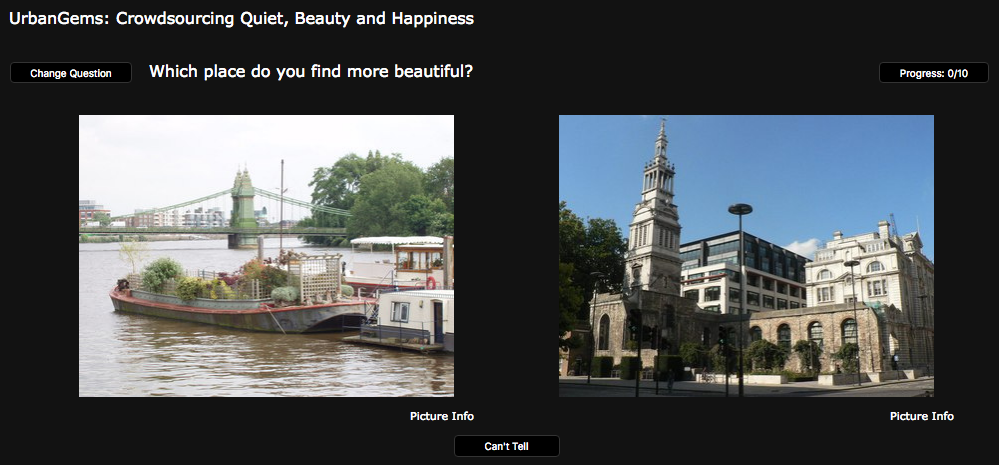
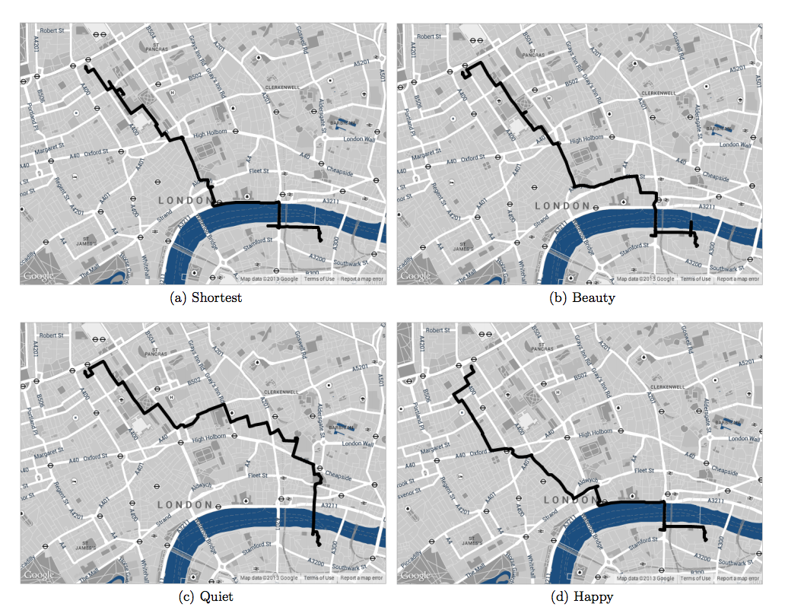

+++
author = "Yuichi Yazaki"
title = "「最も美しい」や「最も楽しい」道順を提案する研究"
slug = "most-beauty-route"
date = "2016-07-20"
categories = [
    "consume"
]
tags = [
    "研究",
]
image = "images/fi_MostBeautyRoute-1.png"
+++

「A地点からB地点まで」。いわゆるナビゲーションシステムによるルート案内を、感性に訴えるものにしようという提案をした研究者がいます。彼の話を聞いてみましょう。

彼のとった方法論としては、大きく２つ。

一つ目はロンドンで実施したといいますが、[クラウドソーシング](http://www.urbangems.org/)を利用して、Google Street Viewや[Geograph](http://www.geograph.org.uk/)から取得した位置情報を持っているAとBの２つの写真を同時に見せ、どちらがより「美しく、幸せ」にみえるかを人間に選んでもらい、その結果をナビゲーション結果表示に利用する、というものです。実際に美しいと感じるかどうかを住民30人に歩いてもらい検証したそうです。写真を撮った本人以外がタグ付け（評価）に参加できるところが面白いですね。

二つ目は500万枚あるFlickr上の写真と、ポジネガ判定したそのコメント文を利用し、同様のアルゴリズムを用いてボストン版を制作（つまりクラウドソーシングを使わずにFlickr上のテキストデータを用いた）したそうです。こちらでも数十人でテストして実証できたそうです。

美しさを尊重しても12%ほどしか時間が長くならなかったそうです。

これは、バルセロナにあったYahoo Labs（2016年2月にYahoo! Researchへの組織改編にともなって解散）に所属していたダニエレ・クエルチャ氏がLabsに入る前から進めていた研究を、Labsに入ってから三名で結実させ、論文として公表したものです。

[The Shortest Path to Happiness: Recommending Beautiful, Quiet, and Happy Routes in the City](https://arxiv.org/abs/1407.1031)

欧州においてバルセロナはICT分野で抜きん出た功績を挙げている都市なんだそうで、「初音ミク」の基礎技術をヤマハと共同研究したのがバルセロナの大学のようなんですね。Yahooがラボをバルセロナに置いていたこともそれを裏付けしそうです。

[ヤマハ・剣持秀紀氏のVOCALOID開発昔話](https://togetter.com/li/127451)

[**初音ミクに使われている技術ってメイド・イン・カタルーニャだったのか！って話**](http://blog.archiphoto.info/?eid=1170599)

通常のナビゲーションシステムでは主に、いかに早くたどり着くか、もしくは安くたどり着くかが提案されます（カーナビのように渋滞を避けるようなものもありますが）。これは、早かったり安かったりすることが良いことである、という価値観自体が、ナビゲーションシステムにすでに組み込まれてしまっているともいえるし、そういう価値観があるからこそ作り出されたともいえそうです。

このこと自体は自明ではあるのですが、しかし人は時には、通勤であってもひと駅余計に歩いていつもと違う道を歩きながら新しい景色を探しながら歩いたり、大きい荷物があるときないときでルートを変えたりしているはずです。また旅行でその都市を訪れた人が、住んでいる人のように町を歩く手がかりを得られるのかもしれません。

客観データ（地形、交通、公的施設、売店や商業施設）などは（場所によりそうですが）かなりの部分がデータとしてストックされ、実際に一般ユーザーに利用されていると思うのですが、さらに細微な人の指向性に寄り添うためには、このような主観データといえるものを、コンセプトや絵ではなく、実際のサービスとして提供されると、より人の価値観へ訴えかけそうです。

### TED

ダニエレさんがこの話をTEDで7分くらいで話してますのでよかったらどうぞ。

[最も楽しい経路が選べる地図](https://www.ted.com/talks/daniele_quercia_happy_maps?language=ja)

### 紹介記事

- [VentureBeat](http://venturebeat.com/2014/07/08/need-directions-yahoo-software-chooses-the-most-beautiful-travel-routes-instead-of-the-shortest/)
- [MIT Technology Review](https://www.technologyreview.com/s/528836/forget-the-shortest-route-across-a-city-new-algorithm-finds-the-most-beautiful/)
- [秋元@サイボウズラボ・プログラマー・ブログ](http://developer.cybozu.co.jp/akky/2014/07/the-happiest-route-on-map/)
