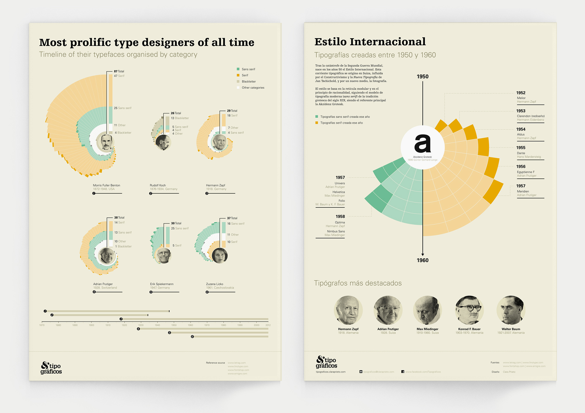
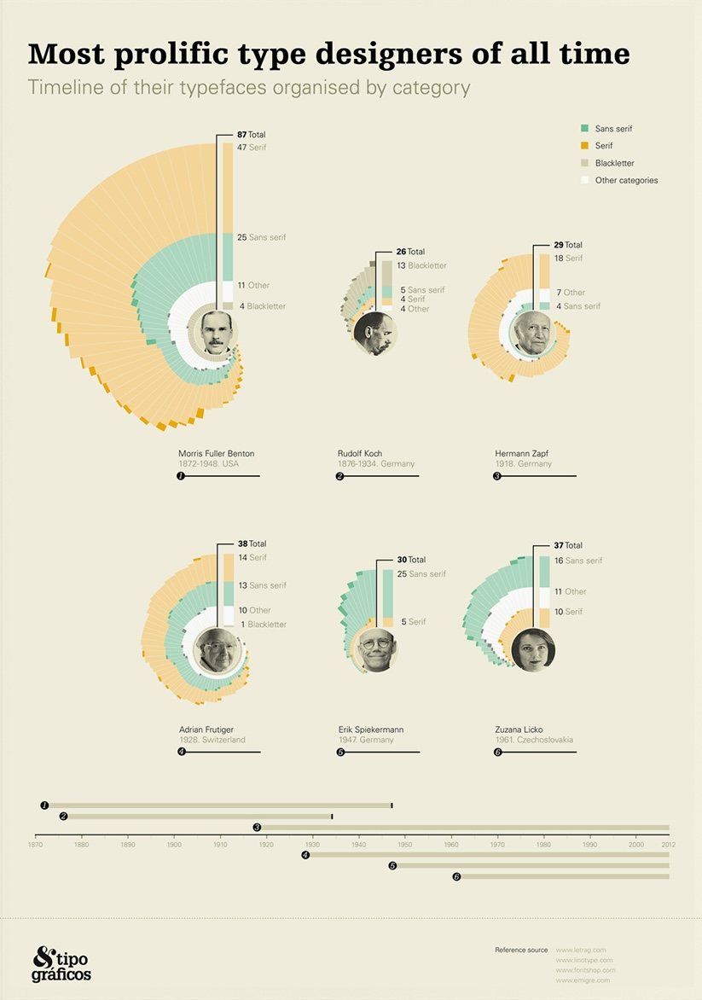

+++
author = "Yuichi Yazaki"
title = "Visualizing the Most Prolific Type Designers"
slug = "most-prolific-type-designers"
date = "2025-10-11"
categories = [
    "consume"
]
tags = [
    "",
]
image = "images/cover.png"
+++

This infographic visualizes notable type designers by the number and categories of typefaces they created. Designed by Clara Prieto, it is structured into two main parts: the most prolific type designers on the left and the international style on the right.

<!--more-->

## Left-Side View

The left section ranks or compares designers by output, using visual structure to make production volume and category differences easier to compare.

## Why It Matters

Typography history is often told through movements, specimens, and individual typefaces. This work shifts attention to designers' output as data, making the history of type design comparable as a quantitative field.

## Summary

The infographic is a useful example of visualizing design history. It organizes cultural production through counts, categories, and layout while preserving a strong graphic identity.
