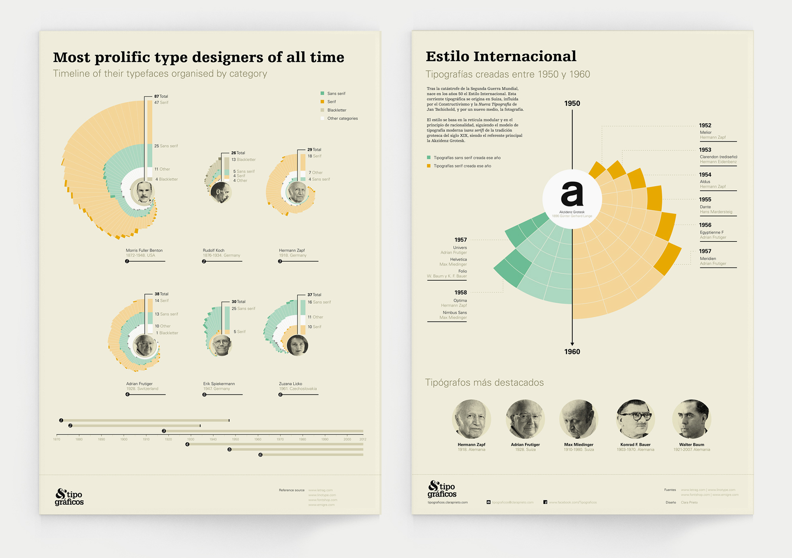
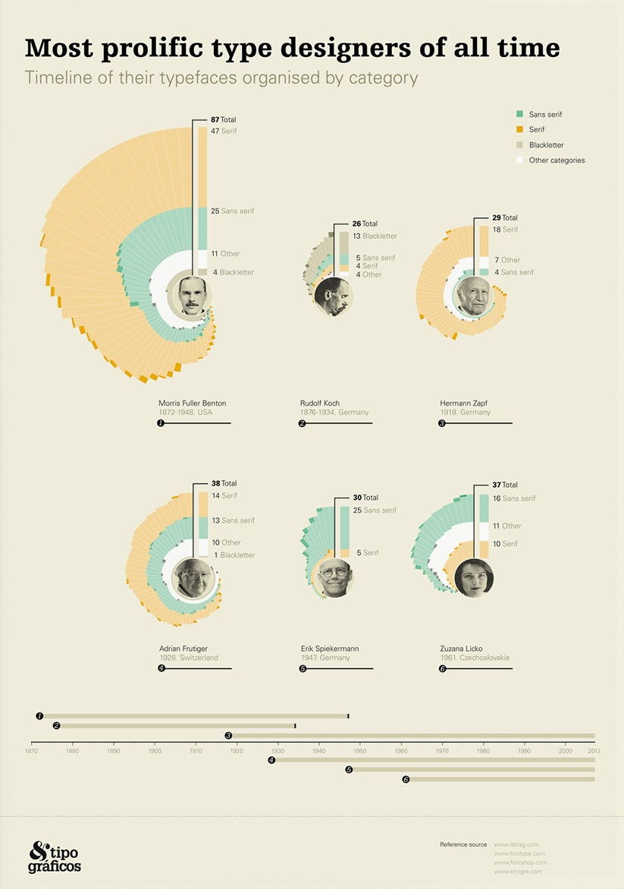
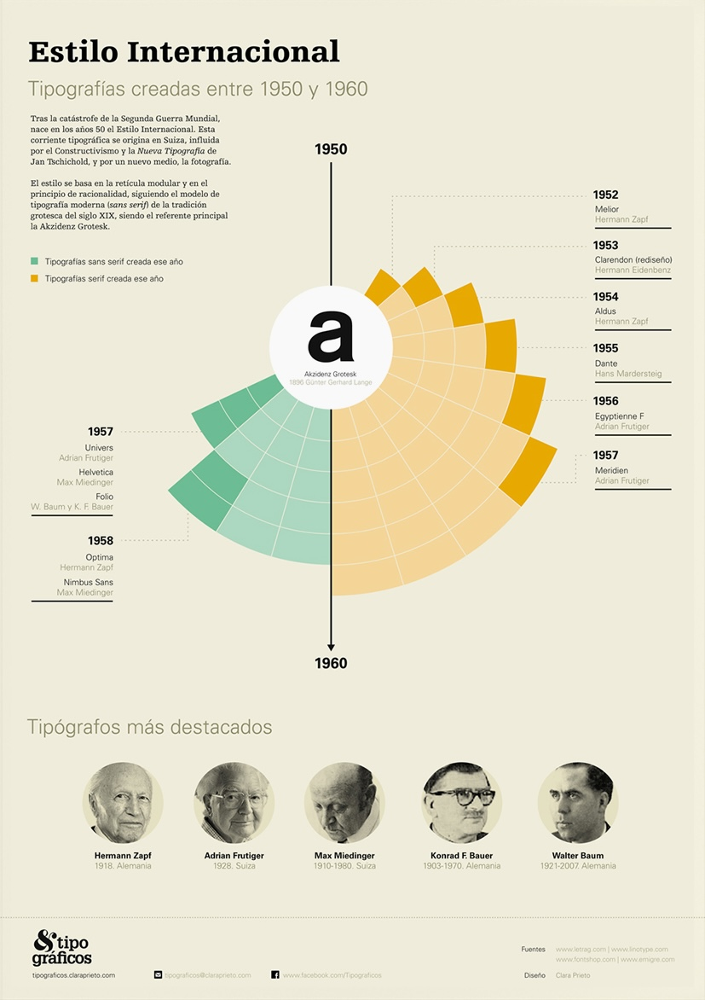

+++
author = "Yuichi Yazaki"
title = "最多書体デザイナーの可視化"
slug = "most-prolific-type-designers"
date = "2025-10-11"
categories = [
    "consume"
]
tags = [
    "",
]
image = "images/cover.png"
+++

このインフォグラフィックは、歴代の代表的な書体デザイナーを、制作したフォント数とカテゴリー別に可視化した作品です。デザインはClara Prieto氏によるもので、視覚的に整然とした情報構成が特徴です。作品全体は、左側の「最多書体デザイナー」と右側の「国際様式」の2部構成になっています。

<!--more-->

## 左側の図

### チャートの見方

左側の図では、各デザイナーの制作書体数が円弧状に放射され、ジャンル（Sans Serif、Serif、Blackletter、その他）ごとに色分けされています。各円弧の角度が作品数を示しており、外側に向かうほど多くの書体を制作したことを意味します。

たとえば **Morris Fuller Benton** は87書体（うち47がSans Serif）を手がけており、20世紀初頭アメリカの商業印刷時代における多様なフォント開発を牽引しました。

同様に **Hermann Zapf** （ドイツ）は、書体の美学と可読性を両立させたデザインで知られ、後のユニバーサル・デザイン思想にも影響を与えています。

下部にはタイムラインがあり、各デザイナーが活動した年代が一目で分かるようになっています。1870年代から2000年代までの軸上に、主要な活動時期が点で示されています。

### 背景と意図

この作品は、書体デザインの歴史的潮流を俯瞰し、技術革新とデザイン思想の発展を同時に捉えることを意図しています。Sans Serifが増加する20世紀半ばのモダニズム的転換期に注目しながら、クラシックなSerifや装飾的Blackletterも同列に扱うことで、タイポグラフィの多様性を表現しています。

## 右側の図

### チャートの見方

放射状の年表に沿って、1950年から1960年までに登場した主要フォントが扇状に配置されています。緑色はSans Serif系フォント、オレンジ色はSerif系フォントを表します。

例えば、1957年には **Helvetica**（Max Miedinger）と **Univers**（Adrian Frutiger）が登場し、スイス・デザインの黄金期を象徴しています。翌年1958年には **Optima**（Hermann Zapf）や **Numbus Sans** などが発表され、これらは後の国際的なデザイン標準となりました。

下部には主要な書体デザイナー（Zapf, Frutiger, Miedinger, Bauer, Baum）の肖像と活動期間が示されています。これにより、国際スタイルの形成における主要人物が視覚的に理解できるようになっています。

### 背景と意図

右側の図は、1950年から1960年の間に生まれた「インターナショナル・タイポグラフィック・スタイル（スイス様式）」の時代を描いたものです。中心に置かれた「a」のシンボルは、アクシデンツ・グロテスク（Akzidenz Grotesk）を象徴しており、無駄のない構造と中立的なデザインが特徴です。

## まとめ

Clara Prieto氏による「Tipográficos」シリーズは、タイポグラフィ史をデータビジュアライゼーションとして再構成した優れた作品です。書体という静的なデザイン要素を時間軸とカテゴリーで整理することで、デザイナーたちの創作の広がりと、時代ごとの美学的変遷を一目で理解できる構造になっています。
情報デザインとしても完成度が高く、教育・展示用途にも適した作品です。

## 参考・出典
- [Clara Prieto | Tipográficos – Data Visualisation & Scientific Illustration](https://www.claraprieto.com/tipograficos)