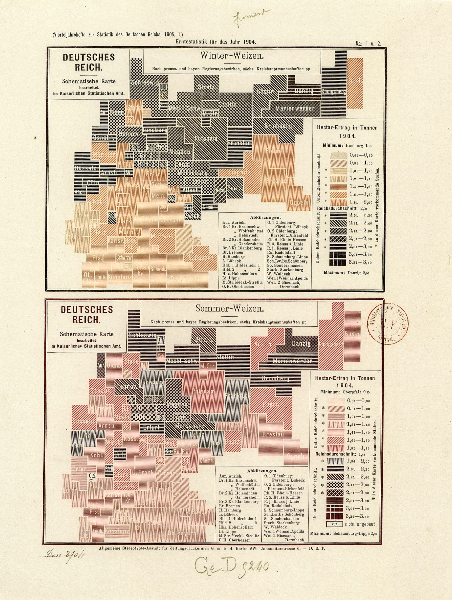
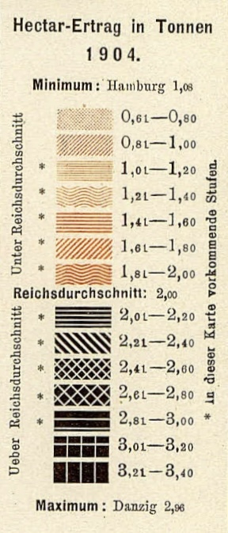
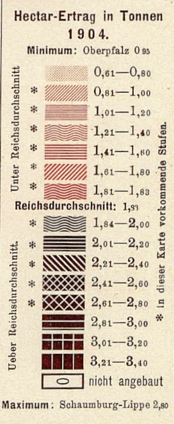

+++
author = "Yuichi Yazaki"
title = "Multicolor and Texture: A 1904 German Wheat-Yield Map"
slug = "multi-color"
date = "2025-10-02"
categories = [
    "technology"
]
tags = [
    "カラー",
]
image = "images/cover-schematic-chropleth.jpeg"
+++

In 1904, the **Imperial Statistical Office of Germany** published a thematic statistical map of wheat yields. It shows both **winter wheat** and **summer wheat**, allowing yields per hectare to be compared across administrative districts of the empire.

<!--more-->

## Visualizing Many Classes

One striking feature is the large number of classes: up to 15 yield categories. The range runs from about 0.61 tons per hectare to roughly 3.4 tons per hectare, with the imperial average used as an important dividing point between below-average and above-average yields.

By modern standards, 15 classes is a lot. The map handles this by combining **light-to-dark color** with **texture**, including lines, waves, grids, and cross-hatching.

- **Low yields**: pale pinks and oranges with fine line patterns.
- **Middle values**: slightly darker colors with denser marks.
- **High yields**: very dark tones with strong hatching and cross patterns.

The viewer can first read lightness as a broad low-to-high scale, then use texture to distinguish finer categories.

## Design Under Printing Constraints

In the early twentieth century, multicolor statistical printing was technically and economically constrained. Subtle color differences alone would not reliably separate 15 classes. Pattern therefore became a crucial encoding channel.

The map is a good example of a hybrid color-and-texture design that turns production constraints into a visual strength.

## Modern Perspective

Today, tools such as ColorBrewer help designers create legible and color-vision-aware schemes. A diverging color scale might be used for this kind of data. Still, the 1904 map succeeds in carefully layering information with limited means.

## Summary

This wheat-yield map is an early and sophisticated example of multicolor choropleth design. It shows how cartographic clarity depends not only on color, but also on texture, print technology, and classification strategy.
