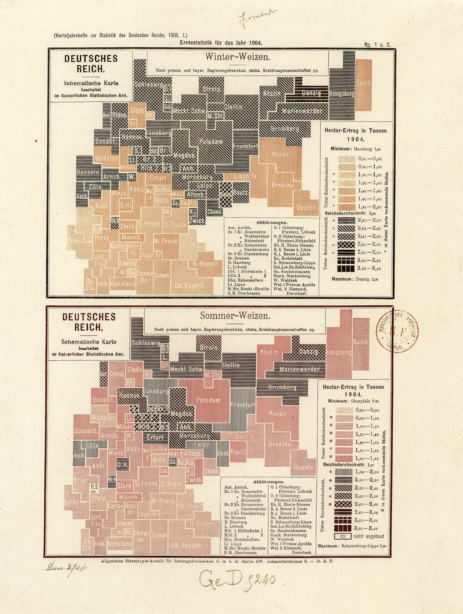
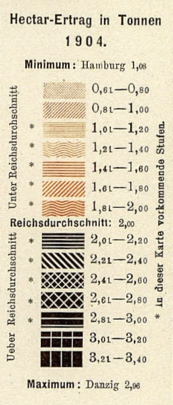
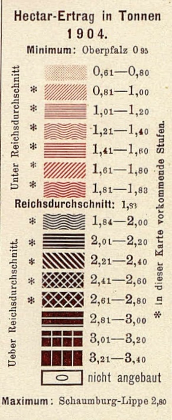

+++
author = "Yuichi Yazaki"
title = "多色使いとテクスチャの工夫 - 1904年ドイツ帝国統計局による小麦収量地図"
slug = "multi-color"
date = "2025-10-02"
categories = [
    "technology"
]
tags = [
    "カラー",
]
image = "images/cover-schematic-chropleth.jpeg"
+++

1904年、ドイツ帝国統計局（Kaiserliches Statistisches Amt）は、小麦の収量統計を地図化した「統計主題図」を刊行しました。ここでは **冬小麦（Winter-Weizen）** と **夏小麦（Sommer-Weizen）** の2種類が描かれ、帝国内の各行政区ごとの1ヘクタールあたり収量を比較できるようになっています。

<!--more-->

## 多段階の項目を可視化する工夫

この地図の大きな特徴は、収量を 最大15段階に区分して表現している点です。最低値は 0.61トン/ha、最高値は約 3.4トン/ha と広いレンジをカバーし、さらに帝国平均（Reichsdurchschnitt）を境界に「平均未満」「平均以上」をはっきり分けています。

現代の感覚では15階級はかなり細かい区分ですが、当時はこれを読みやすく見せるために、色調（淡色〜濃色）＋模様（線・波線・格子・クロスなど） を組み合わせるという工夫が凝らされています。

- **低収量（0.6〜1.8トン/ha）** 薄いピンクやオレンジなどの淡色に、細かな線や波模様を重ねて表現。
- **中間（帝国平均付近、約1.9〜2.0トン/ha）** 少し濃い色合いに、より密度のある模様を加える。
- **高収量（2.0トン以上）** 黒に近い濃色を基調とし、斜線、格子、クロスハッチングなど大胆な模様を重ねて階層を細分化。

これにより、地図を一目見れば **「明るい＝低収量、暗い＝高収量」** という直感的理解が可能になり、さらに模様の違いで数値区分をより細かく判別できるようになっています。

## 印刷制約下でのデザイン

20世紀初頭は、統計図を多色刷りで印刷するのは技術的にも経済的にも難しい時代でした。微妙な色の濃淡だけで15段階を識別させるのは困難であり、そこで 模様によるパターン表現 が重要な役割を果たしています。

つまりこの図は、印刷技術の制約を逆手に取った「多色＋テクスチャ」のハイブリッドデザイン の好例と言えます。

## 現代の視点から

今日では、ColorBrewer などの配色設計ツールを使って「見分けやすく、色覚にも配慮したカラーマップ」を作ることが可能です。しかし、この1904年の図版は、限られた手段でありながらも情報を正確に階層化し、直感的に伝えることに成功しています。

統計地図の歴史において、これは **「コロプレスマップ（Choropleth Map）の初期的な多色使いの実践例」** であり、視覚化の工夫と印刷文化の関係を知る上で重要な作品です。

