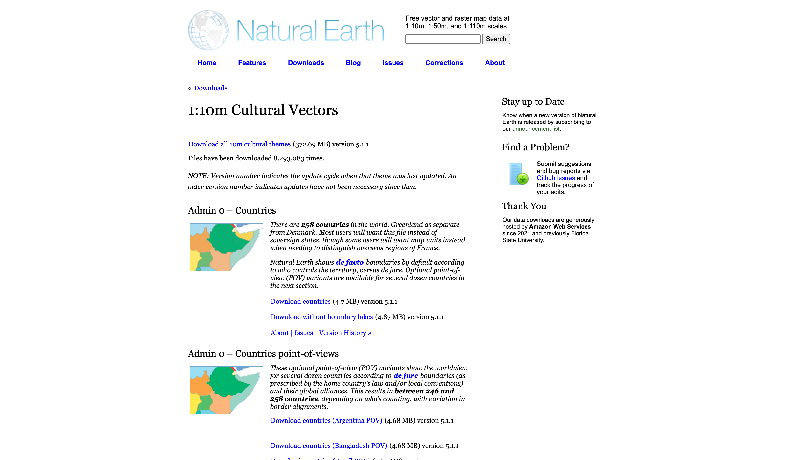
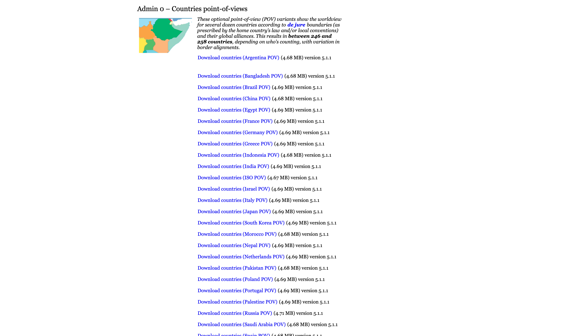
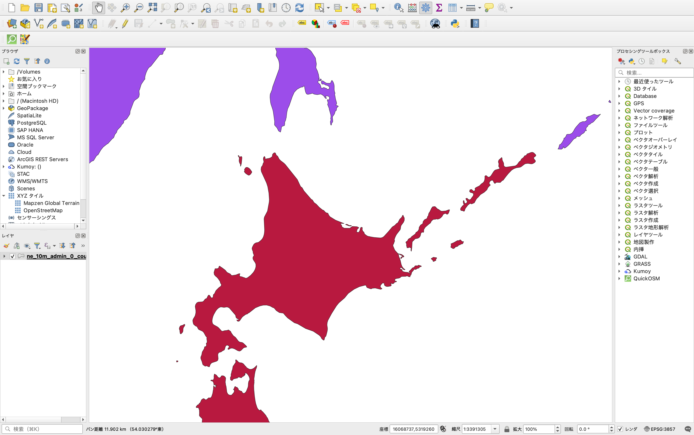
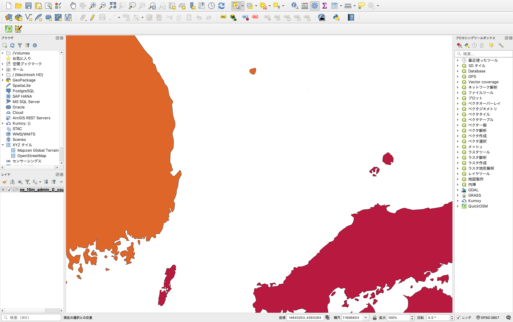
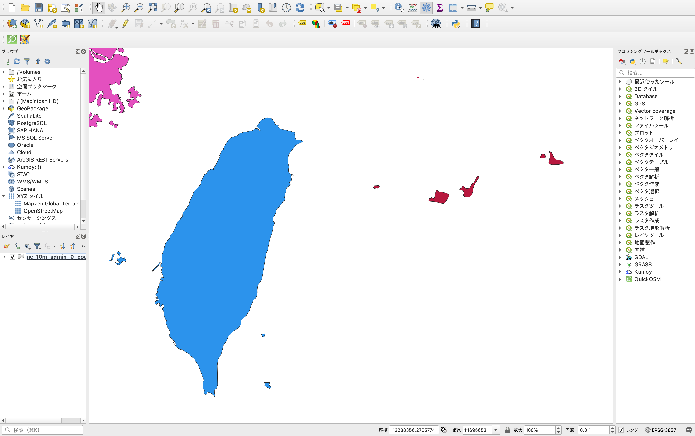

+++
author = "Yuichi Yazaki"
title = "Natural EarthのPOV（Point of View）データ"
slug = "natural-earth-pov"
date = "2026-03-27"
categories = [
    "technology"
]
tags = [
    ""
]
image = "images/land_01.png"
+++

Natural Earthは、無料で利用できる高品質な地図データセットです。1:10m、1:50m、1:110mのスケールでベクターおよびラスター形式のデータを公開しています。特に文化ベクター（Cultural Vectors）では、国境や行政境界などの政治的なデータを扱っています。

このデータセットでは、デフォルトで **de facto（実効支配）** に基づいた境界を表示します。つまり、実際に誰がその地域をコントロールしているかという視点です。一方 **POV（Point of View）** は、特定の国や機関の **de jure（法的主張）** に基づく世界観を反映した代替データです。

### POVとは何か

POVとは「Point of View」の略で、「視点」や「世界観」を意味します。Natural Earthの文脈では **各国が自国の法律や国際的な同盟関係に基づいて世界をどのように見ているか** を表す境界データのバリエーションです。

デフォルトのデータは中立的な実効支配を基準としていますが、領土問題を抱える地域では国によって認識が異なります。POVバリアントを使うことで、日本視点、中国視点、アメリカ視点など、特定の国の公式見解に合わせた地図を作成できます。これにより、地図の表示される国の数や境界線が少しずつ変わります（通常246〜258カ国程度）。

 

### POVの「作品の見方」と使い方

POVデータの見方と使い方を、平易に詳しく説明します。

まず、<a href="https://www.naturalearthdata.com/downloads/10m-cultural-vectors/">ダウンロードページ（1:10m Cultural Vectors）</a>を開くと、「Admin 0 – Countries point-of-views」というセクションがあります。ここには、さまざまな国ごとのPOVファイルがリストアップされています。

- `ne_10m_admin_0_countries_jpn.zip` → 日本（Japan）の視点
- `ne_10m_admin_0_countries_chn.zip` → 中国（China）の視点
- `ne_10m_admin_0_countries_usa.zip` → アメリカ（United States）の視点
- `ne_10m_admin_0_countries_iso.zip` → ISO基準の視点

日本（Japan）の視点のファイルをGISソフト（QGISなど）で開き、日本の領土を着色するとこのようになっています。

**見方のポイント**：
- デフォルトの`ne_10m_admin_0_countries.zip`は実効支配ベースです。
- POVファイルはあらかじめその国の視点で「組み立て済み」のデータです。すぐにその視点の地図が描けます。
- 政治的に敏感な地域（例：南シナ海、クリミア、台湾など）で境界の描き方が変わるため、用途に応じて選択してください。
- 属性を組み合わせれば、複数の視点を1つのデータで切り替えることも可能です。

この機能は、地図作成者が「どの国の読者に向けた地図か」を意識して柔軟に調整できるように設計されています。

### POVが追加された背景

Natural Earthは2009年頃からプロジェクトが始まり、デフォルトでde facto境界を採用してきました。これは「実際に地上で誰がコントロールしているか」を優先するポリシーです。しかし、国際的な利用者から「自国の法的主張を反映したデータが欲しい」という要望が寄せられました。

著者も本サイト<a href="/natural-earth-border-issue/">2014年の記事</a>にて「日本政府の主張する国境ではない」と異議申し立てをNatural Earthに行ったことを報告しました。

このような意見に応じて、バージョン5で公式にPOVサポートが追加されました。31カ国・機関分の専用視点データと、属性による柔軟な切り替え機能が整備され、より多様な世界観に対応できるようになりました。

### v5リリースのタイミングと内容

Natural Earthのバージョン5（v5.0.0）は**2021年12月**にリリースされました。このバージョンでPOV機能が正式に導入されました。

主な追加内容は以下の通りです：
- Admin 0関連テーマへのalternate points of view（代替視点）のサポート
- `fclass_*`属性（例：`fclass_jpn`）の追加
- 31の国・機関向けpre-built（組み立て済み）POVファイルの提供

これにより、以前は属性レベルでしか対応できなかった機能が、専用ダウンロードファイルとして見つけやすく整備されました。現在はバージョン5.1.1が最新ですが、POVの基盤はv5.0.0で確立されています。

### 以前の状況との違い

バージョン5以前（v4まで）では、fclass_*属性による境界切り替えは一部存在していましたが、専用POVファイルのセクションや一覧はなく、利用者は自分でデータを加工する必要がありました。v5以降はダウンロードページに専用セクションが設けられ、誰でも簡単に各国視点のデータを入手できるようになりました。

## まとめ

Natural EarthのPOV機能は、2021年12月のバージョン5リリースで本格的に導入された便利な機能です。デフォルトの実効支配ベースに加え、各国の法的主張に基づく世界観を簡単に切り替えられるようになりました。これにより、領土問題の多い地域でも、目的に合った地図を作成しやすくなっています。

地図制作の際に「どの視点で世界を描くか」を意識するきっかけとしても、とても参考になる仕組みです。ぜひ公式ダウンロードページから実際のデータを確認し、ご自身の作品に活かしてみてください。

### 参考・出典
- [Natural Earth Disputed boundaries policy](https://www.naturalearthdata.com/about/disputed-boundaries-policy/)
- [1:10m Cultural Vectorsダウンロードページ](https://www.naturalearthdata.com/downloads/10m-cultural-vectors/)
- [Admin 0 – Countries point-of-viewsブログ](https://www.naturalearthdata.com/blog/admin-0-countries-point-of-views/)
- [GitHub Releases - v5.0.0](https://github.com/nvkelso/natural-earth-vector/releases)

