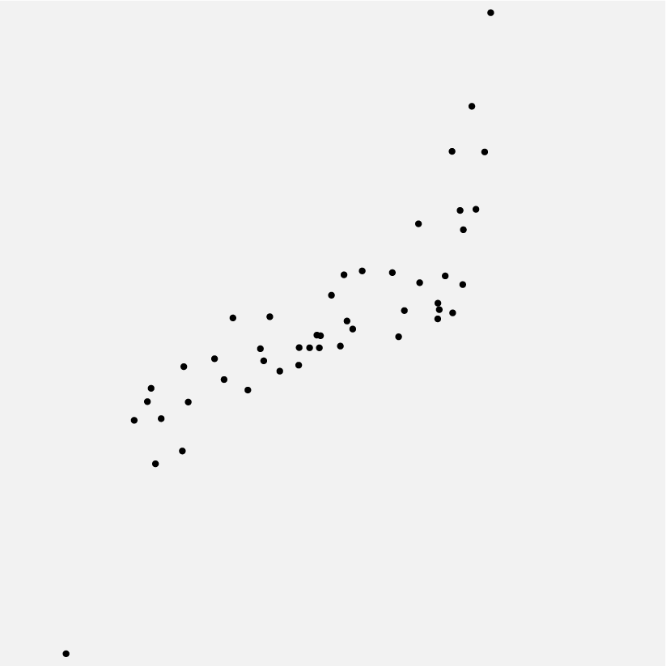
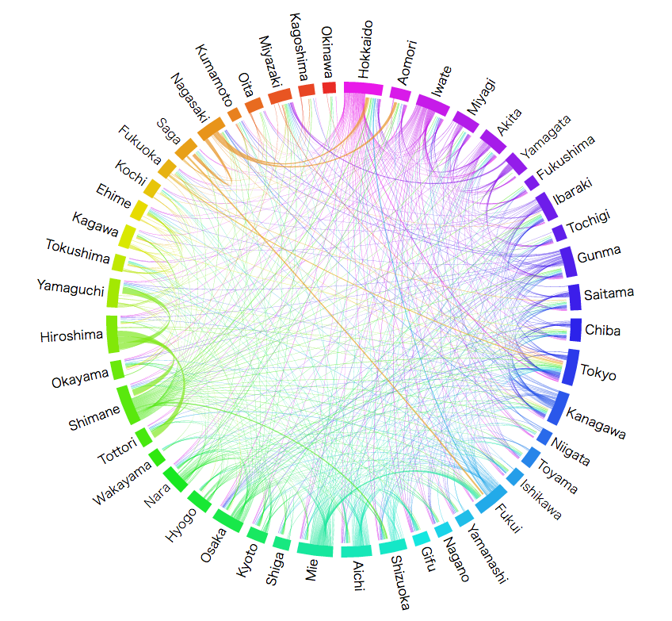
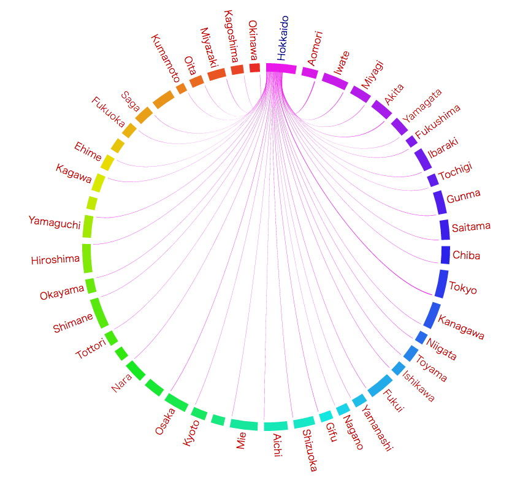
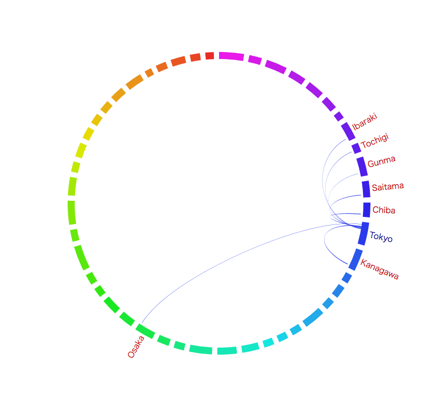
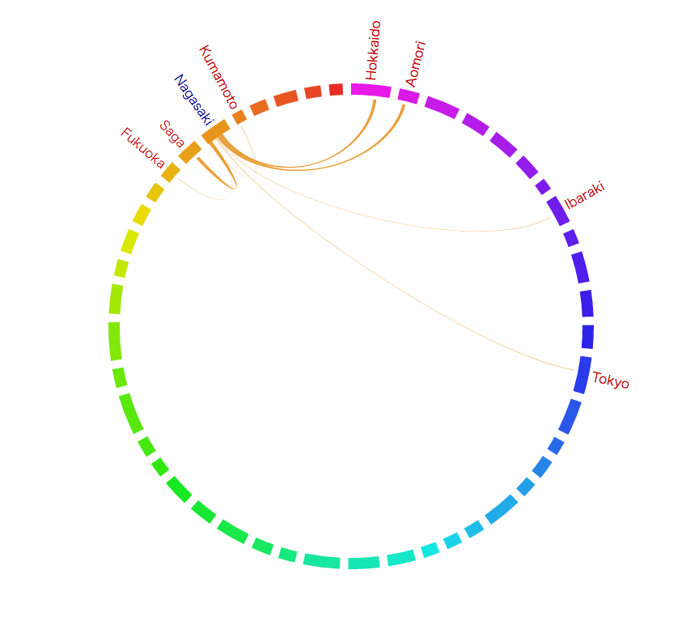
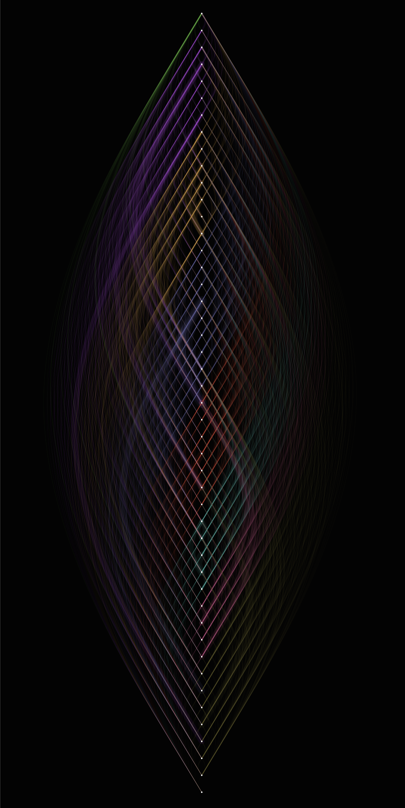
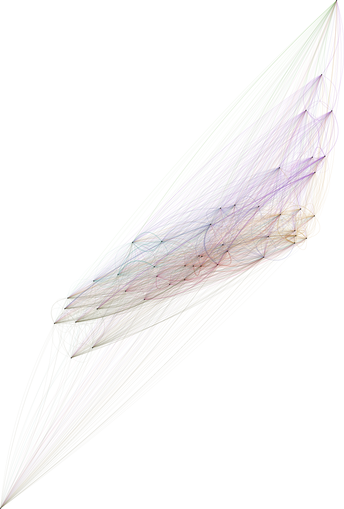

+++
author = "Yuichi Yazaki"
title = "国立国会図書館 初のデータビジュアライゼーションイベントが開催されます"
date = "2016-07-13"
description = "AIによる音声の自動文字起こし（トランスクライブ）、良いサービスが続々登場しています。英語にも当然対応しているので、特に海外のカンファレンスに参加される方には強い味方になります。"
categories = [
    "event"
]
tags = [
    "NDL","ハッカソン"
]
image = "ndl2016-1-1.png"
+++

国立国会図書館 初のデータビジュアライゼーションイベントが開催されます。

<!--more-->

## 国会図書館にはデータがたくさん

国会図書館には収蔵している書籍に関するデータもあるのですが、今回は「ウェブサイト」がテーマとなっています。
国会図書館では、15年前よりウェブページのアーカイブをおこなっており、その結果はWARPというウェブサービスとして公開されています。

[Warp – 国立国会図書館インターネット資料収集保存事業](http://warp.da.ndl.go.jp/)

## データを探しだそう

今回はこれらの中から、地方自治体ウェブサイトのメタデータなどを使って、データ・ビジュアライゼーションを行います。今回のイベント専用に、データ取得サイトを用意しています。ヤフーなどで検索するように、検索した結果をデータセットとして取り出すことが可能となっています。APIを扱うエンジニア・スキルは今回必要ありません。
地方自治体というとちょっと硬そうですが、私達の出身地や今住んでいる場所についての個性がここからわかってくるかもしれません。

## たとえば…?

都道府県同士の関係性に注目してみましょう。都道府県それぞれのサイトから、他の都道府県サイトへ、どのくらいリンクが張られているでしょうか。またそこには何らかの偏りがあるでしょうか。昔と今とで何か違いがあるでしょうか。

## 都道府県、どう並べる？

グラフの種類が…とか、ツールが…と考える前に自由に発想してみましょう。
円状に並ぶと、かわいいですね。

一直線に並べてみたり。

地図っぽく並べてみたり。

## つながりを視覚化してみる

それではこれらを使って、都道府県同士のつながりを線で表現してみましょう。つながりが強いほど太い線で表してみます。またつながりの質によって色を変えてみることにします。

### 円状
円状に置いた都道府県同士を曲線でつないでいます。またつながりが多い都道府県ほど、弧の長さが長くなっています。

ここでは静止画でいくつかの都道府県にフォーカスしてみましょう。

八方美人な北海道

たくさんの都道府県にまんべんなくエールを送る、そつのない北海道。

関東エリアと大阪のみの東京

意外と付き合いの範囲が狭い東京（汗）。

自由奔放な長崎

長崎さん。自由すぎます（笑）。おつきあいの内容が気になります。

これは国会図書館で公開している可視化のサンプルでもあります。国会図書館サイト上で見ていただくと、他の都道府県の様子もみることができます。

[都道府県サイトのリンク関係](http://warp.da.ndl.go.jp/contents/reccommend/collection/preflink.html)

### 一直線

この例は筆者の作例で、個別の関係性を明らかにすることよりも、全体的にみたときの印象を重視してみました。

### 地図っぽく
この例も筆者の作例で、個別の関係性を明らかにすることよりも、全体的にみたときの印象を重視してみました。日本列島を描かずに、日本を浮かび上がらせたらと思いました。

これらはすべて同じデータを元にしたものです（フォーマットは少し異なります）。同じデータからであっても、このように色々な表現が可能なことがおわかりいただけるかと思います。

## ツール紹介

### Tableau Public

パソコンにインストールするソフトウェア。数十万円するソフトウェアですが、Publicヴァージョンを利用すると無償です。制作したものをウェブで公開することを条件に、無償となっています。

[Tableau Public](https://public.tableau.com/)

### RAW
ブラウザ上でチャートを作成できるツール。ダウンロードし、イラストレータで加工する、といった使い方が可能です。

[RAW](http://raw.visualizing.jp/)

### インフォグラム

ブラウザ上でチャートを作成できるツール。

[インフォグラム](http://infogr.am/)

### D3.js
今回の「一直線」、「地図っぽく」の例のように、一から好きなようにコーディングで作るにはこのライブラリを利用します。

[D3.js](https://d3js.org/)

### QGIS
パソコンにインストールするソフトウェア。無償。地図上にてデータを可視化するのが得意です。

[QGIS](http://www.qgis.org/ja/site/)

## ハッカソンに参加しよう

ツールは一部難しいものはありますが、しばらく使えばなれてしまうことと思います。また不明点は会場で教えてもらうことも可能となっています。
今回のハッカソンでは、都道府県の特徴や関係性を、データベースから如何に探すか、という面白さがあると思います。
名産物の単語がどのくらい含まれているのか？　方言は？　
また他のデータを同時に扱うことで、これまでわからなかった特徴が浮かび上がってくるかもしれません。
ウェブサイトの大きさと人口に関係はあるのか？　人口が減っていく地方自治体のサイトに共通の予兆はあるのか？　自治体の広報予算とウェブサイトの大きさに関係性は見いだせるのか。
パッと思いついたものだけ上げましたが、ここのアイディア次第で、面白い作品が作れると思います。
ツールを使いこなして、データから何かを発見する。お互いの成果をみることも、ためになるし、面白い体験になると思います。
