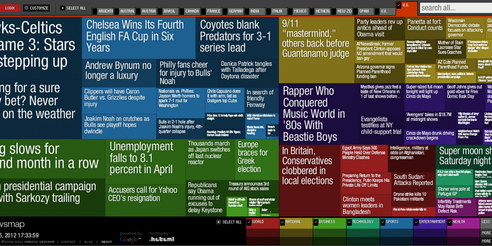
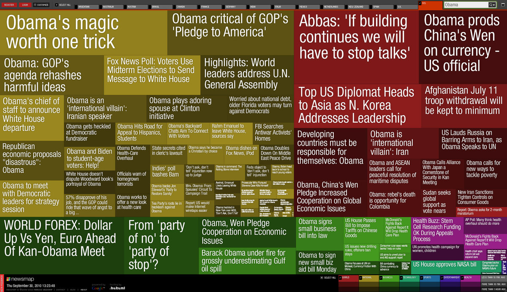
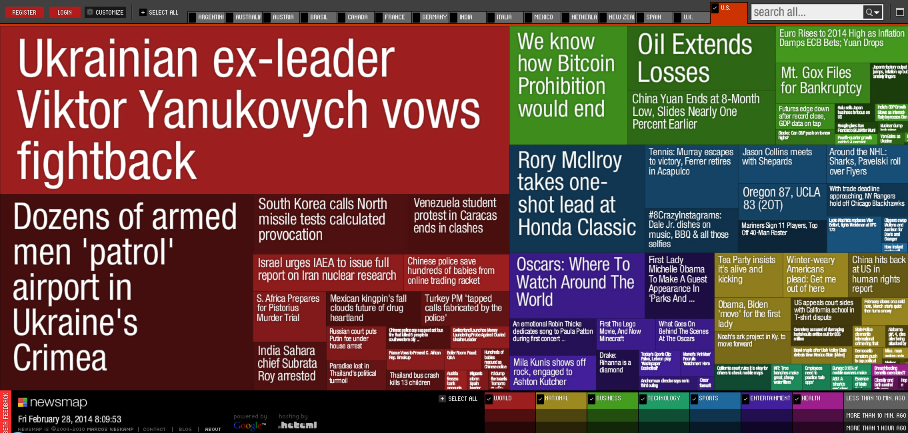
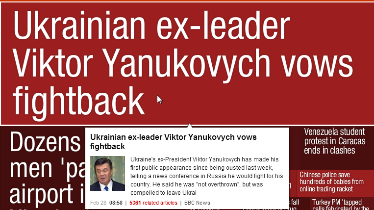
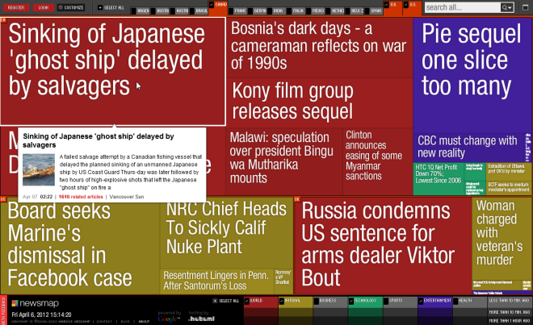

+++
author = "Yuichi Yazaki"
title = "Newsmap - ニュースを俯瞰する可視化の実験"
slug = "newsmap"
date = "2025-09-27"
categories = [
    "consume"
]
tags = [
    "",
]
image = "images/newsmap.png"
+++

2004年、インフォメーションデザイナー Marcos Weskamp（マルコス・ウェスカンプ）氏 によって公開された Newsmap は、ニュースの見え方を一変させた実験的なウェブアプリケーションです。データの出典は Google News。その記事群をもとに、ツリーマップという可視化手法を用いてニュース全体を俯瞰できるように設計されています。

MoMA（ニューヨーク近代美術館）の展覧会 Talk to Me にも展示され、また Ars Electronica 2004 で「Net Vision Distinction」を受賞するなど、デザインとテクノロジーの両面で国際的に高く評価されました。

<!--more-->

## 仕組みと設計思想

Newsmap の特徴は、ニュースを「記事そのもの」としてではなく、「報道量」や「注目度」という別の軸で表現する点にあります。

### 面積＝報道量

Google News が自動的に作成するニュースクラスタの規模（記事数や露出度）を矩形の大きさに変換します。大きなニュースは広い面積、小さな話題は狭い面積として描かれます。

### 色＝ジャンル

政治・国際・スポーツ・経済などのジャンルを色で区別。視覚的にニュースの分布を把握できます。

### クリック＝元記事に移動

各矩形にはクラスタ内の代表的な記事タイトルが表示され、クリックすれば元記事に移動可能です。

### 階層構造とレイアウト最適化

関連するニュースはクラスタ単位でまとめられ、矩形分割アルゴリズム（ツリーマップ）が読みやすさを保ちながら全体を配置しています。

Weskamp 氏は Newsmap を「Google News の置き換えではなく、補完ツール」と位置づけています。意図的に偏りを浮き彫りにすることで、ニュースの背後にある構造やバイアスを直感的に捉えられるようにしているのです。

## 画面デザイン

## 技術的な側面

MoMA の展示解説によれば、Newsmap は PHP、HTML、JavaScript、Flash、MySQL など当時のウェブ技術を組み合わせて実装されていました。可視化にはツリーマップアルゴリズムを採用し、矩形のアスペクト比を調整しながらニュース量を空間に割り当てています。

ここで重要なのは、Newsmap が 記事内容そのものを解析しているわけではないという点です。内容の意味づけは Google News に委ねられ、Newsmap 側ではクラスタ規模を比率化・変換して可視化に適した形へと加工しています。

## 評価と影響

Newsmap は公開直後から話題を呼びました。

- Ars Electronica（2004）受賞：インタラクティブ・メディア作品として評価
- MoMA 展示：デザイン史に記録された事例
- ジャーナリズムからの注目：短時間でニュースのトレンドや偏りを把握できるツールとして紹介

また、教育や研究の文脈でもしばしば取り上げられ、情報デザインにおける「ニュース可視化の典型事例」とされています。後年、オープンソースの Newsmap.js など、派生プロジェクトが登場したのも影響の大きさを物語ります。

## 限界と批判

もちろん Newsmap には課題もあります。

- 1. 中立性の保証はしない...表示されるのは「報道量の大小」であって、「重要性」ではありません。かえってメディアの偏りが強調される場合もあります。
- 2. Google News 依存...データソースが Google News に限られるため、その選択基準や地域性の影響を受けます。
- 3. 完成版ではなく “super beta”...開発者自身が「super beta」と呼んでおり、常に実験的な性質を持つ作品でした。

## iPad登場とFlipboardへの接続

Newsmap が公開されたのは 2004年。一方、Apple が iPad を発表したのは2010年であり、両者は時期的に重なってはいません。しかし、タブレットの普及によって「情報をどう提示するか」という課題が再び注目されました。

同年7月に公開された Flipboard は、iPad 専用の「ソーシャルマガジン」アプリとして大きな話題を呼びました。ここに Marcos Weskamp 氏が Head of Design として参画し、Newsmap で培った「ニュースを俯瞰的に、かつ魅力的に見せる」発想を、モバイル時代の体験デザインに展開しました。

- Newsmap：PCブラウザ上でニュースを俯瞰する可視化実験
- Flipboard：タブレット上でニュースを「雑誌のように読む」ユーザー体験

この連続性は、Weskamp 氏のキャリアの中で「ニュースと可視化」「情報と体験デザイン」がどのように進化していったかを象徴しています。

## 意義と今日的な意味

Newsmap の意義は、ニュースを「読む」だけでなく「眺める」ことを可能にした点にあります。情報が氾濫する現代において、

- 報道の偏りを把握する
- トレンドを一目で理解する
- 情報を批判的に観察する

こうした視点を与えてくれるデザインは、今もなお重要な学びを提供してくれます。

## まとめ

Marcos Weskamp 氏の Newsmap は、Google News を素材に、ツリーマップで偏りや注目度を直感的に見せる、単なる技術実験にとどまらず、ニュースの受け取り方を問い直すデザインとして評価されています。

## 参考・出典

- [MoMA: Talk to Me – Newsmap（展示ページ）](https://www.moma.org/interactives/exhibitions/2011/talktome/objects/146231/)  
- [Journalism.co.uk: Global news mapped out (2004年記事)](https://www.journalism.co.uk/news/global-news-mapped-out/s2/a5857/)  
- [MFRU: Marcos Weskamp – Newsmap（プロジェクト説明）](https://www.mfru.org/projects/newsmap)  
- [Cool Hunting: Newsmap（レビュー記事）](https://coolhunting.com/tech/newsmap/)  
- [IJNet: Why journalists should still be using Newsmap（記事）](https://ijnet.org/en/story/why-journalists-should-still-be-using-newsmap)  
- [Reasons.to Conference – Marcos Weskamp（登壇者紹介）](https://reasons.to/2007/brighton/speakers/marcos-weskamp)
- [Flipboard 公式サイト](https://about.flipboard.com/)