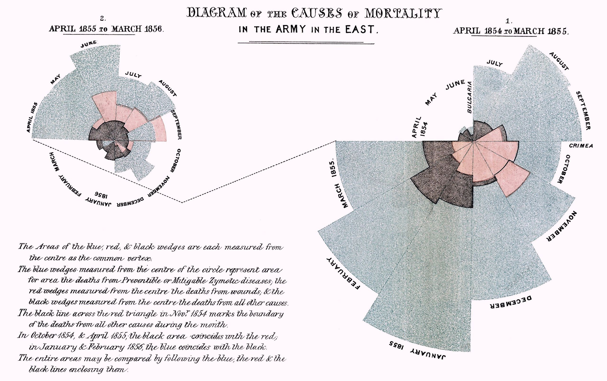
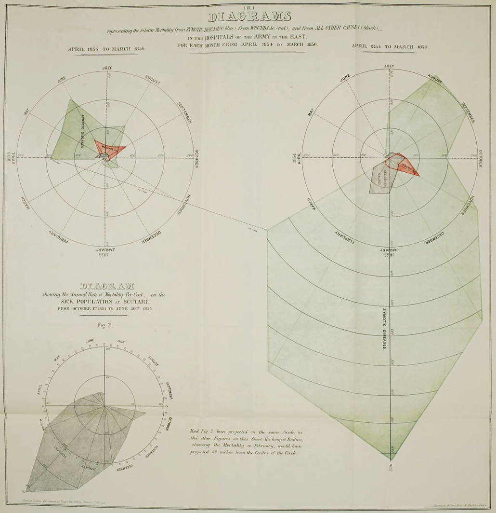

+++
author = "Yuichi Yazaki"
title = "ナイチンゲールによる「鶏冠」チャート"
slug = "nightingale-chart"
date = "2020-08-14"
description = ""
categories = [
    "consume"
]
tags = [
    "",
]
image = "images/Nightingale-mortality.jpg"
+++

フローレンス・ナイチンゲールによって開発された歴史に残るチャート、当時は、“coxcomb” 、現代では “polar-area diagram” というチャート類型として認識されています。

<!--more-->

端的にいうと、病院における兵士の死亡率は、実際の戦闘 （赤）やその他の原因（黒）で死亡したよりも、予防もしくは軽減可能な伝染病（青色）で死亡したことを示しており、当時のイギリス政府へ現状を訴えるために、データを自身で記録し、のちに制作したレポートに挿入されました。

ナイチンゲール自身が直接ヴィクトリア女王に接見できる身分だったり、知人の夫が当時の戦時大臣だったりしたこともあって、相談しながら行動を起こしているのですが、レポートの甲斐あって実際に改善されたということです。

1854年3月、フランス、イギリス、サルデーニャ、オスマン帝国とロシアの間で戦争が勃発しました。戦争での戦闘のほとんどはクリミア半島で起こりましたが、負傷したイギリス軍は黒海を越えたトルコの病院に運ばれました。

ナイチンゲールは、ボランティア看護師としてほかの女性たちと一緒にトルコに同年10月に到着します。最初は病棟への立ち入りを拒否され、ナイチンゲールと仲間の看護師たちが患者との接触を許されたのは、病院が危機的な状態になった翌年1855年3月だったとのことです。

負傷した兵士の環境を改善しようと努力していく中で、患者の福祉の重要性を示す証拠として、病院での死亡者数を綿密に記録しました。その結果を当時のイギリス政府へ訴えるために作られたのが、この著名なチャートでした。

戦争が二年間に渡って行われたことをうけ、チャートの一つが一年を指します。右が一年目、左が二年目です。時計でいうと九時の箇所から始まり、時計回りにぐるっと一周すると一年間を一ヶ月ごとに示しています。一年目の終わりの箇所から点線が引き出され、左の二年目へとつながっています。

よくみると、ナイチンゲールと仲間の看護師たちが患者との接触を許された1855年3月を境に、左と右、二つのチャートに分けていることが見て取れます。

作品画像の左下に記載されている文章の日本語訳を以下に掲載します。

> 青、赤、黒のウェッジの領域は、それぞれ中心から共通の頂点として測定されます。
> 円の中心から測った青いくさびは、予防可能または軽減可能な伝染病疾患（Zymotic Diseases）による死亡者の面積を、中心から測った赤いくさびは、負傷（Wounds and Injuries）による死亡者の面積を、中心から測った黒いくさびは、その他（All other Causes）のすべての原因による死亡者の面積を表しています。
> 1854年11月の赤い三角形の上の黒い線は、その月の他のすべての死因による死亡者の境界を示している。1854年10月、1855年には、黒の部分が赤と一致し、1856年1月、2月には、青の部分が黒と一致しています。
> 全体のエリアは、青、赤、黒のラインで囲まれているので、比較することができます。
> the Causes of Mortality in the British Military during the Crimean War

これより以前に作成したチャートでは、面積ではなく、原点からの長さを数値で示しているため、その誤りに気づき、撤回されています。

## 参考文献

UCLA Elmer Belt Florence Nightingale Collection
Nightingale’s ‘Coxcombs’ | Understanding Uncertainty
report by Hugh Small 
ナイチンゲールは統計学者だった！-統計の人物と歴史の物語- 丸山健夫2008.