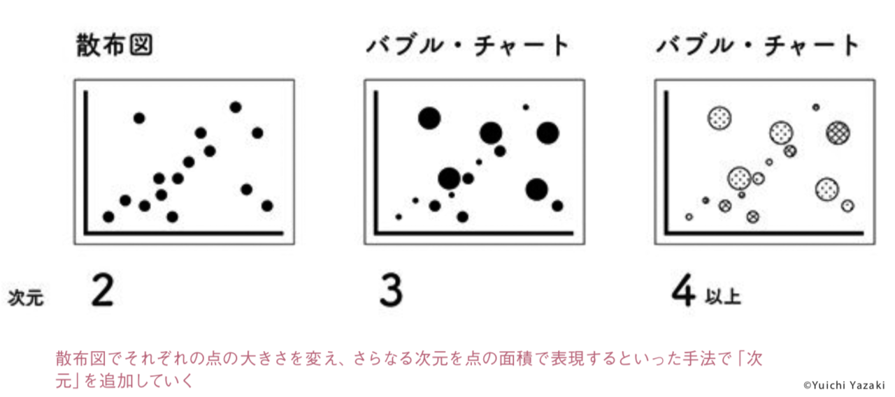

+++
author = "Yuichi Yazaki"
title = "データ可視化は相手の腹に落ちて価値が出る"
slug = "nikkeibd-201404"
date = "2019-08-24"
categories = [
    "principle"
]
tags = [
    "",
]
image = "images/thumb_ph_vizjp.png"
+++

※日経ビッグデータ2014年4月号掲載記事の転載です。

データ活用とデータ分析の間には「データ可視化」、最近は「データビジュアライゼーション」と呼ぶ段階が存在している。 オープンデータが広がる今、市民がビジュアライゼーションの基本を身に付けることが社会を変える第一歩となる。

情報デザインの世界で著名な米カリフォルニア 芸術大学デザイン戦略MBAプログラム・ディレクターのネイサン・シェドロフ氏が考案した「理解のスペクトル」という図だ。単なる「データ」が「知恵」になるステップを説明するものだ。

データはそのままでは人の記憶に残りづらい。量が膨大だったり、特徴が視覚的に捉えづらかったりするからだ。そこでチャートやグラフなどで表現すると、特徴を視覚的に捉えられ短期記憶に残る。これは「情報」と呼ぶが、過去の経験や記憶と結びつき自分ごとになり得る。

人はそれぞれ立場が異なる。データの絞り込みや視点の変更といった  
「柔らかで動的なユーザーインターフェース」が大事だ。うまく機能する ことで、腑に落ちる。これが「知識」であり、経験を通じて「知恵」になり、さらに同じ知識を多くの人が共有し常識となっていく。

### 相手の状況で異なる伝え方

こうして相手に何かを伝えようとするとき、相手が能動的に接しようとしているか、もしくは受動的かによっても伝え方を変えていく必要がある。また、相手の知識の多寡によっても、伝え方や伝える順番を考慮 する必要がある。知らないかつ受動的な場合、興味を持ってもらうために訴求方法を工夫し、エンタテインメント性を高めなければならない。

多くのチャートやグラフは、2次元(ディメンジョン)程度しか表現できず、工夫を凝らすことは難しい。そこで世に存在する多数のデータの中から適切なものを組み合わせ、次元を追加して表現することが有効である。意図したインサイトが表現できれば、誰にでも開かれた「データ分析の大衆化」につながる。

自治体や国がオープンデータを公開するようになった。また、国や自治体だけでなく民間企業のデータ活用を後押しするための基本法「官民データ活用推進基本法」が成立。個人が自身のデータの流通に積極的に関与するようになる。オリンピックまでの期間を国が「オープンデータ2.0」と名付けるなど、データ活用の社会的な機運が高まっている。

東京オリンピック・パラリンピックのボート・カヌー会場は提案時の会場が思いのほか高額になったため、他の候補地が検討された。五輪 組織委員会はコスト増大、選手輸送、宿泊施設など9つの問題点を挙げた。

仮にこれらを、それぞれの会場ごとに、実現度と足りない部分を追加するとどこにいくらかかるのか、全てを一覧できる一枚の大きなマトリックスのチャートで表現したらどうだったろう。1つの価値観、つまり1つの次元だけで比較できないからこそ、いくつもの価値観で同時に比較 することが欠かせない。

データから知識・知恵を紡ぎだし、人の心に寄り添い、社会をよりよくすることに役立てられるデータビジュアライゼーションの果たす役割がこれまで以上に重要となっている。市民が自らその基本を習得することが、知識、知恵を広げて社会を変える第一歩となる。
