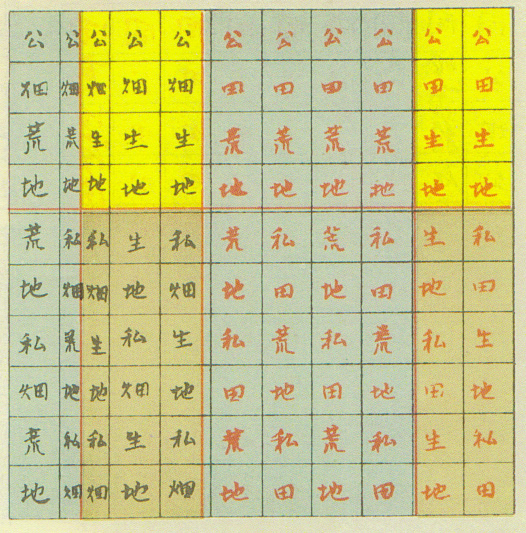

+++
author = "Yuichi Yazaki"
title = "Ninomiya Sontoku and the Idea of Land Classification"
slug = "ninomiya-sontoku-land-ratio-graph"
date = "2025-10-09"
categories = [
    "consume"
]
tags = [
    "",
]
image = "images/cover.png"
+++

In the late Edo period, the agricultural reformer and thinker **Ninomiya Sontoku (1787-1856)** conducted detailed land surveys and management reforms to revive struggling rural communities.

As part of this work, he created a diagram known as a **land ratio graph**, designed to visualize the proportions of rice fields, dry fields, cultivated land, and wasteland within an estate.

<!--more-->

The graph was later included in volume 10 of *The Complete Works of Ninomiya Sontoku* and was reintroduced in the journal *Surveying* in 2005 as an early example of Japanese land-survey thinking.

It is notable as a statistical land-classification diagram from Japan before modern cadastral surveying.

## How to Read the Diagram

The upper part of the diagram is labeled **public**, while the lower part is labeled **private**. These categories broadly correspond to tax-assessed land and privately cultivated or hereditary land. Each section is further divided into rice fields, dry fields, currently cultivated land, and wasteland. Rectangular area represents proportion.

| Category | Meaning | Position | Notes |
|---|---|---|---|
| Public | Land subject to tax or lordly control | Upper section | Public or domain land |
| Private | Land used or inherited by villagers | Lower section | Privately cultivated land |
| Rice field / dry field | Agricultural land class | Within each layer | Classified by use |
| Cultivated land | Land currently under cultivation | Light areas | Productive land |
| Wasteland | Uncultivated or abandoned land | Gray areas | Target for reclamation |

The structure is close in spirit to modern land-use classification maps and land-category statistics.

## Historical Significance

Sontoku surveyed land conditions while carrying out rural reconstruction projects for domains and the shogunate. In the Sakuramachi estate, in present-day Tochigi Prefecture, he analyzed the balance of fields and wasteland and used those measurements to plan reclamation and stabilize tax revenue.

By calculating the ratios of land use, he practiced a statistical form of agricultural administration. The graph is therefore more than an illustration; it is an early expression of rational land management in Japan.

## Terminology

Terms such as public, private, rice field, dry field, cultivated land, and wasteland were part of the practical vocabulary of Edo-period agricultural administration. Sontoku's categories align with the land-management language used in contemporary texts and tax practice.

## Summary

This graph is not related to ancient Chinese or ritsuryo land-allocation systems. It is the product of empirical land-use investigation in late Edo Japan. Sontoku connected moral and communal reform with quantitative understanding of land as a shared resource. In that sense, the diagram can be read as an early Japanese form of governance-oriented data visualization.

## References

- [National Diet Library Search: The Complete Works of Ninomiya Sontoku, Vol. 10](https://ndlsearch.ndl.go.jp/books/R100000039-I1243452)
- [Hotoku Museum](https://www.hotoku.or.jp/)
- [Wikimedia Commons: Ninomiya Sontoku Graph in 1823.jpg](https://commons.wikimedia.org/wiki/File:Ninomiya_Sontoku_Graph_in_1823.jpg)
- [CiNii Books: The Complete Works of Ninomiya Sontoku](https://ci.nii.ac.jp/ncid/BN0082116X)
