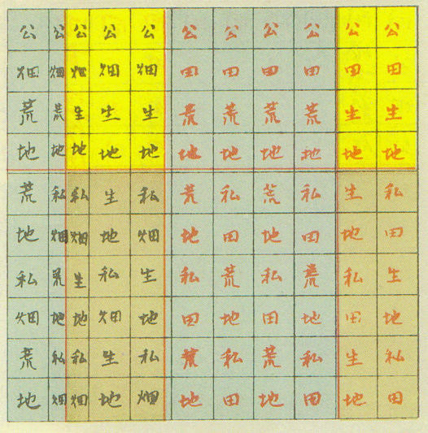

+++
author = "Yuichi Yazaki"
title = "二宮尊徳と「土地分類」の思想"
slug = "ninomiya-sontoku-land-ratio-graph"
date = "2025-10-09"
categories = [
    "consume"
]
tags = [
    "",
]
image = "images/cover.png"
+++

江戸時代後期、農政家・思想家として知られる **二宮尊徳（1787–1856）** は、荒廃した農村を復興するために独自の土地調査と経営改革を行いました。

その活動の中で尊徳は、領地の田・畑・荒地などを実地に調べ **土地利用の割合を可視化するための図表「量率グラフ」** を作成しました。

<!--more-->

この「量率グラフ」は、のちに『二宮尊徳全集』第10巻に収録され、さらに2005年刊『測量』誌（日本測量協会）に「国土調査の先駆者」として再紹介されています。

図は **近代地籍測量以前の日本における土地分類統計図** として注目される存在です。

## 図解の見方

図の上部には「公」、下部には「私」とあり、それぞれが「年貢対象地」と「私的耕作地」を意味します。さらに各段は「田」「畑」「生地」「荒地」に細分化され、矩形の面積比がその割合を表しています。尊徳自身はこの比率をもとに、荒地を耕作地へ転換し、年貢収入を安定させる方策を立てました。

| 区分 | 意味 | 位置 | 解説 |
|------|------|------|------|
| 公 | 年貢対象の土地 | 図の上段 | 領主に帰属する「公地」 |
| 私 | 自家耕作または永業地 | 図の下段 | 村民が利用・世襲可能な土地 |
| 田／畑 | 耕地分類 | 各段に配置 | 作付け用途に応じた区分 |
| 生地 | 現に耕作されている地 | 明色 | 既存の耕地 |
| 荒地 | 未耕地・休耕地 | 灰色 | 開墾対象地 |

この構成は、今日の「土地利用分類図（Land Use Classification Map）」や「地目別統計図」に近い概念を持ち **公・私の二層構造と地目区分を一図で表した** 初期の統計的地図表現です。

## 歴史的背景と制度的意義

尊徳は、藩や幕府から農村再建を命じられる中で、領地の現況を把握するために土地利用調査を行いました。
桜町領（現・栃木県真岡市付近）の復興では、田畑の面積比を分析し、荒地の開墾を促す政策を立案しています。

1830年代には冷害・飢饉に対応する作付け転換指導を行い、また **土地利用の「量率」を算出して村ごとの耕作比を最適化する** という、統計的な農政を実践しました。

このような活動から「量率グラフ」は単なる図解ではなく **近代国土調査や地籍測量に通じる合理的な土地認識の萌芽** とみなされています。

## 用語の整合と当時の語彙

図中で使われている「公」「私」「田」「畑」「生地」「荒地」という語彙は、当時の農政文献（『地方凡例録』『農業全書』など）にも登場する一般的な用語です。

特に「生地」「荒地」は天保期以降の土地整理や年貢徴収の際に用いられた分類であり、尊徳の分析は時代の実務語彙と完全に整合します。

## 測量・統計史における意義

日本の土地制度史において **視覚的な土地比率表現（図的統計）** が明確に確認できる事例はきわめて少なく、この「量率グラフ」は最古級の可視化資料とされます。
尊徳は自ら地図や地形図を作成し、測角儀・磁針コンパス・望遠鏡などを購入して現地測量も行っていたことが記録に残っています。

これらの活動は、今日の「土地分類調査」「地籍調査」の源流として再評価されています。

## まとめ

この図は、中国の「均田制」や律令国家の「班田収授法」とは無関係であり **江戸後期の実証的な土地利用調査の成果** です。尊徳は、道徳的教化（報徳思想）と並行して、土地という「公共資源」を定量的に把握し、農村再建に結びつけました。それは後世の統計地図・地籍調査・土地分類制度へとつながる **日本型ガバナンス・データビジュアライゼーションの原型** といえます。

## 参考・出典

- [国立国会図書館サーチ「二宮尊徳全集 第10巻」](https://ndlsearch.ndl.go.jp/books/R100000039-I1243452)
- [国立国会図書館 リサーチ・ナビ「二宮尊徳関係資料」](https://ndlsearch.ndl.go.jp/rnavi/oldmaterials/sontoku)
- [報徳博物館 公式サイト](https://www.hotoku.or.jp/)
- [報徳博物館「二宮尊徳と報徳」](https://www.hotoku.or.jp/sontoku/)
- [日光市「歴史民俗資料館・二宮尊徳記念館の概要」](https://www.city.nikko.lg.jp/soshiki/10/1041/3/1960.html)
- [真岡市「二宮尊徳資料館」](https://www.city.moka.lg.jp/kakuka/bunka/gyomu/rekishi_bunka/rekishi_bunkazai/5/index.html)
- [Wikimedia Commons: Ninomiya Sontoku Graph in 1823.jpg](https://commons.wikimedia.org/wiki/File:Ninomiya_Sontoku_Graph_in_1823.jpg)
- [CiNii Books「二宮尊徳全集」書誌](https://ci.nii.ac.jp/ncid/BN0082116X)