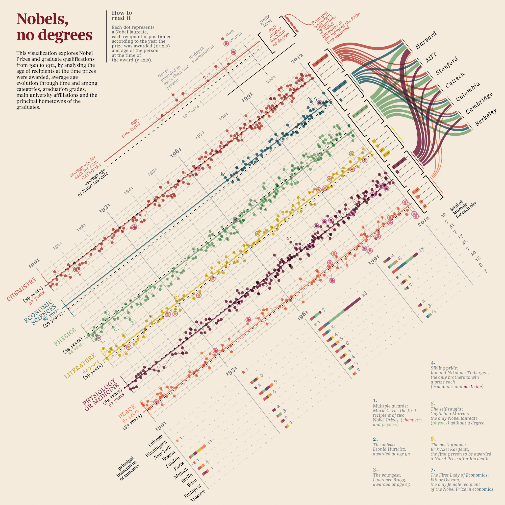
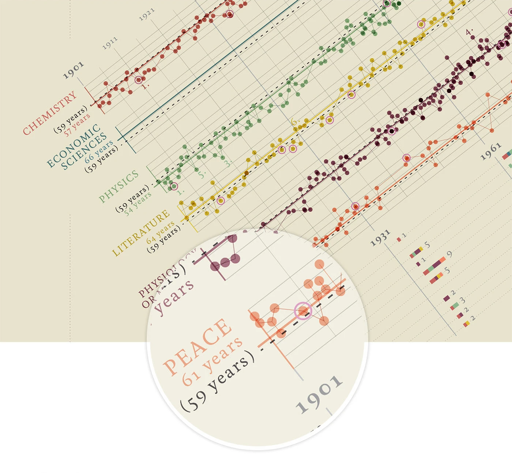
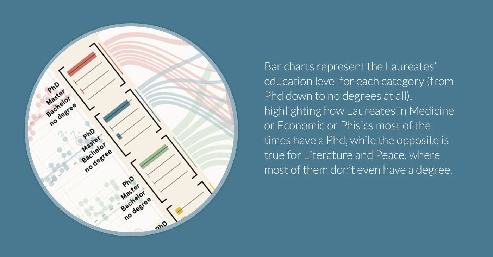
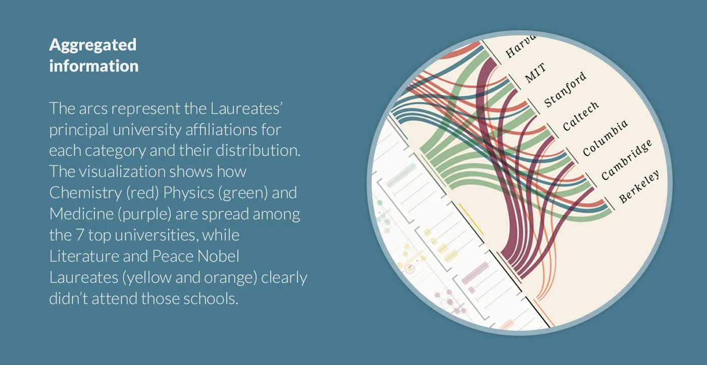
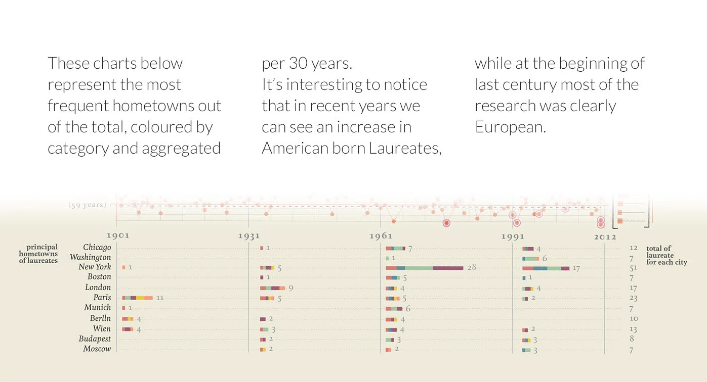
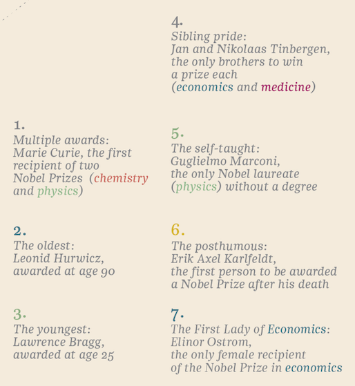

+++
author = "Yuichi Yazaki"
title = "Nobels, No Degrees: Visualizing Genius Beyond Credentials"
slug = "nobels-no-degrees"
date = "2025-10-06"
description = ""
categories = [
    "consume"
]
tags = [
    "複数チャートの組み合わせ"
]
image = "images/cover.png"
+++

**Nobels, no degrees** is a data visualization by **Giorgia Lupi** that examines the educational backgrounds and ages of Nobel Prize winners from 1901 to 2012.

The phrase "no degrees" points to the presence of Nobel laureates who did not hold formal academic degrees. The work asks readers to look beyond credentialism and consider the many paths through which knowledge and creativity emerge.

<!--more-->

## How to Read It

The poster is dense, but it is organized into clear information layers.

### 1. Age and Timeline

The central dot-and-line structure plots:

- **X axis**: Nobel Prize year, from 1901 to 2012
- **Y axis**: laureate age
- **Dot**: one laureate
- **Double-ring dot**: female laureate
- **Color**: prize category, such as Chemistry, Economics, Physics, Literature, Medicine, or Peace

Average laureate ages are shown by category, making it possible to see the tendency for Nobel recognition to come later over time.

### 2. Education

The bar chart on the left compares highest degree by category:

- PhD
- Master's
- Bachelor's
- No degree

Scientific fields are dominated by PhDs, while Literature and Peace include more laureates outside formal academic pathways.

### 3. University Affiliation

The flow diagram in the upper right shows links between laureates and major universities, including Harvard, MIT, Stanford, Caltech, Columbia, Cambridge, and Berkeley. The absence or thinness of flows for Literature and Peace suggests that those categories are less tied to elite university affiliation.

### 4. Birthplace

The lower chart groups laureates' birthplaces into 30-year periods. It shows the geographic center of Nobel recognition shifting from European cities such as London, Paris, and Berlin toward American research centers such as Chicago, Boston, and Stanford.

### 5. Seven Notable Laureates

The lower-right notes highlight seven cases, including Marie Curie, Lawrence Bragg, Leonid Hurwicz, Guglielmo Marconi, and Elinor Ostrom. These examples reinforce the theme that achievement follows many different life paths.

## Significance

The visualization questions the relationship between educational institutions and creativity. It does not deny the importance of formal education, but it places degree holders and non-degree holders in the same visual field, making the diversity of intellectual trajectories visible.

## Summary

"Nobels, no degrees" treats the Nobel Prize not only as a record of achievement, but also as a human dataset of age, geography, gender, affiliation, and education. It is a data story about the nonlinear paths through which knowledge is produced.

## References

- [Nobels, no degrees — Behance](https://www.behance.net/gallery/14159439/Nobel-no-degrees)
