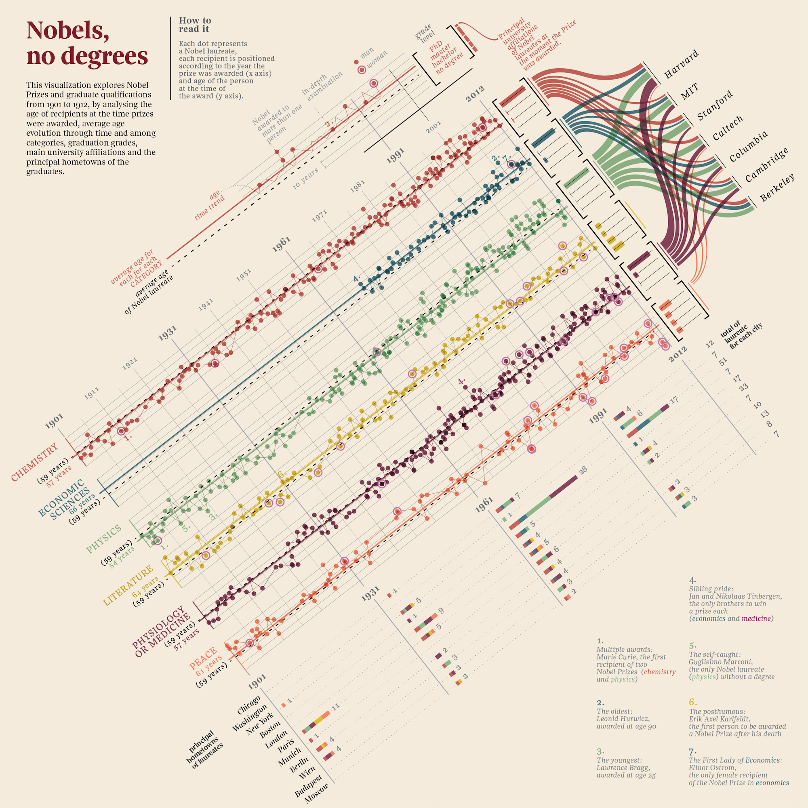
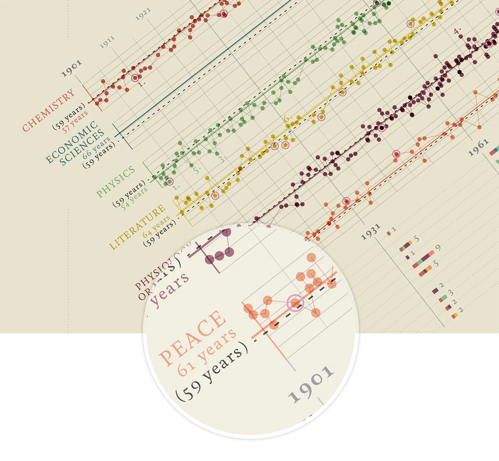
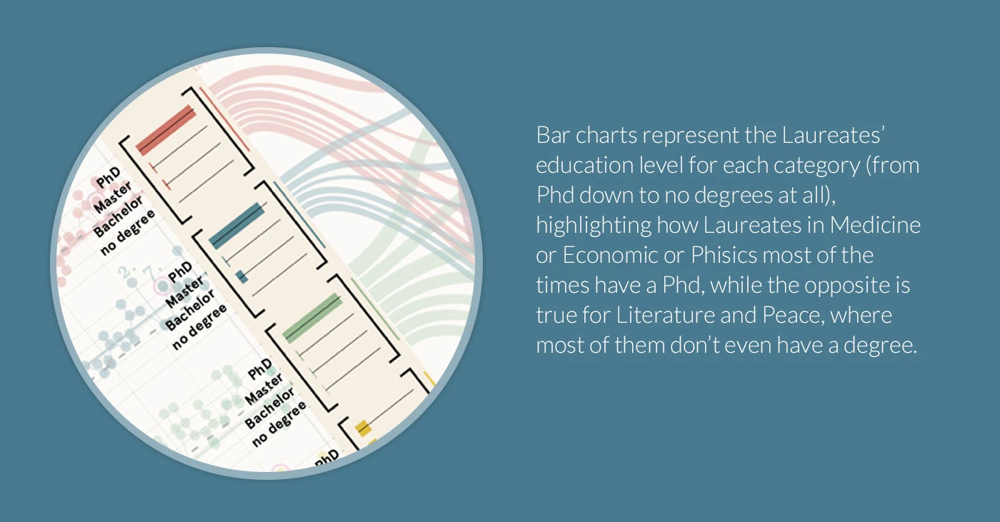
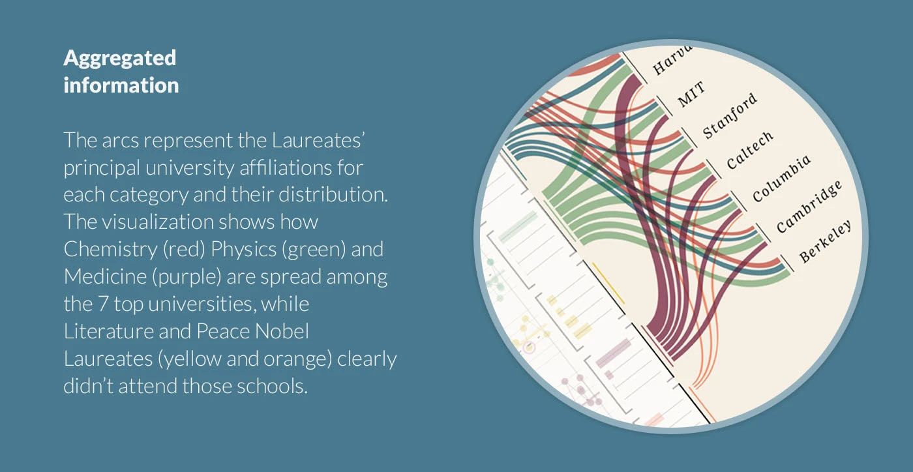
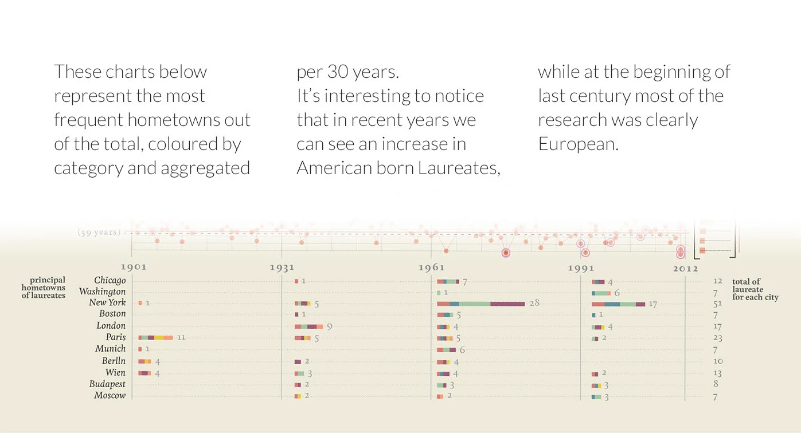
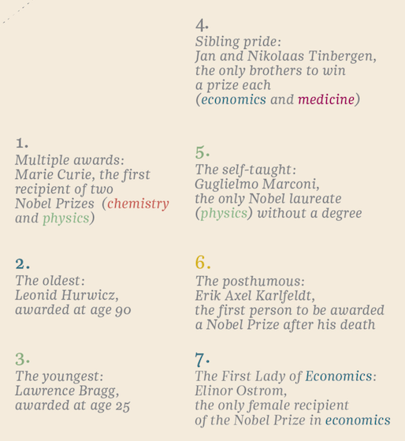

+++
author = "Yuichi Yazaki"
title = "学位のない天才たちを可視化する"
slug = "nobels-no-degrees"
date = "2025-10-06"
description = ""
categories = [
    "consume"
]
tags = [
    ""
]
image = "images/cover.png"
+++

**「Nobels, no degrees」** は、データ・ヴィジュアライゼーション・デザイナー **Giorgia Lupi** による作品で、1901年から2012年までの **ノーベル賞受賞者の学歴と年齢の傾向** を可視化したものです。

タイトルの **"no degrees（学位なし）"** は、ノーベル賞受賞者の中に正式な学位を持たない人物が存在するという事実を象徴しており、**教育制度や学歴偏重の枠組みを超えて「知の多様性」を描く**ことを目的としています。

Lupiは、データを数値ではなく「人間の物語」として扱う **データ・ヒューマニズム（Data Humanism）** の提唱者であり、本作はその代表的な実践例です。

<!--more-->

## 図解の見方

この作品は、一見複雑な大判ポスターですが、明確な構成ロジックに基づいて設計されています。全体は次の4つの情報レイヤーで構成されています。

### 1. 年齢と時系列

中央の折れ線状ドットチャートが主構造です。

- **横軸（X軸）** ：ノーベル賞の**授与年（1901–2012）**
- **縦軸（Y軸）** ：受賞者の**年齢**
- **各点（dot）** は1人の受賞者を表し、
  - **二重円（double-rounded dots）** は **女性受賞者** を示します。
  - **カテゴリごとに色分け** ：
    - 化学（赤）
    - 経済学（青緑）
    - 物理学（緑）
    - 文学（黄）
    - 医学（紫）
    - 平和（橙）

平均受賞年齢（例：物理・化学＝59歳、平和＝61歳）が各賞ごとにタイトル下部に記され、時代とともに受賞年齢が上昇する傾向を確認できます。

### 2. 学歴

左側の棒グラフでは、各分野の受賞者の最終学位を比較します。

- **PhD（博士）**
- **Master（修士）**
- **Bachelor（学士）**
- **No degree（学位なし）**

この部分は「受賞者カテゴリ × 学位レベル」の二次元ヒートマップ的構造を持ち、教育的達成度と分野の専門性の相関を視覚的に表現しています。科学系（物理・化学・医学・経済学）はPhDが多数を占める一方、文学や平和賞では学位を持たない例が顕著です。

### 3. 所属大学

右上の流線図（サンキー・ダイアグラム）は、受賞者の主要な大学所属を示しています。

- 主な7大学：
  - Harvard
  - MIT
  - Stanford
  - Caltech
  - Columbia
  - Cambridge
  - Berkeley
- 流線の色はカテゴリに対応（化学＝赤、物理＝緑、医学＝紫など）

この部分は「大学 ↔ 受賞者分野」の双方向ネットワークであり、ノード間の太さは受賞者数の分布を反映しています。文学・平和の流線がほとんど存在しないことから **これらの分野は大学制度外の文脈で評価される傾向** が視覚化されています。

### 4. 出身地

下部の棒グラフは、30年ごとに区切った受賞者の出身地分布を示します。

- 1901年：ロンドン・パリ・ベルリンが中心（ **ヨーロッパ主導** ）
- 1961年以降：シカゴ、ボストン、スタンフォードなど **アメリカ出身者が急増**

この部分は時間スライス（30年ごと）における都市別頻度分布で **研究の地理的重心がヨーロッパからアメリカへ移行した様子** を定量的に可視化しています。

### 5. 特筆される7人の受賞者

右下には、作品中で特筆される7人の受賞者が紹介されています：

1. **Marie Curie** – 二度の受賞（化学・物理）
2. **Leonid Hurwicz** – 最年長（90歳）
3. **Lawrence Bragg** – 最年少（25歳）
4. **Jan & Nikolaas Tinbergen** – 兄弟で別分野受賞（経済学・医学）
5. **Guglielmo Marconi** – 学位なしの物理学賞受賞者
6. **Erik Axel Karlfeldt** – 死後受賞（文学）
7. **Elinor Ostrom** – 経済学賞唯一の女性受賞者

これらは作品全体のテーマ **no degrees（学位に依存しない知）** を象徴的に補強しています。

## 背景と意義

この可視化は、単なるデータの可読化を超えて **「教育制度と創造性の関係」** を問い直しています。  
高学歴の科学者だけでなく、形式的な学位を持たずに世界を変えた人物たちも並列に描かれることで **「知の到達は教育経路の多様性によって支えられている」** というLupiの思想が明確に伝わります。

## まとめ

『Nobels, no degrees』は、ノーベル賞という“知の権威”を題材に、 **人間の学びと発見の非線形性** を可視化した作品です。  
学位・年齢・出身・性別・所属といった属性を超え、それぞれの人生の「知への道筋」を等価に描くことで **「学び」と「創造」の関係を再定義するデータ叙事詩** として機能しています。

この作品を通じて、Giorgia Lupiが掲げる「データを人間的なものとして扱う」という理念が、視覚的にも哲学的にも結実していることがわかります。

## 参考・出典

- [Nobels, no degrees :: Behance](https://www.behance.net/gallery/14159439/Nobel-no-degrees)