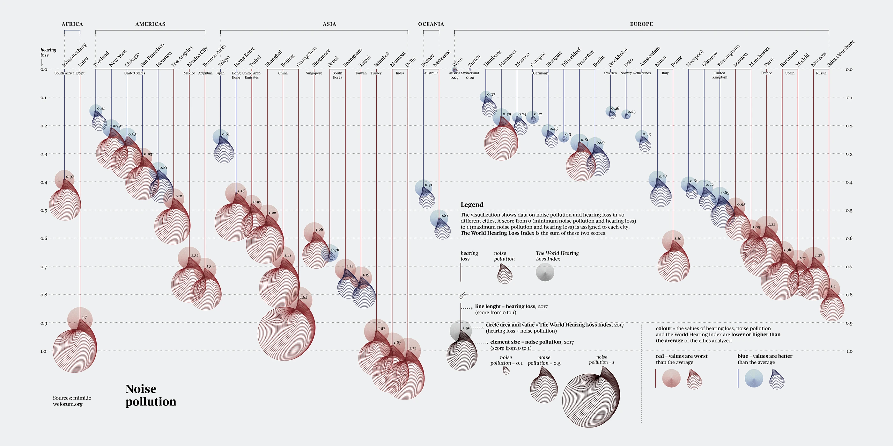
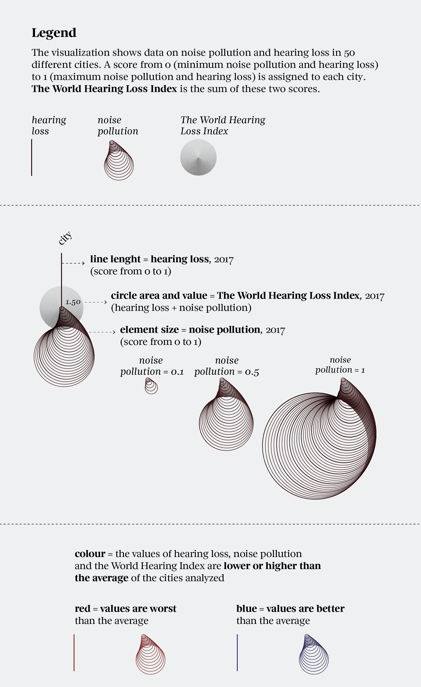

+++
author = "Yuichi Yazaki"
title = "Noise Pollution: Visualizing Urban Noise and Hearing Loss"
slug = "noise-pollution"
date = "2025-10-05"
description = ""
categories = [
    "consume"
]
tags = [
    "オリジナルのビジュアル変換",
]
image = "images/cover.png"
+++

This work compares **noise pollution** and **hearing loss** in major cities around the world. The data is based on a joint study by **mimi.io**, a company specializing in hearing data analysis, and the **World Economic Forum**.

Across 50 cities, it quantifies the relationship between urban noise environments and auditory health through the **World Hearing Loss Index**.

<!--more-->

## Author and Context

The visualization was created for *Visual Data*, the data visualization column in *La Lettura*, the cultural supplement of *Corriere della Sera*. Designer **Federica Fragapane** is known for turning complex social data into structured and poetic visual forms. Here, she connects the sound of cities with public health.

## How to Read the Legend

Each city is represented by a vertical line and a circle at its end:

- the **line** represents hearing loss
- the **circle** represents noise pollution
- the **number** inside the circle represents the combined World Hearing Loss Index

### 1. Noise Pollution

Noise pollution measures the average noise level of a city, including traffic, construction, nightlife, and other persistent urban sound. The score ranges from 0 to 1.

In the visualization, it is represented by circle size. Larger circles indicate louder cities.

### 2. Hearing Loss

Hearing loss measures the average reduction in residents' hearing ability, also on a 0 to 1 scale.

It is represented by the length of the vertical line. Longer lines indicate greater hearing loss.

### 3. World Hearing Loss Index

The index combines the noise pollution score and hearing-loss score. It is printed inside each circle. Higher values indicate cities where both noise and hearing loss are more severe.

### 4. Color

Color compares each city with the overall average:

- **Red**: worse than average
- **Blue**: better than average

## Reading the Relationship

The important point is to compare circle size and line length together.

- Long line and large circle: serious noise and hearing loss
- Short line and small circle: quieter city with lower hearing impact
- Short line but large circle: noisy city where hearing impact may not yet be severe
- Long line but small circle: hearing loss may be shaped by factors beyond current noise levels

## Background

Urban noise is increasingly treated as a public-health issue. Traffic, construction, entertainment districts, and dense urban activity can affect sleep, stress, cardiovascular health, and hearing. The World Health Organization has warned that environmental noise is an important form of pollution in cities.

## Summary

"Noise pollution" shows that quietness is not merely an aesthetic quality of a city. It is part of public health, welfare, and urban policy. By pairing environmental noise with hearing outcomes, the visualization makes the hidden cost of noisy cities visible.

## References

- [Noise pollution — Behance](https://www.behance.net/gallery/96908251/Noise-pollution)
- [World Economic Forum: Cities with the worst noise pollution](https://www.weforum.org/stories/2017/03/these-are-the-cities-with-the-worst-noise-pollution/)
- [Mimi World Hearing Index](https://mimi.io/hearing-science/world-hearing-index)
