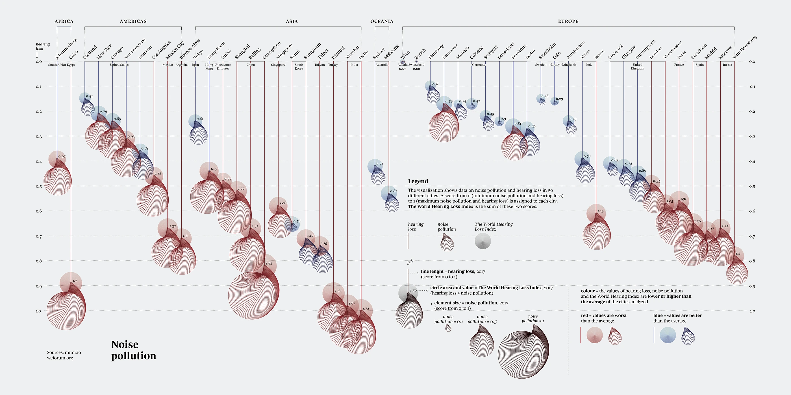
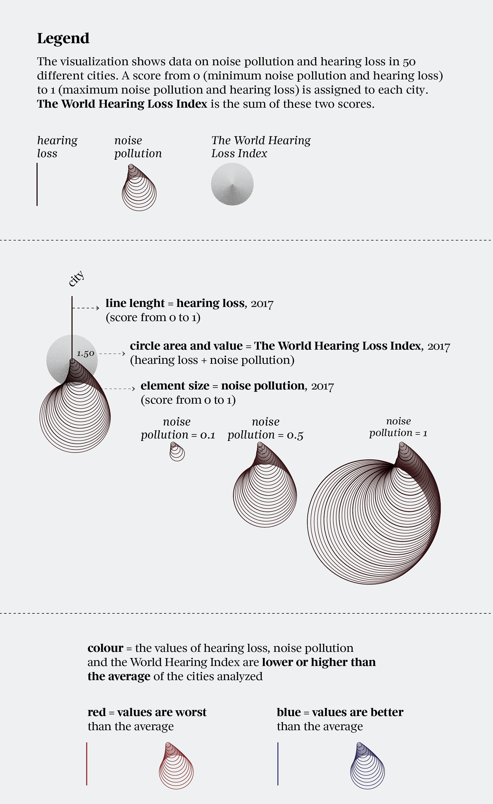

+++
author = "Yuichi Yazaki"
title = "世界都市の騒音汚染と難聴指数を可視化する「Noise pollution」"
slug = "noise-pollution"
date = "2025-10-05"
description = ""
categories = [
    "consume"
]
tags = [
    "オリジナルのビジュアル変換",
]
image = "images/cover.png"
+++

この作品は、世界の主要都市における **騒音汚染（noise pollution）** と **聴覚損失（hearing loss）** の関係を比較したものです。  
データは、聴覚データ分析を専門とする **mimi.io** と、世界経済フォーラム **(World Economic Forum)** の共同調査に基づいています。
50都市を対象に、騒音環境と聴覚への影響を数値化し、都市ごとの「 **World Hearing Loss Index（世界聴覚損失指数）** 」として表しています。

<!--more-->

## 作者情報

この作品は、イタリアの主要新聞 *Corriere Della Sera* の文化別冊「 *La Lettura* 」内のデータビジュアライゼーション欄「 *Visual Data* 」のために制作されたものです。  
作者のフェデリカ・フラガパーネ（Federica Fragapane）は、複雑な社会データを詩的かつ構造的に可視化することで知られるデータビジュアライゼーション・デザイナーです。  
本作でも、科学的データと美的表現を両立させ **都市の「音」と「健康」を結びつける新しい視覚言語** を提示しています。

## 凡例の読み方と構造の理解

この作品は **都市ごとの「騒音環境」と「聴覚への影響」を同時に可視化** したものです。  
各都市は一本の縦線と、その先端に描かれた円で表されます。そして、

- **線** が示すのは「聴覚損失」  
- **円** が示すのは「騒音汚染」  
- **数値** が示すのは「両者を合算した総合指数（World Hearing Loss Index）」  

です。この3要素が連動しており、「 **音のうるささが、耳への影響にどの程度つながっているか** 」を読み解くことが、この作品の肝です。

### 1. 騒音汚染（Noise Pollution）

**定義：**
都市の平均的な騒音レベルを数値化したもの。  
交通量、工事、夜間活動など、日常環境における持続的な騒音を指します。  
スコアは **0（静か）〜1（非常にうるさい）** の範囲で表されます。

**図での表現：**
- 円の「大きさ」で表現されます。円が大きいほど騒音が強いです。
- 例：右下に位置する都市ほど、騒音が深刻な傾向があります。

### 2. 聴覚損失（Hearing Loss）

**定義：**  

住民の聴覚能力の低下度合いを示す指標。  
長期的な騒音暴露や加齢による平均的な聴力低下が数値化されています。  
こちらも **0（正常）〜1（高度な損失）** のスコアです。

**図での表現：**  

- 各都市の「縦線の長さ」で表されます。線が長いほど聴覚損失が大きい（＝耳が悪くなっている）。  
- 都市の並びは地域別（アフリカ、アメリカ、アジア、オセアニア、ヨーロッパ）に分類されています。  

### 3. 世界聴覚損失指数（The World Hearing Loss Index）

**定義：**  
騒音汚染スコアと聴覚損失スコアを足し合わせた総合値。  
都市の「騒音による健康影響」をひとつの数値にまとめたものです。

**図での表現：**  
- 円の内部に記された数値（例：0.97）として表示されます。  
- この数値が高い都市ほど、「騒音も聴覚損失も共に深刻」であることを意味します。

### 4. 色（Colour）

**定義：**  
都市ごとの値が、全都市平均より良いか悪いかを示す相対評価です。

**図での表現：**  
- **赤（Red）** ：平均より悪い（＝騒音も損失も大きい）  
- **青（Blue）** ：平均より良い（＝静かで耳にも優しい）  

**意味：**  
色を追うことで、どの地域が「より静かで健康的」か、あるいは「騒音の悪循環に陥っているか」を直感的に把握できます。

### 2つの指標を「同時に見る」ことのポイント

この作品は、「騒音が大きい都市が本当に耳への影響も大きいのか？」を一目で比較できるよう設計されています。  
具体的には、

- **線が長くて、円が大きい都市** ...騒音も損失も深刻（たとえばカイロ、広州など）  
- **線が短くて、円が小さい都市** ...静かで聴力への影響が少ない（たとえばストックホルム、オスロなど）  
- **線が短いのに円が大きい都市** ...騒音は多いが、まだ耳への影響は限定的（短期的問題）  
- **線が長いのに円が小さい都市** ...騒音以外の要因（加齢や産業構造など）が影響している可能性

つまり **円（騒音）と線（聴覚損失）を「対応づけて」見ることが、この作品の理解の核心** です。

### 凡例の一覧

| 要素 | 意味 | 図での表現 | 読み取りのポイント |
|------|------|-------------|------------------|
| 騒音汚染 | 都市のうるささ | 円の大きさ | 大きいほど騒音が大きい |
| 聴覚損失 | 平均的な聴力低下 | 線の長さ | 長いほど聴力損失が大きい |
| 総合指数 | 騒音＋聴覚損失 | 円の中の数値 | 値が高いほど深刻 |
| 色 | 相対的な良し悪し | 赤／青 | 赤＝悪化、青＝良好 |

## 背景知識

この可視化の背景には **都市生活が人間の聴覚に与える影響** を定量的に把握しようとする試みがあります。  
近年、世界保健機関（WHO）は、都市部の環境騒音を「新しい公害」と位置づけており、交通騒音・建設音・娯楽施設の音量などが人の健康を脅かす要因として警鐘を鳴らしています。

たとえば、図中で赤色が目立つ都市は、交通量や人口密度が極めて高く、生活騒音が深刻であることが知られています。  
一方、青色で示された都市は、環境規制が厳しく、都市設計の段階で静音性が重視されている点が特徴です。

## まとめ

この作品は、単なる環境データの比較にとどまらず **「都市の静けさ」は社会的な豊かさの指標でもある** ということを可視化しています。  
騒音汚染はもはや生活の副産物ではなく、健康・福祉・都市政策を横断する重要なテーマです。  
静かな都市は、人間の幸福度を支える「インフラ」でもあることを、この図は美しく明快に示しています。

## 参照リンク

- [Noise pollution :: Behance](https://www.behance.net/gallery/96908251/Noise-pollution)
- [These are the cities with the worst noise pollution :: World Economic Forum](https://www.weforum.org/stories/2017/03/these-are-the-cities-with-the-worst-noise-pollution/)
- [Mimi World Hearing Index :: Mimi Hearing Technologies](https://mimi.io/hearing-science/world-hearing-index)