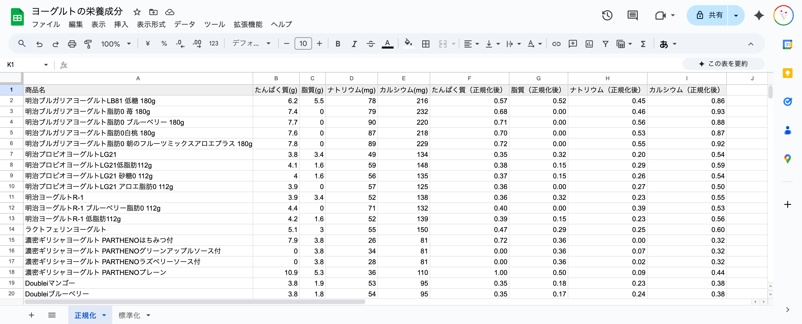
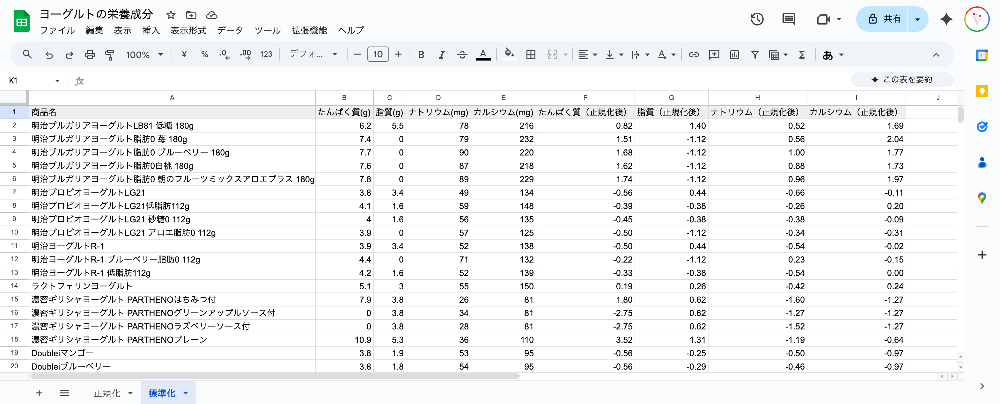

+++
author = "Yuichi Yazaki"
title = "Googleスプレッドシートで学ぶ「正規化・標準化」の考え方"
slug = "normalize-standarize"
date = "2025-10-16"
categories = [
    "technology"
]
tags = [
    "",
]
image = "images/yogurt.png"
+++

チャートは「きれいに描くこと」よりも **「正しく比べること」** が大事です。  

単位や桁の違いをそのまま放置せず、正規化・標準化を通して「公平な形」にしてあげることで「本当のバランス」が見えてきます。

<!--more-->


## はじめに

「このヨーグルト、タンパク質が多い」
「こっちのは炭水化物が多い」

そんなふうに、いくつかのヨーグルトを並べて**栄養バランスを比較**したいとき、レーダーチャートはとても便利な方法です。

でも、いざ数字を入れてみると……

> 炭水化物の数値だけ大きくて、形がいびつ。
> たんぱく質よりもカルシウムが大きいが、実は単位がミリグラムとグラム。

そう **栄養成分ごとに単位やスケールが違う** ため、そのままでは「形の比較」ができません。

そこで登場するのが **正規化（Normalization）** と **標準化（Standardization）** です。


## 正規化とは「それぞれを0〜1におさめる」

正規化とは **最小値を0、最大値を1にしてスケールをそろえる** ことです。
たとえば、タンパク質が3〜10gの範囲でばらついている場合、

| 商品 | タンパク質 (g) | 正規化後の値 |
|------|----------------|---------------|
| A | 3 | 0.00 |
| B | 5 | 0.29 |
| C | 10 | 1.00 |

といった具合に、すべて「0〜1」の間に変換されます。
こうすることで、どの栄養素も**同じ物差し**で比べられるようになります。

### スプレッドシートでの式

```
=(B2 - MIN($B$2:$B$10)) / (MAX($B$2:$B$10) - MIN($B$2:$B$10))
```

- `B2` … 今のセルの値  
- `MIN($B$2:$B$10)` … その列の最小値  
- `MAX($B$2:$B$10)` … その列の最大値  
- `$` … 範囲を固定する記号（コピーしてもズレないように）

> 注：対象データの範囲が2行目から20行目まである場合 「$B$2:$B$20」 とします。




## 標準化とは「平均を0、ズレを数値化する」

もうひとつの方法が「標準化」です。
こちらは **平均を0にして、平均からどれくらい離れているか** を示すものです。

| 商品 | 脂質 (g) | 標準化後の値 |
|------|----------|---------------|
| A | 1.2 | -1.05 |
| B | 2.5 | 0.12 |
| C | 4.0 | 1.27 |

プラスなら平均より多い、マイナスなら少ない、という見方になります。

### スプレッドシートでの式

```
=(B2 - AVERAGE($B$2:$B$10)) / STDEV($B$2:$B$10)
```

- `AVERAGE()` … 平均を計算  
- `STDEV()` … 標準偏差（ばらつきの大きさ）

> 注：対象データの範囲が2行目から20行目まである場合 「$B$2:$B$20」 とします。

この方法は「平均との差」を見る分析に向いています。
結果がマイナスになることがあるので、レーダーチャートに使うときは注意してください。




## どちらを使えばいいの？

| 目的 | 向いている方法 | 特徴 |
|------|----------------|------|
| 0〜1の間で比較したい | 正規化 | 値がきれいに0〜1に収まる。レーダーチャートに最適。 |
| 平均との差を分析したい | 標準化 | 平均を基準に、プラス・マイナスで比較できる。 |

初心者がまずレーダーチャートを描きたいときは **正規化（0〜1にそろえる）** から始めるのがおすすめです。


## まとめ

- 正規化＝ **スケールを0〜1にそろえる**  
- 標準化＝ **平均を0、ばらつきをそろえる**  
- どちらも「バラバラの単位を共通の物差しにする」ための手法  
- スプレッドシートでも数式ひとつで簡単にできます！


## おわりに

チャートは「きれいに描くこと」よりも **「正しく比べること」** が大事です。  

単位や桁の違いをそのまま放置せず、正規化・標準化を通して「公平な形」にしてあげることで「本当のバランス」が見えてきます。


## おまけ

説明に用いたスプレッドシートです。データ自体は少し古いですが、セルに埋め込まれた計算式は参照できると思います。お役立てください。

- [ヨーグルトの栄養成分](https://docs.google.com/spreadsheets/d/13ONRlk_UlW7z2iI3Rkstbj5xDbyvFEGrcaMsgFytMM0/edit?usp=sharing)


## 参考・出典

- [Google スプレッドシートの関数リファレンス](https://support.google.com/docs/table/25273)
- [Normalization vs Standardization — Towards Data Science](https://towardsdatascience.com/standardization-vs-normalization-dc81f23085e3/)
