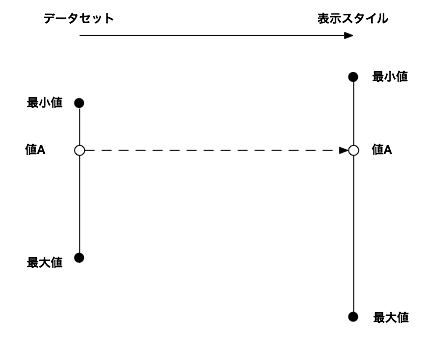
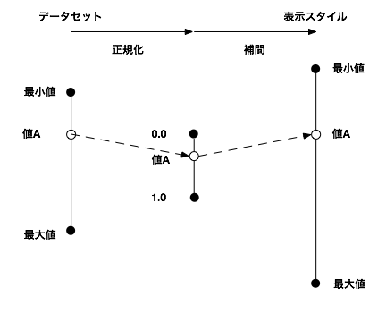
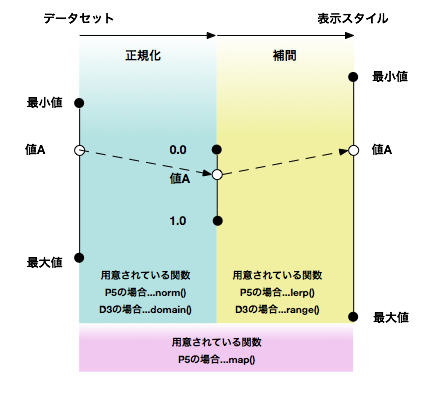

+++
author = "Yuichi Yazaki"
title = "ビジュアライズにおける正規化"
slug = "normalize-visualize"
date = "2014-03-24"
categories = [
    "technology"
]
tags = [
    "d3-js","processing"
]
image = "images/fi_Normalize.png"
+++

たとえばある変数の値が350の場合、ある棒グラフではY座標はいくつになるでしょうか。またはあるバブルチャートでは円の直径はいくつになるでしょうか。

インプットとしてのデータセットが持つ数値体系や幅（最小値〜最大値）などは、たいていアウトプット先の例えば液晶ディスプレイなどとは数値体系や幅（例えば表示領域など）が異なるため、両者をつなぐための方法論が必要になります。視覚化される要素の座標や大きさだけではなく、色や数値ではない例えばカテゴリーなどにも同様の手法が適用可能です。

Processingではmap、D3ではscaleという機能でまとめられています。しかしここには「正規化」という概念が隠されています。正規化という言葉にはいくつかの意味があり、ここではベクトルにおける正規化のことを指します。

その変数が含まれるデータセット全体（もしくは基準とすべき）最小値〜最大値の幅の中で、どの辺りにあるかを、0.0〜1.0の間で数値化します。そしてその値を表示のための値として再度変換します。

前者を正規化(normalize)、後者を補間(interpolation)と呼ばれることが多いです。

※P5...ビジュアライズのためのフレームワークProcessingの略称。P5には他にもnormalize()やlerpColor()などの関数もありますがわかりやすさのために図からは省略しています。

なんでこんなことをするのかというと、いくつか理由があげられます。

### １回正規化されたデータは、様々な表示スタイルに利用可能。

ユーザーインタラクションによって、表示領域の幅が変更されたり、レイアウトのフォーマットが棒グラフから地図へ変更されても、正規化されたデータは有効で、表示スタイルにあわせて補間して使えばよいです。補間というと語感的に少しわかりづらいですが、イメージ的には伸張とかレンダリングという言葉が近いかもしれません。

### 異なるデータを同様に扱うことができる。

いったん正規化という枠にはめることで、多様なデータを同様に扱うことができるようになります。たとえば統計データとセンサーが取得したデータを関連づけて表示することも可能になります。

### プログラムが生成する値との親和性

プログラム内部で生成される乱数やパーリンノイズ、またサイン／コサインなど三角関数で生成される値なども正規化された値（0.0〜1.0）で用意されることが多いです。外部から取り込んだ数値も、プログラム内部で生成された数値も、同様に扱うことができるようになります。

### 正規化と補間は、正比例で入出力がなされるべきとは限らない。

描くグラフによって y=ax+b のような正比例、ではない関数を用いるものがあるためです。  
Processingの場合、組み込み関数ではおそらく正比例のみが用意されています。  
D3では統計学で必要なものが一通り用意されているので最適なものを選ぶことができます。一つのオブジェクトにつき正規化と補間で同じスケーリングの仕方が適用されます。
