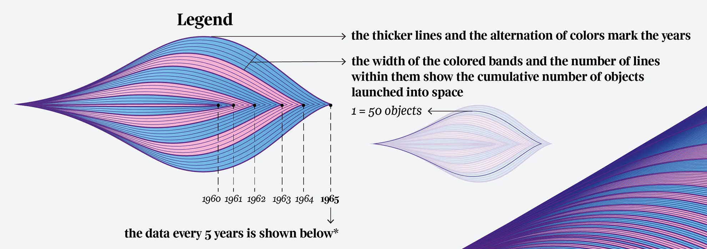
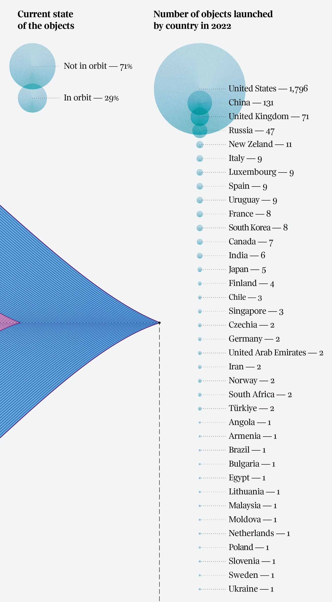

+++
author = "Yuichi Yazaki"
title = "Objects Launched into Space"
slug = "objects-launched-into-space"
date = "2025-10-05"
description = ""
categories = [
    "consume"
]
tags = [
    "オリジナルのビジュアル変換",
]
image = "images/cover.png"
+++

This infographic visualizes every human-made object launched into space since Sputnik in 1957. It appeared in **La Lettura**, the cultural supplement of **Corriere della Sera**, as part of the annual "Orizzonti Visual Data" series.

<!--more-->

## Overview

The central wave-like form represents the cumulative number of objects launched into space from 1957 to 2022, including satellites, rockets, probes, and stations.

- Thick lines and alternating colors mark year boundaries.
- Layer width and line density indicate cumulative launches.
- One line corresponds to about 50 objects.
- Alternating pink and blue create a five-year rhythm across time.

At the right edge, the graphic summarizes launches by country in 2022 and the current status of objects in orbit.

## How to Read the Legend

The left legend explains that each layer grows as more objects are launched. The expanding form becomes a visual history of human activity beyond Earth.

The right legend shows launches by country in 2022. Circle size represents count. The "Current state of the objects" section indicates the share that remains in orbit and the share that has decayed or left orbit.

## Background and Data

The work shows the acceleration of space activity over time. Since the 2010s, launches have increased sharply, driven in part by private companies such as SpaceX and by the growth of satellite constellations.

The data is based on statistics from **Our World in Data**. For 2022, the graphic highlights the scale of national launch activity, with the United States far ahead of other countries.

## Summary

Federica Fragapane's "Objects launched into space" sits at the intersection of scientific history and data aesthetics. It turns the accumulation of space activity into a physical-looking form, making time, quantity, and technological expansion visible at once.

## References

- [Objects launched into space — Behance](https://www.behance.net/gallery/169039001/Objects-launched-into-space?locale=en_US)
- [Cumulative number of objects launched into outer space — Our World in Data](https://ourworldindata.org/grapher/cumulative-number-of-objects-launched-into-outer-space)
- [Annual number of objects launched into outer space — Our World in Data](https://ourworldindata.org/grapher/yearly-number-of-objects-launched-into-outer-space)
- [United Nations Register of Objects Launched into Outer Space — UNOOSA](https://www.unoosa.org/oosa/en/spaceobjectregister/index.html)
- [Online Index of Objects Launched into Outer Space — UNOOSA](https://www.unoosa.org/oosa/osoindex/search-ng.jspx)
- [Space Exploration and Satellites — Our World in Data](https://ourworldindata.org/space-exploration-satellites)
