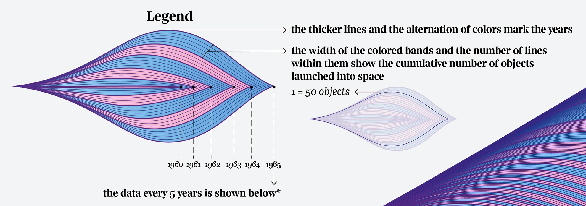
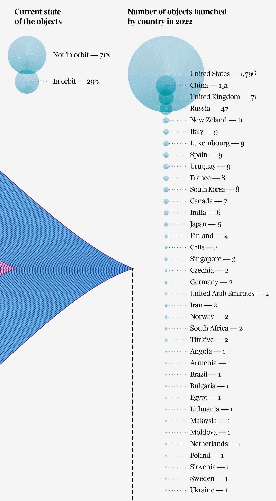

+++
author = "Yuichi Yazaki"
title = "宇宙へ打ち上げられた物体たち"
slug = "objects-launched-into-space"
date = "2025-10-05"
description = ""
categories = [
    "consume"
]
tags = [
    "オリジナルのビジュアル変換",
]
image = "images/cover.png"
+++

この作品は、1957年のスプートニク打ち上げ以降に宇宙へ送られたすべての人工物を、時間軸に沿って丁寧に可視化したインフォグラフィックスです。イタリアの新聞 **Corriere della Sera** の文化別冊 **La Lettura** に掲載され、毎年恒例の「Orizzonti Visual Data」シリーズの一つとして発表されました。

<!--more-->

## 図解の概要  

中央の波形のような可視化は、1957年から2022年までに打ち上げられた人工物（衛星、ロケット、探査機、ステーションなど）の累積数を表しています。  
それぞれの層は時間の経過を中心に左右対称に広がり、年ごとの増加を直感的に感じ取れるようになっています。

- **太い線と色の交替** ：各年の区切りを示しています。  
- **層の幅と線の密度** ：打ち上げ数の累積を示します。  
  - 1本の線が約50個のオブジェクトに相当します。  
- **色の交互変化（ピンクとブルー）** ：5年ごとのリズムを形成し、時間の流れを視覚的に強調しています。

右端には、2022年の国別打ち上げ数と、軌道上に残るオブジェクトの現況が示されています。

## 凡例の見方  

左側の凡例は、この図の構造を理解するための鍵となっています。  

- 「太い線」と「色の交替」は年の境目を意味しています。  
- 各層の幅と内部の線の本数が、その年までに打ち上げられた物体の累積数を示しています。  
- 「1 = 50 objects」という注記により、1本の線が約50個の打ち上げに対応していることがわかります。  

このように、時間とともに層が広がっていく形が、そのまま人類の宇宙進出の歩みを象徴しているのです。

右側の凡例は、2022年における国別の打ち上げ数を示しています。

- **円の大きさ**は打ち上げ数を表しています。  
- 上部の「Current state of the objects」では、軌道上に残っている物体が約29％、すでに軌道を離脱したものが約71％であることがわかります。

## 背景とデータ  

この作品は、宇宙開発の加速を **時系列で量的に把握する** ためのデータ・ビジュアライゼーションです。単なる統計グラフではなく、「時間」と「空間」の拡張を感じさせるデザインが特徴的です。  

2010年代以降、民間企業（たとえばSpaceXなど）の参入によって打ち上げ数が急増していることが、図の右端からも読み取れます。  

データは **Our World in Data** による統計を基にしており、2022年時点での国別打ち上げ数では、アメリカが1,796件、中国が131件、イギリスが71件とされています。この差は宇宙産業の集中度を端的に示しています。

## まとめ  

Federica Fragapaneの「Objects launched into space」は **科学史とデータ美学の交差点** に立つ作品です。  
人類の宇宙活動を、数量と形態の両面から俯瞰できるように設計されており、単なる情報の可視化を超えて **時間の積み重ねそのものを造形化した作品** といえます。  

## 参考・出典

- [Objects launched into space :: Behance](https://www.behance.net/gallery/169039001/Objects-launched-into-space?locale=en_US)
- [Cumulative number of objects launched into outer space :: Our World in Data](https://ourworldindata.org/grapher/cumulative-number-of-objects-launched-into-outer-space)
- [Annual number of objects launched into outer space :: Our World in Data](https://ourworldindata.org/grapher/yearly-number-of-objects-launched-into-outer-space)
- [United Nations Register of Objects Launched into Outer Space :: UNOOSA](https://www.unoosa.org/oosa/en/spaceobjectregister/index.html)
- [Online Index of Objects Launched into Outer Space :: UNOOSA](https://www.unoosa.org/oosa/osoindex/search-ng.jspx)
- [Space Exploration and Satellites :: Our World in Data](https://ourworldindata.org/space-exploration-satellites)
- [Payloads and rocket bodies in space, by orbit :: Our World in Data](https://ourworldindata.org/grapher/space-objects-by-orbit)