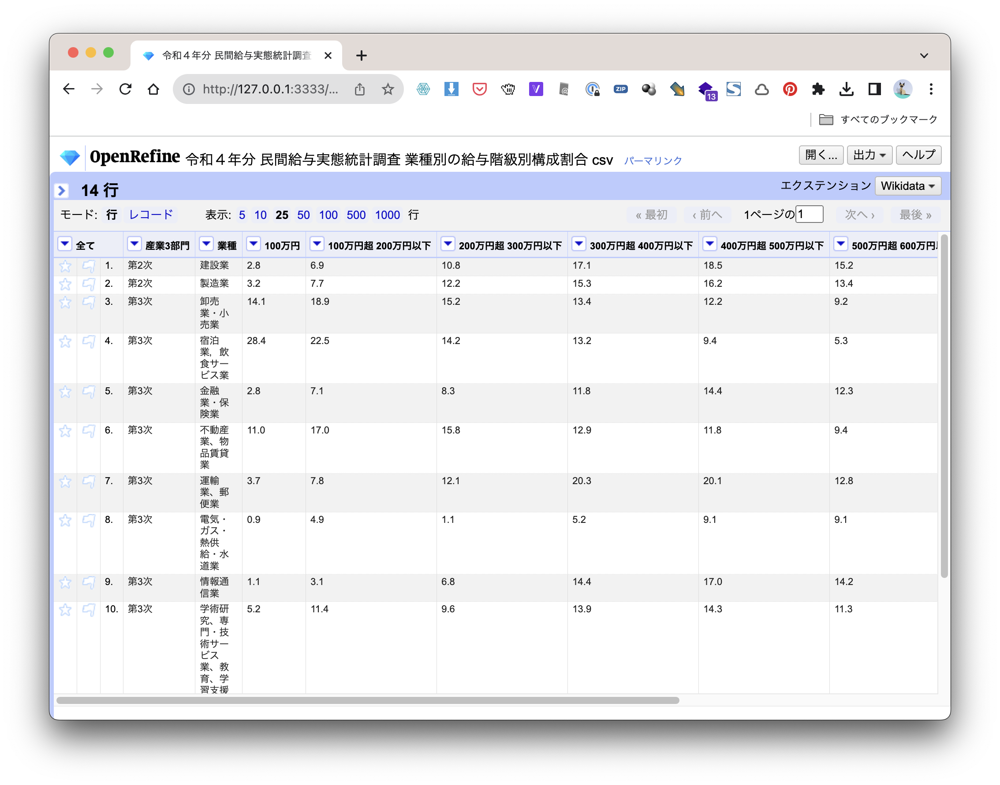
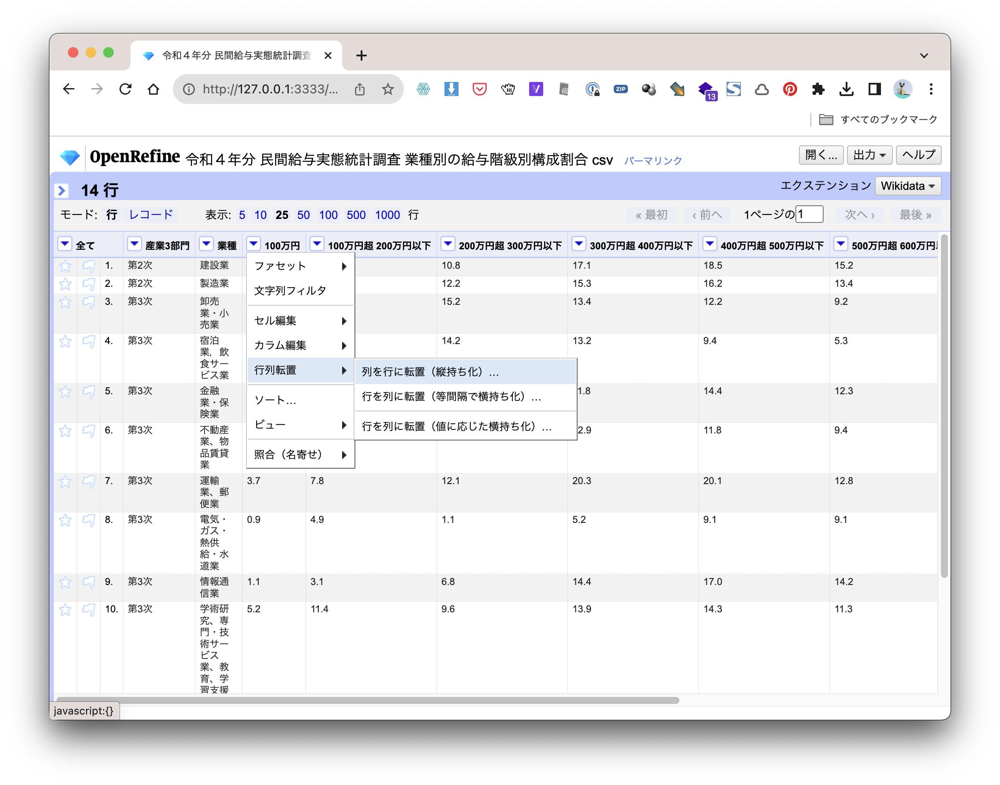
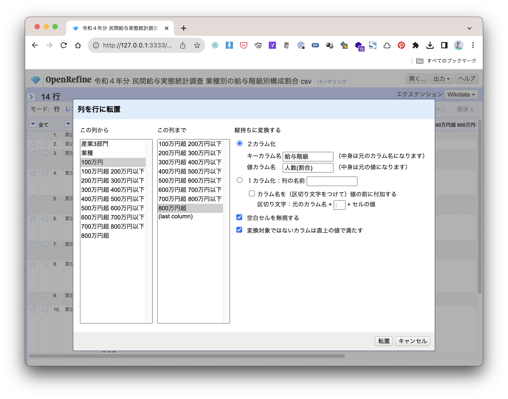
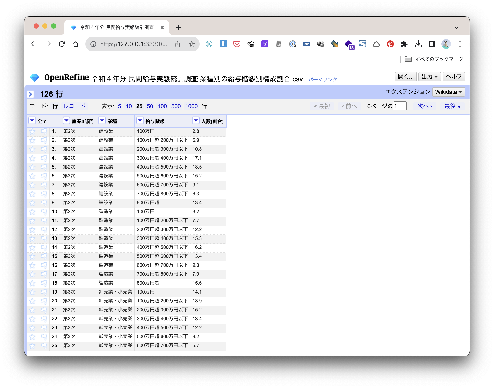

+++
author = "Yuichi Yazaki"
title = "OpenRefineでのピボットテーブルの解除"
slug = "openrefine-reverse-pivot"
date = "2023-11-19"
categories = [
  "technology"
]
tags = [
  "openrefine","クレンジング"
]
image = "images/image_3hours_refine.png"
+++

Excelでピボットテーブル化した（もしくはいわゆる横持ちと呼ばれる状態）の表を、ピボットテーブルする前の状態（もしくはいわゆる縦持ちと呼ばれる状態）に戻す作業は、これまでやや複雑でした。オープンソースのクレンジングツールであるOpenRefineを用いると、かなりシンプルな手順で実行することが可能です。

「業種別の給与階級別構成割合」の表データを参考に手順を紹介します。

「行列転置」→「縦持ち化」という機能を呼び出します。どの列からでも大丈夫です。

修正する列の範囲を「この列から」「この列まで」指定します。2カラム化を選択します。キーカラム名には属性の名称、値カラム名には値の名称を付けます。横持ちの状態ではいずれの列の名称もデータファイル内に明示されていませんので、適切な名称を付けます。

「変換対象ではないカラムは直上の値で満たす」にもチェックを入れておきましょう。

このように「逆ピボットテーブル化」=「縦持ち化」が行えました。

