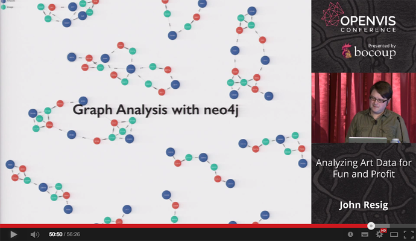

+++
title = "[OpenVis Conf 2014] John Resig講演"
slug = "openvisconf-2014-johnresig"
date = "2014-07-01"
categories = [
    "event"
]
tags = [
    "john-resig","openvisconf"
]
image = "images/fi_AnalyzingJapaneseArt.png"
+++

# OpenVis Conference 2014

**Part 2: Keynote Day 2**

## 2\. John Resig: _Analyzing Art Data for Fun and Profit_

二日目のキーノートスピーカーは言わずと知れた著名ライブラリjQueryの作者、John Resigでした。彼はJavaScript関連の本を何冊も執筆している有名なJavaScriptハッカーですが、他方、非常に熱心な日本文化、特に浮世絵のファンとしての一面も持っています。彼のキーノートは、まさにその両面が融合された非常に興味深いものでした。

### 講演の様子（YouTubeへのリンク）

[John Resig - Analyzing Art Data for Fun and Profit](https://www.youtube.com/watch?v=u2pZ_OVRzVc)



### 日本文化と浮世絵

- 日本の絵画について。私（Resig)は日本絵画の大ファンであり、文化についても個人的に研究している
- 日本の絵画と文化的背景の紹介
- スライドを使って日本の有名な絵画について説明。日本人には馴染みの深いものばかり
    - 葛飾北斎　「富嶽三十六景　神奈川沖浪裏」
    - 江戸時代の地図
    - 浮世絵(_Pictures of the floating world_, or Ukiyo-e)の紹介
    - 各種美人画
    - 当時の文化的背景の紹介
    - 参勤交代
    - 歌舞伎
        - 当時の社会での歌舞伎の人気。
        - スポーツイベントと演劇の融合のようなもの。(屋号を観客が叫ぶ辺りをスポーツイベント的と捉えているようだ)
        - 女形の概念
    - 神話の世界
    - 歌川国芳の紹介
        - 擬人化の歴史
            - 国芳による猫の侍　(1840年代)
        - だまし絵。有名な人間で人間の顔を描いた浮世絵
            - そこに描かれるナマズの絵。これは日本においての地震のメタファー
            - つまりこれは震災で死んだ人々を描いたもの
    - どのように日本絵画を学んだか
        - 日本絵画に関する英語の専門書を読む
        - 日本語の学習。江戸時代における古語も。
        - 古い書（毛筆文）を学ぶ

#### コメント

日本人である私よりも、遥かに江戸文化に理解があるようでした。趣味とは言え凄いことです。そして同時に海外で暮らす人間として、自国文化への知識の欠如は恥ずかしいことだとも改めて認識しました。自国文化におけるaestheticsに対して自分なりの考えと理解を持つことは、英語よりもずっと大切です。印象派絵画と浮世絵の関係などは、欧米人あたりが良く興味を持って聞いてくるトピックですし。

### 浮世絵のデータベース

- このような趣味が高じて浮世絵のデータベースを作ることにした。
- [Ukiyo-e Search](http://ukiyo-e.org/)
    - 世界中のデータベースや美術館のサイトから集めた浮世絵のデータベース
    - 検索は英日対応。自力で翻訳したらしい（日本からのユーザーも多い）
    - この部分の実装は、Node.jsの国際化モジュールを使った
        - [i18n-node-2](https://github.com/jeresig/i18n-node-2)
    - デプロイは[Amazon Cloudfront](http://aws.amazon.com/cloudfront/)を利用

#### 版画のデータ収集

- これはかなり困難な作業だった。Machine-friendlyなAPIを公開しているようなところは少ない
- 基本的にはクローリング&スクレイピング
- 大学や美術館のデータベースは必ずしもベストではない。検索もあまり使い勝手が良くなかった。

##### 実際の作業

- [PhantomJS](http://phantomjs.org/)を利用して美術館、大学、研究機関などのサイトをクローリング
- 自動的にクロールして、必要な情報をデータベースに流し込むために、かなり大規模なパイプラインを構築した。
- その他に使用したツール
    - [Image Scrubber](https://github.com/jeresig/jquery-imgscrubber)
    - [Stack Scraper](https://github.com/jeresig/stack-scraper)
    - [MatchEngine](http://services.tineye.com/MatchEngine)
        - 類似した画像を検索するツール
        - 実際に使用してみると、元のデータにかなりの間違いが見つかった
        - 間違いの例としては、左右逆のイメージや白黒など。

##### 画像の類似性サーチ

- 実際の版画を撮影してネットで検索

 \* [offline-crop](https://github.com/jeresig/offline-crop) \* [node-appcache-glob](https://github.com/jeresig/node-appcache-glob) \* オフラインで処理

#### 画像解析による版画の研究

- スクレイピングで得たデータベースを検索すると、たくさんの類似した画像が見つかった。それらは別のものなのか、何か共通点があるのか？

 \* 例：　二つの良く似た浮世絵（歌舞伎役者） \* メトロポリタンの画像データでサインを改変してあるものを発見した \* 元々は同じもの。 \* 多面的なデータ比較により、歌川国芳もののだと発見した

 \* 例：作者不明の浮世絵 \* メトロポリタン美術館では作者不明となっていた浮世絵の画像があった \* しかし、画像類似検索で上がってきた他の美術館のデータにはアノテーションがあった \* そしてメトロポリタンのメタデータは修正されることになった

#### メタデータの比較

- 日本人の名前の表記の揺れを吸収してメタデータを作成するのは困難な作業。(これは日本人にとっても困難な作業なので、日本語の専門家でもない外国人である彼がこの作業を一人でやってのけたのは驚きです。)

 \* 例: 浮世絵画家の「歌川広重」を指す名前のメタデータ \* 広重 \* 歌川広重 \* hiroshige \* Hiroshige utagawa \* ひろしげ

 \* 例：苗字の表記の揺れ \* Ando, 安藤, 安東, あんどう, 安堂, etc.

 \* これらの揺れを統合して一つのメタデータエントリに仕上げる。 \* 発音、漢字、ローマ字等のデータを統合 \* JSONとしてストア \* (この作業を、彼は_Artist Rectification_と呼んでいた。「アーティスト情報の整流作業」とでも訳せばよいのだろうか？)

 \* 利用したツール群 \* [hepburn](https://github.com/lovell/hepburn) \* [node-enumdict](https://github.com/jeresig/node-enamdict) \* [node-ndlna](https://github.com/jeresig/node-ndlna)

##### メタデータ統合により作成した東洲斎写楽のエントリ例

`JSON:syaraku.json { "original": "Sharaku Tōshūsai (東洲斎写楽)", "locale": "ja", "kanji": "東洲斎写楽", "given": "Sharaku", "given_kana": "しゃらく", "surname": "Tōshūsai", "surname_kana": "とおしゅうさい", "surname_kanji": "東洲斎", "given_kanji": "写楽", "name": "Tōshūsai Sharaku", "ascii": "Tooshuusai Sharaku", "plain": "Toshusai Sharaku", "kana": "とおしゅうさいしゃらく" }`

##### コメント

多分に力技な部分もありますが、趣味でよくここまでやったなあ、というのが正直な感想です。ずいぶんと良くなってきたとは言え、様々な形で保存されている生物学関連の公共データベースのデータを統合する作業を日頃行っている身としては、色々と頷ける部分もある一方、こういう苦労が少なくなる「機械にやさしいウェブ」が世界には必要だという認識も新たにしました。最近は、天文学分野で使われる「ダークマター」と言う語をもじって、「ダークデータ」などという呼び方もあるようですが、情報としては価値があるにもかかわらず、機械からのアクセスが困難なためにネットの海の底にひっそりと眠っているこういったデータをサルベージする技術や標準化がますます必要な時代になると思います。

### フリックコレクションとのコラボレーション

このようなデータベースを作成する過程で、世界各地の美術館とコンタクトを取り合うようになり、結果、業務としてフリック・コレクション（ニューヨークにある美術館）とコラボレーションすることになった。

- コレクション画像データの機械による解析
- 例：イタリアのルネッサンス期絵画のデータ解析
    - 相同性検索で同じ絵画からの画像かどうか、膨大な数の画像を検証
    - 結果、多数のコピー（模倣）、修復痕等を発見した
        - そっくりな画像だが細部と画家のメタデータが異なる（＝模倣）
        - メタデータが一致、画像もほぼ一致するが、画像のある一部分が異なっている（＝修復）
    - これらを発見する技法としては、Neo4jを使ってのグラフ解析を行った
        - Cypher（Neo4j固有のグラフDB用クエリ言語）を使用
        - SQLでは困難な、複雑なクエリを作成
        - 画像、メタデータをグラフ構造として表現したことにより、間違ったデータが収蔵されてるのを発見することが出来た

### まとめ

 \* アートをハックするには？ \* オークションに行くといい \* プレビューの日を使うと、買うか買わないかはともかく、非常に高価なものに間近で見て触れることが出来る

 \* 毎日（自分のための）コードを書くということ \* [Write Code Every Day](http://ejohn.org/blog/write-code-every-day/) \* いずれそれが仕事になることもある \* [Research](http://ejohn.org/research/)

### 全体の感想

ハッカーに好きなことをやらせると面白いことが起こると言う好例だと思いました。世界各地に散らばる、あまり使い勝手の良くない浮世絵のデータベースから、自分で使いたいからという理由で、精度の高いメタデータベースを構築したと言う、最近のテクノロジーを人文学系の研究に適用した結果起きた良い化学反応だと思います。現在の高度に複雑化した世界では、ある分野の専門家でもちょっと専門外のことになるとまるでわからない、ということが頻繁に起きます。彼の使っているツールやアルゴリズムは、画像解析やコンピュータビジョンの研究者の間では「枯れた」ものでしょうし、グラフデータベースやNode.jsベースの各種ツールも全てオープンソース実装で手に入る一般的なものです。しかしそれらを組み合わせて、アート分野に適用した結果、美術館のキュレーターの人力だけではとてもできなかったであろう仕事が完成しています。

日本絵画に対する情熱から始まり、没頭するうちにそれが仕事の一部にもなったと言う理想的な流れですが、やはり普通の人間と違うのは、仕事の外できっちりと動くものをリリースして、メンテナンスするというモチベーションの維持でしょう。後日私が参加したEdward Tufteのレクチャーで彼が引用したこのフレーズを思い出しました。

> _Real artists ship_ - Steve Jobs
