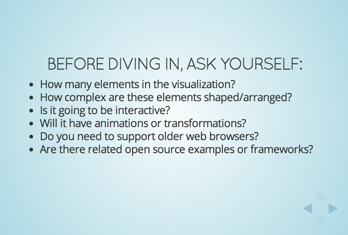
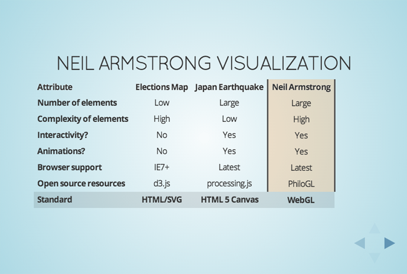
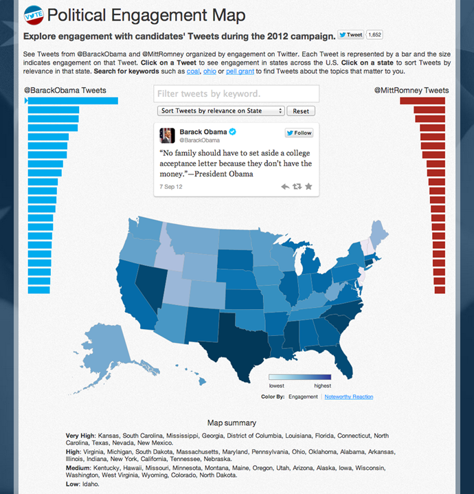
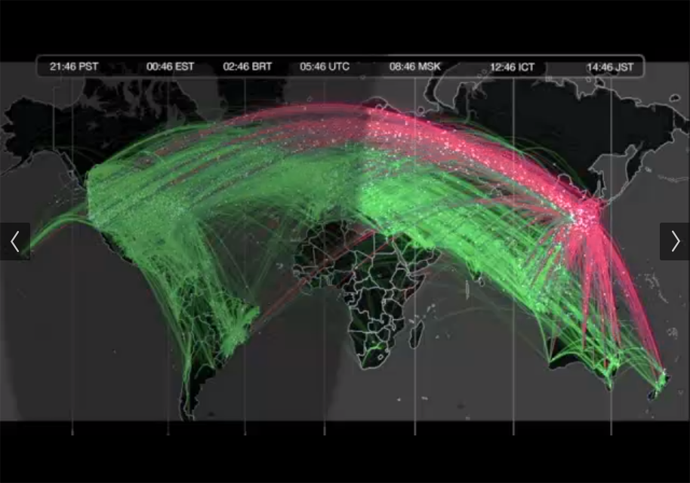
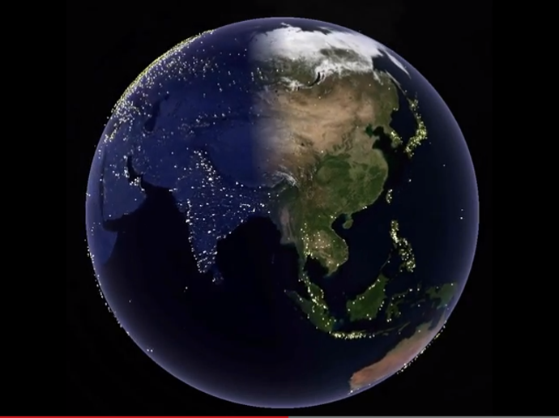

+++
title = "ブラウザーでのデータビジュアライゼーションにおける技術選定のポイント"
slug = "openvisconf2013-miguel"
date = "2013-11-05"
categories = [
    "technology"
]
tags = [
    "openvisconf","twitter"
]
image = "images/fi_OVC2013Miguel.png"
+++

ブラウザー上でデータビジュアライゼーションをやる場合にどの技術を使うべきなのか。そんなテーマでTwitter社でVisual Analysis & Insights teamのMiguel Rios氏が、今年5月にボストンのOpenVis Conferenceで講演しました。

講演での順番とはちょうど逆になりますが、話の流れがわかりやすい順番に構成します。

主にブラウザーのレンダリングの仕方が、DOM構造を残した状態なのか、そうでなく1つのDOM要素(canvas要素)の中にすべて描画するのか、という点を切り口に、主要な実装方法であるHTML/CSS、SVG、HTML5 Canvas、WebGLを取り上げ、整理しています。

### 実装にとりかかる前に明らかにすべきこと

- 要素はどのくらいの数になるのか
- それらの要素はどのくらい複雑な形をしているか、また配置するか
- どの程度インタラクティブ性を持たせるか
- アニメーションや変形はさせるのか
- 古いブラウザをサポートする必要があるかどうか
- 関係するオープンソースの例やフレームワークはあるのかどうか

これらの検討項目とともに依ってたつ実装方法と実際のTwitter社での事例とともにまとめた表を使いながら説明がされました。

### ウェブ標準技術とビジュアライゼーションとの親和性

こちらも講演ドキュメントで一番右側の列がハイライトされてますが、これはその項目を説明中のキャプチャだからなので気にしないでください（すべてフラットに扱われている表が講演ドキュメント中ないため）。わかりやすくするため、並び順を一部入れ替え翻訳すると以下の通りになります。

<table class="wp-block-table table-single"><tbody><tr><th>ウェブ標準技術</th><td>HTML/SVG</td><td>HTML 5 Canvas</td><td>WebGL</td></tr><tr><th>オープンソースのフレームワーク</th><td>d3.js</td><td>processing.js</td><td>PhiloGL</td></tr><tr><th>Twitter社での実例</th><td>2012 U.S. ELECTIONS MAP</td><td>2011 JAPAN EARTHQUAKE</td><td>NEIL ARMSTRONG'S VISUALIZATION</td></tr><tr><th>要素の数</th><td>少ない</td><td>多い</td><td>多い</td></tr><tr><th>要素の複雑さ</th><td>複雑</td><td>簡易</td><td>複雑</td></tr><tr><th>インタラクティブ性</th><td>なし</td><td>あり</td><td>あり</td></tr><tr><th>アニメーション</th><td>なし</td><td>あり</td><td>あり</td></tr><tr><th>ブラウザのサポート</th><td>IE7+</td><td>モダンブラウザのみ</td><td>モダンブラウザのみ</td></tr></tbody></table>

### それぞれの実装法の用途

文章としては以下のようにまとめられています。

HTML/SVG要素が少ない、形状が複雑、インタラクティブなビジュアライゼーションに適している。CANVAS小規模から比較的多数の要素やアニメーションに適している。WEBGL小規模から非常に大多数の要素、複雑な形状のアニメーションや3Dビジュアライゼーションに適している。

### 参照したTwitter社の実装例

#### 2012 U.S. ELECTIONS MAP

2012年選挙の際、大統領候補者によって送られたTweetによるエンゲージメントの可視化。

#### 2011 JAPAN EARTHQUAKE（リンク先は動画）

3.11の地震発生一時間後、日本発のTweetがどのようにRetweetされ世界中に伝播していったかの可視化。

#### NEIL ARMSTRONG'S VISUALIZATION（リンク先は動画）

ニール·アームストロングが亡くなったことについての@NASAのTweetがどのようにRetweetされ世界中に伝播していったかの可視化。

### 所感

全体的に話の構造がすっきりとわかりやすい理にかなう説明でしたが、DOM構造を活かすかどうかがブラウザー上の実行速度しか念頭にない点は気になりますね。このプレゼンテーションの会場に筆者は居たのですが、会場から「モバイルの場合は？」という質問に「モバイルは今回考慮してないよ」との回答に会場の一部から失笑が起こりました。…なかなかシビアですね。  
また直接この講演の内容とは関係ないですが、SVG用ライブラリを使った実装でも描画部分をCanvasで行って描画速度をあげているユーザーもその会場にいました。  
降壇あとに直接聞いたところ、Twitter社のデータサイエンティストは4名で、主に社内向け（インターナル）の分析とビジュアライズの方がほとんどだとのことでした。またこの講演の少し後の時期にTwitter社は[Lucky Sort](http://luckysort.com/)という[ビッグデータのビジュアライゼーション会社を買収しています](http://techcrunch.com/2013/05/13/twitter-acquires-big-data-visualization-startup-lucky-sort-service-to-shutter-in-months-ahead/)ので現在はまた体制が変わっていることと思います。

実際のプレゼンテーションの動画やドキュメントへのリンクを以下に掲載しますので是非たどってみてください。

- [Miguel Riosの講演(スライド)](http://miguelrios.github.io/openvis-web/#/)
- [Miguel Riosの講演(動画)](http://www.youtube.com/watch?v=XKGV-_5DqHA)
- [Twitter's Miguel Rios on Choosing Viz Methods - Features - Source: An OpenNews project](http://source.opennews.org/en-US/articles/twitters-miguel-rios-choosing-viz-methods/)
