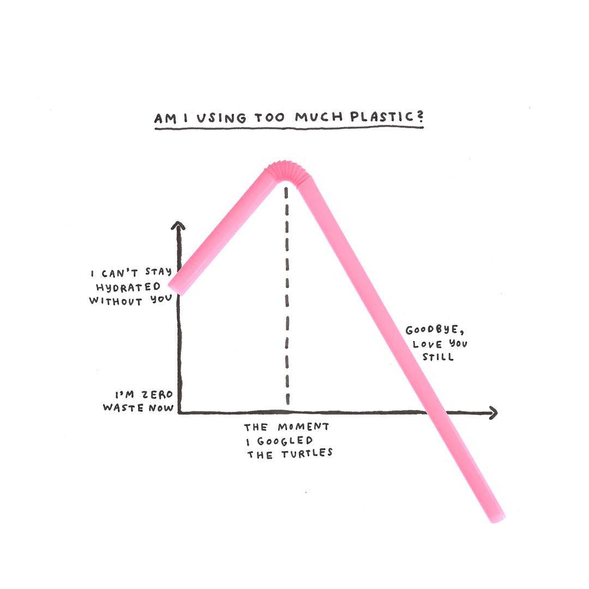

+++
author = "Yuichi Yazaki"
title = "考えすぎ? ハンドメイドの過剰なチャートたち"
slug = "overthinking-this"
date = "2019-10-11"
description = ""
categories = [
    "consume"
]
tags = [
    ""
]
image = "images/EB3B25MVUAAOXDE.jpeg"
+++

元バズフィードニュースデザイナーだったMichelle Rialさんのかわいらしい絵本です。毎日の生活でグルグル思い悩んでいることを時に過剰に、時にモノからテーマを発想してチャート作品作りをしています。いくつかご紹介します。

<!--more-->

[Am I Overthinking This?: Over-answering life’s questions in 101 charts](https://amzn.to/4bNI9EV)

### ベン図

ダイエットを妨げるもの、ということで、乳製品、カフェイン、糖分、アルコール、グルテンを制限するとして…どうやっても友達を減らしてしまうのでは?と考えすぎています。

友達・同僚・好ましくない人、それぞれに送るメールの最後にどう書くか？考えすぎても、結局「Sent from my iPhone」となってしまいます。

ビートルズの歌詞から、人生を励ます言葉を探す。

コーヒーカップの裏を使ったベン図で、結局珈琲が好き。

### 植物

鉢植えと植物、いつもちょうど良いものが手に入らなくてグルグル。

### 小物使い

検索でプラスチック被害のことを知ってから、プラスチック使用料の激減（マイナスなのはどういうこと?）。

歯医者の予約日が近くと歯磨き頻度が上がり、歯医者にかかり終わると歯磨き頻度が減っていく。

見た目に気を使いたいのと、楽なウェアを着たい気持ちの戦い。

### サンフランシスコの地元の出版社から発売

[Am I Overthinking This?: Over-answering life’s questions in 101 charts](https://amzn.to/4bNI9EV)

Kindle版、書籍版と両方発売されています。発売元は Chronicle Books というサンフランシスコにある地元の出版社です。アップルのWWDC（製品発表会）でサンフランシスコのモスコーンセンターに行かれたことがある方は、会場近くに書店があったのを覚えているかと思います。あれが Chronicle Books の旗艦店です。ほかにも素敵な装丁の本をいくつも発売しています。

