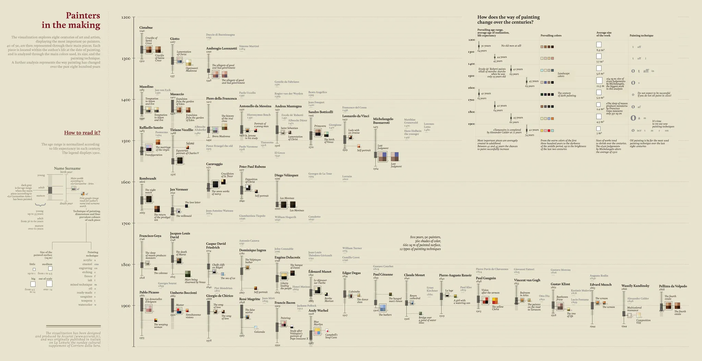
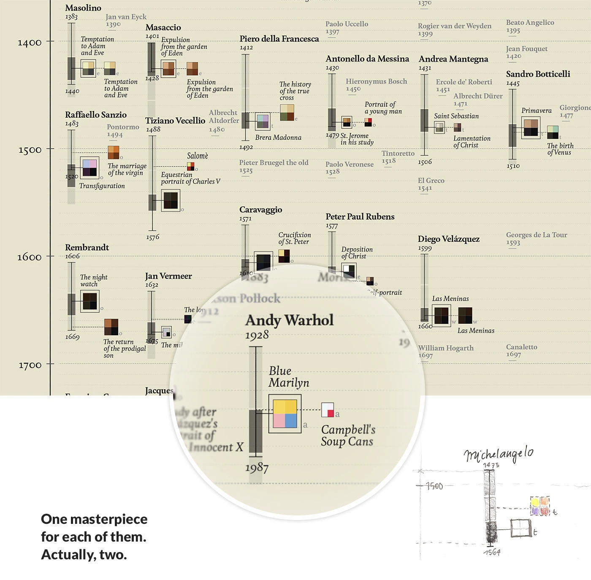
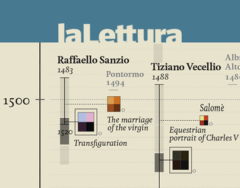
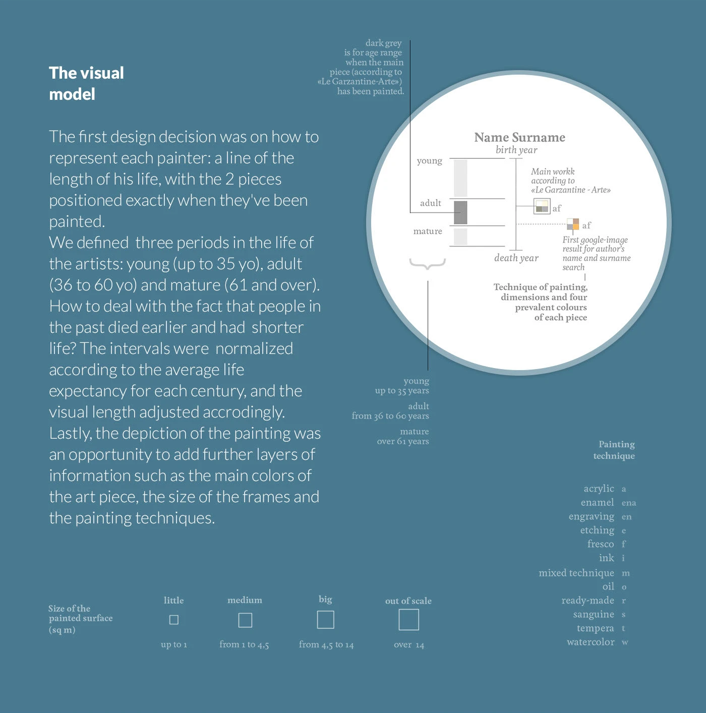
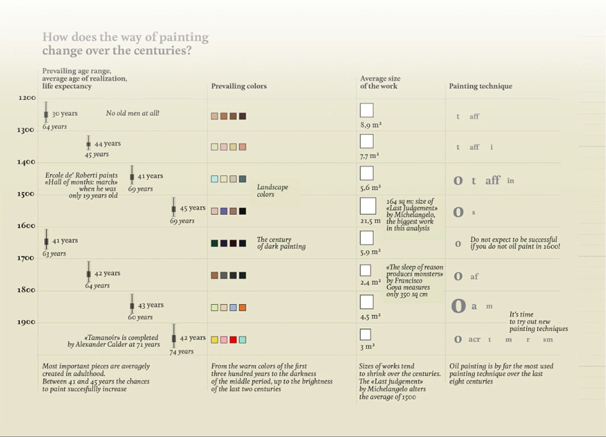

+++
author = "Yuichi Yazaki"
title = "Painters in the Making: Lives and Masterpieces"
slug = "painters-in-the-making"
date = "2025-10-06"
description = ""
categories = [
    "consume"
]
tags = [
    "オリジナルのビジュアル変換",
]
image = "images/cover.png"
+++

**Painters in the Making** by **Giorgia Lupi** maps the lives and major works of painters across roughly 800 years. Covering 90 artists from the Middle Ages to the twentieth century, it brings together lifespan, the timing of major works, painting technique, color, and artwork size in a single visual system.

The piece was created for *La Lettura*, the cultural supplement of the Italian newspaper *Corriere della Sera*.

<!--more-->

## How to Read It

The central vertical axis represents time, from the 1200s to the 1900s. Painters are arranged horizontally. Each artist's life is shown as a line, and the moments when major works were created are inserted as small rectangles along that line.

### 1. Life Stages and Works

The gray line represents the full life of an artist. Darker segments indicate the age range in which key works were produced.

Life is divided into three stages:

- **young**: up to age 35
- **adult**: ages 36-60
- **mature**: age 61 and above

Because average lifespans varied greatly across centuries, the stages are normalized by the life expectancy of each period. This makes it possible to compare a "mature" painter in the 1300s with one in the 1900s without treating age as a fixed universal threshold.

### 2. Attributes of the Works

Each rectangle represents a painting and contains several attributes:

- the four dominant colors extracted from the work
- the physical size of the work in square meters
- the painting technique, such as oil, tempera, or fresco

The result is a compact portrait of not only when painters made their major works, but also what those works were like materially and visually.

## Changes Across Centuries

The table titled "How does the way of painting change over the centuries?" summarizes historical shifts.

| Century | Main tendency | Color tendency | Technique | Average size |
|---|---|---|---|---|
| 1200s | No old painters in the sample | Brown and red tones | Tempera | about 8.9 sq m |
| 1500s | Landscape colors become common | Green and blue tones | Oil and tempera | about 5.6 sq m, with major exceptions |
| 1600s | A darker century | Black and deep green | Mostly oil | about 5.9 sq m |
| 1800s | Brightness returns | Brown to pale blue | Mostly oil | about 2.4 sq m |
| 1900s | New techniques appear | Vivid primary colors | Oil, acrylic, tempera | about 3 sq m |

Over time, works tend to become smaller, while color palettes shift and diversify. Oil painting appears as the dominant technique across much of the long period.

## Choosing the Two Works

The visualization includes both a historically important work and a broadly recognized work for each painter. The former is based on the Italian *Garzanti Art Encyclopedia*, while the latter was selected from the first image returned by Google Images. This lets the graphic compare art-historical authority with popular memory.

## Concept

The work is a representative example of Lupi's **Data Humanism**. It treats artistic lives not as abstract records, but as human rhythms of growth, maturity, and recognition. Time, color, material, and biography are interwoven into a visual timeline.

## Summary

"Painters in the Making" is a visual history of artistic maturation. Each line condenses a life, and each small rectangle marks a moment when that life produced something that entered cultural memory.

## References

- [Painters in the Making — Behance](https://www.behance.net/gallery/14282281/Painters-in-the-making)
- [Data Humanism, the Revolution will be Visualized — Medium](https://medium.com/@giorgialupi/data-humanism-the-revolution-will-be-visualized-31486a30dbfb)
