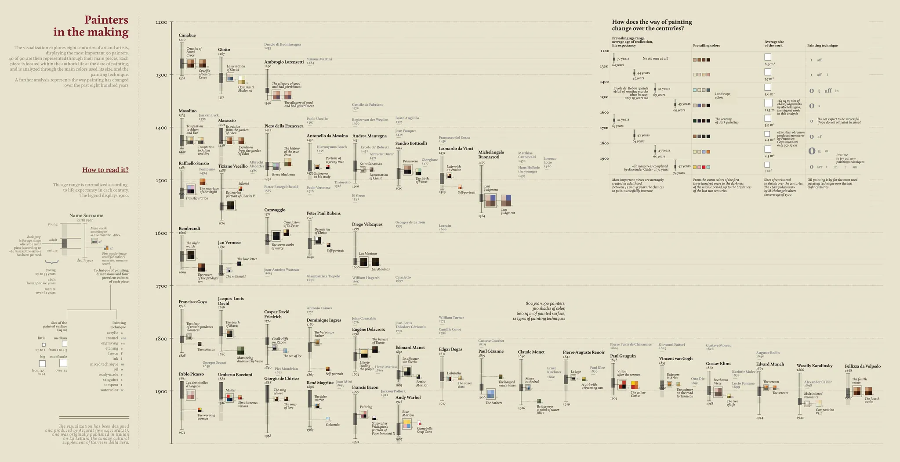
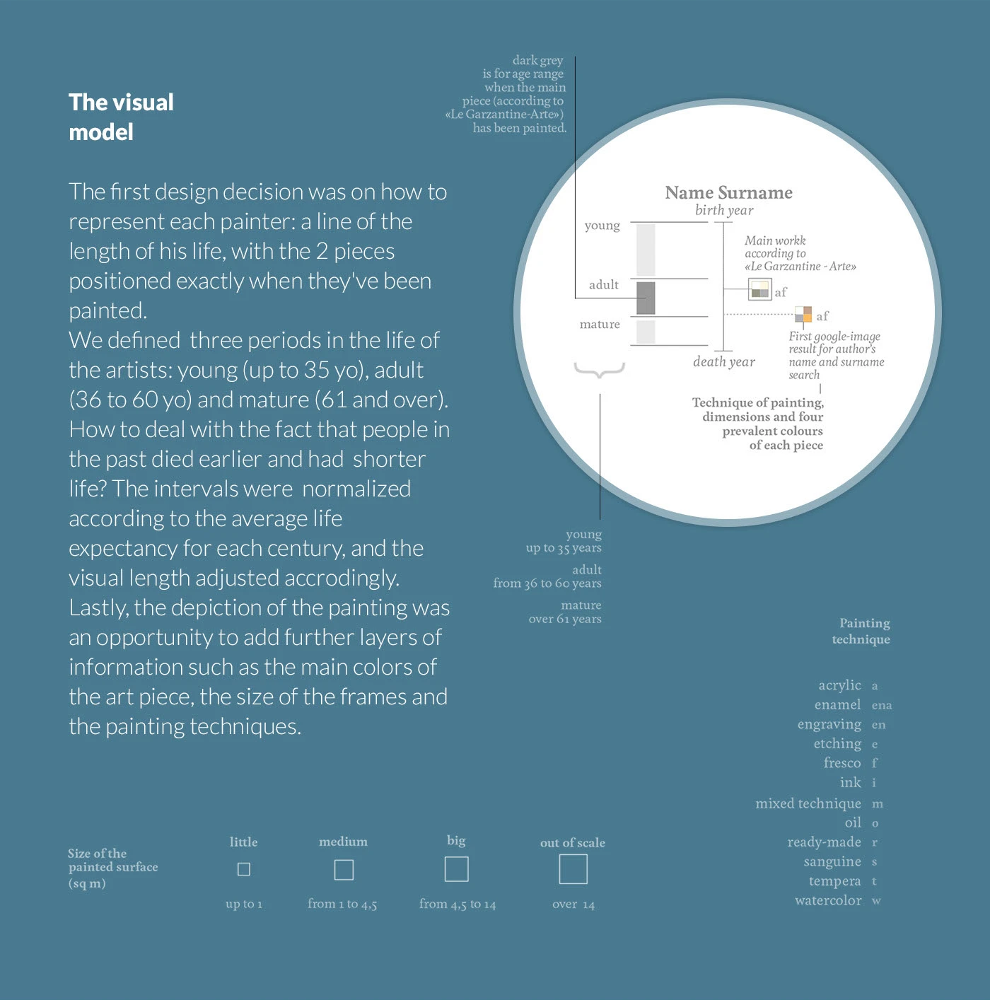
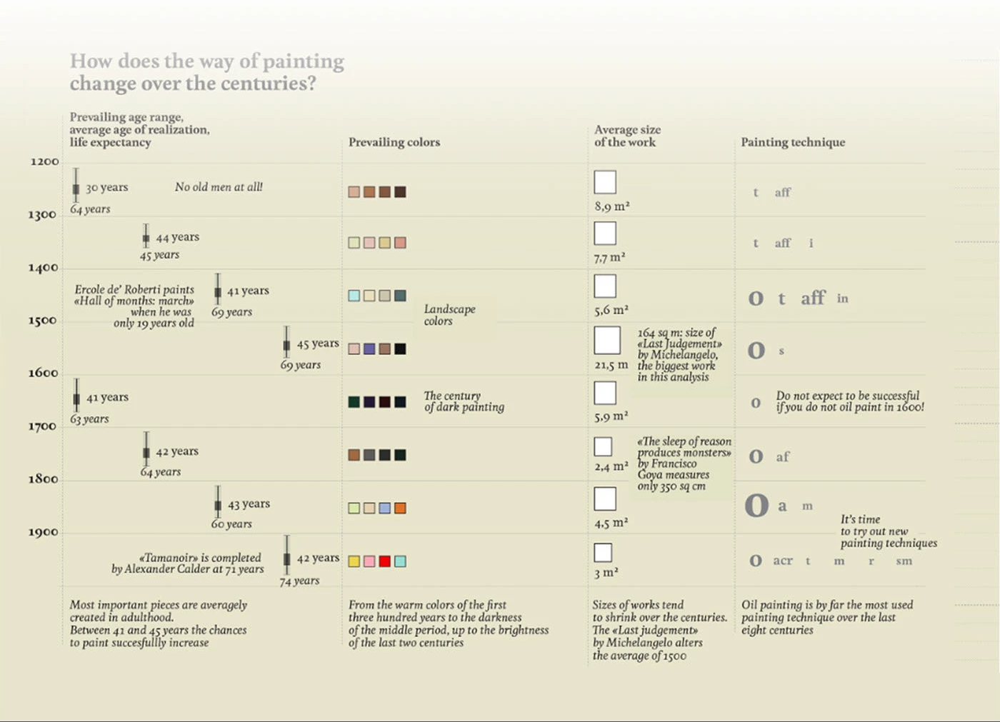

+++
author = "Yuichi Yazaki"
title = "画家たちの人生と代表作"
slug = "painters-in-the-making"
date = "2025-10-06"
description = ""
categories = [
    "consume"
]
tags = [
    ""
]
image = "images/cover.png"
+++

**Giorgia Lupi** による「Painters in the Making」は、約800年にわたる画家たちの人生と代表作を一つの軸上で描き出した作品です。  
中世から20世紀まで、90人の画家を対象に、それぞれの人生の長さ、作品を描いた時期、そして絵画の技法・色彩・サイズを統合的に可視化しています。  
この作品は、イタリアの日刊紙 *Corriere della Sera* の文化面「La Lettura」向けに制作されたものです。

<!--more-->

## 作品の見方

中央の横軸は時間（西暦1200〜1900年代）を示し、縦軸には代表的な画家が並びます。  
各画家の **人生の長さ** は一本の線で表され、その線の中に **代表作が描かれた時期** が小さな矩形として配置されています。  

### 1. 人生の段階と作品

左側の凡例にあるように、  

- 灰色の線は人生の全体を、  
- 濃い灰色の部分はその画家が代表作を制作した年齢帯を示します。  

人生は以下の3段階に区分されています。  
- **young（若年期）**：35歳まで  
- **adult（壮年期）**：36〜60歳  
- **mature（成熟期）**：61歳以上  

ただし、過去の時代では平均寿命が短いため、各世紀ごとの**平均寿命に合わせて正規化**されています。これにより、1300年の「成人期」と1900年の「成人期」は異なる年齢でも同じ割合で可視化されています。

### 2. 作品の属性

各矩形はその画家の代表作を表し、次の情報が含まれます。

- **作品の主な4色**（実際の絵画から抽出）
- **作品の大きさ（m²）**
- **使用された画法**（油彩、テンペラ、フレスコなど）

この多層的な情報により、画家の人生だけでなく、「どのような時期に」「どのような色と技法で」作品を生み出したかが一目でわかります。

## 時代ごとの変化

右上の表「How does the way of painting change over the centuries?」は、時代ごとの特徴をまとめています。

| 世紀 | 主な傾向 | 代表的な色調 | 技法 | 平均作品サイズ |
|------|------------|----------------|------|----------------|
| 1200年代 | 老年画家はいない | 茶・赤系 | テンペラ | 約8.9㎡ |
| 1500年代 | 風景色が主流 | 緑・青系 | 油彩・テンペラ併用 | 平均5.6㎡（ミケランジェロ「最後の審判」は例外的に164㎡） |
| 1600年代 | 暗色の世紀 | 黒・深緑系 | 油彩が主流 | 約5.9㎡ |
| 1800年代 | 明度の回復 | 茶〜淡青系 | 油彩中心 | 約2.4㎡ |
| 1900年代 | 新技法の試み | 原色系・鮮やか | 油彩・アクリル・テンペラ混用 | 約3㎡ |

時代が進むにつれて作品サイズは小型化し、色調は再び明るさを取り戻しています。また、油彩は8世紀にわたって最も多く用いられた技法であることがわかります。

## 二つの代表作を選ぶ方法

本作では各画家について「 **主要作品を1点** 」だけでなく「 **一般的に最も認知されている作品** 」も同時に表示しています。  
前者はイタリア語版『Garzanti Art Encyclopedia』を参照し、後者は **Google画像検索で最初に表示された作品** を採用しています。  
つまり「 **美術史的に重要とされる作品** 」と「 **一般に人々の記憶に残る作品** 」の両方を比較できる構造になっています。  
これにより、専門的評価と大衆的認知のズレをも浮かび上がらせています。

## 背景とコンセプト

この作品は、Lupiが提唱する「 **Data Humanism（データ・ヒューマニズム）** 」の初期代表作の一つです。  
単なる統計情報ではなく **人間の人生のリズムや芸術的成熟をデータとして可視化** する試みです。  
数字の羅列を超えて、人生・時間・創造性の関係を感覚的に理解できるよう設計されています。

LupiはMedium記事「*Data Humanism, the Revolution will be Visualized*」の中で、 

> 「私たちは、データの背後にある人間の本質を取り戻し、数字をそれが表すものと結び付ける必要があります。」
> 
> “We need to reclaim the human essence behind data, to connect numbers back to what they stand for.”  

と述べています。  
本作はまさにその理念を体現したビジュアライゼーションです。

## まとめ

「Painters in the Making」は、データを用いて人間の成長と創造性を描いた、視覚的年表の傑作です。  
1本の線に凝縮された「人生」と「作品の瞬間」は、芸術家がどの時期に最も輝いたかを静かに語りかけます。  
これは、アート史とデータビジュアライゼーションが融合する地点に生まれた、詩的な可視化です。

## 参考・出典

- [Painters in the Making — Behance](https://www.behance.net/gallery/14282281/Painters-in-the-making)
- [Data Humanism, the Revolution will be Visualized — Medium](https://medium.com/@giorgialupi/data-humanism-the-revolution-will-be-visualized-31486a30dbfb)
