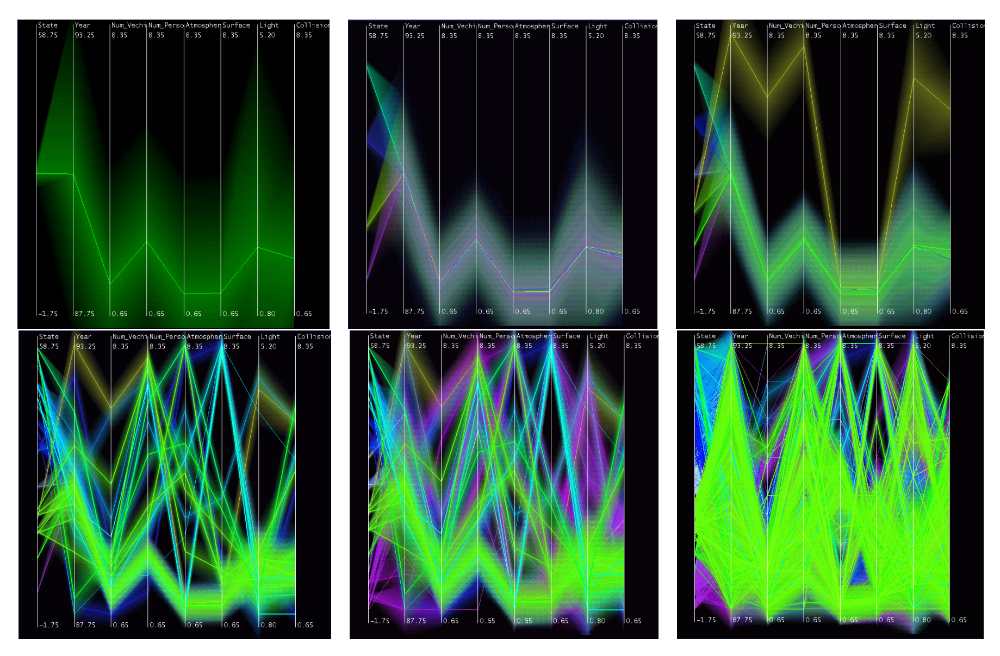
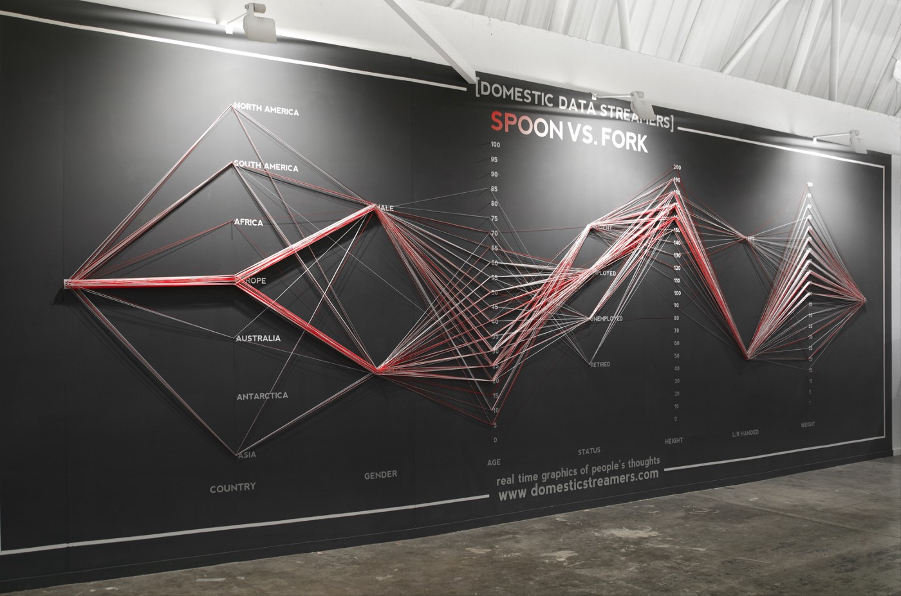
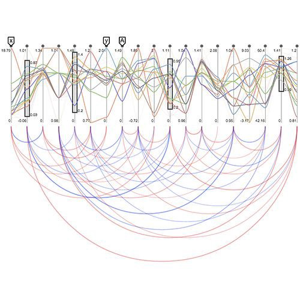
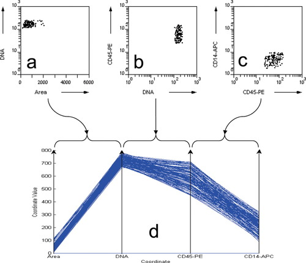

+++
author = "Yuichi Yazaki"
title = "パラレル・コーディネイト（Parallel Coordinates）の事例"
slug = "parallel-coordinates-example"
date = "2020-07-07"

categories = [
    "chart"
]
tags = [
    "",
]
image = "images/1_3-NrFUaSTYJHquNYv0P6Ag.jpeg"
+++

パラレル・コーディネイト（Parallel Coordinates）の事例を紹介します。

<!--more-->

## 一般的な作例

### 1970年から1982年までに発売された車種についての、燃費（MPG）、気筒数、馬力、重量、発売年の相関

<figure>

<figcaption>

[Parallel Coordinates | eagereyes](https://eagereyes.org/techniques/parallel-coordinates)

</figcaption>

</figure>

### 3 つの種のアヤメの花による 4 種類の測定値 (萼弁の長さ、萼弁の幅、花弁の長さ、花弁の幅) 

<figure>

<figcaption>

[parallelcoords | MathWorks](https://jp.mathworks.com/help/stats/parallelcoords.html)

</figcaption>

</figure>

### 主要研究領域における質の高い論文のシェア推移

一見折れ線グラフにみえますが、これも実はパラレル・コーディネイトなのです。

<figure>

<figcaption>

[中国の科学論文シェア急上昇　米国と「2強」に　日本は急落、3位が2領域だけ](https://mainichi.jp/articles/20190505/k00/00m/040/238000c)

</figcaption>

</figure>

## 歴史的な作例

Alfred Inselbergさんによる論文以前に、作成されたチャートをここでは指すものとします。

### Henry Gannett “General Summary, Showing the Rank of States, by Ratios, 1880”

<figure>

<figcaption>

[Scribner's statistical atlas of the United States, showing by graphic methods their present condition and their political, social and industrial development](https://www.loc.gov/item/a40001834/)

</figcaption>

</figure>

## バリエーション

### 3D

<figure>

<figcaption>

[3D Parallel Coordinates](https://innovis.cpsc.ucalgary.ca/Research/3DParallelCoordinates)

</figcaption>

</figure>

### 階層構造を持つ

<figure>

<figcaption>

[Hierarchical Parallel Coordinates for Exploration of Large Datasets](http://davis.wpi.edu/xmdv/docs/vis99_HPC.pdf)

</figcaption>

</figure>

### ラディアルなレイアウト

軸の配置をラディアルなレイアウトにすると、パラレル・コーディネイトというよりレーダーチャートですね。

<figure>

<figcaption>

[Parallel Coordinates (circular layout + straight lines)](https://tulip.labri.fr/TulipDrupal/?q=node/331)

</figcaption>

</figure>

### フィジカルなインスタレーション

<figure>

<figcaption>

[Live survey on physical parallel coordinates.](https://datastori.es/data-stories-58-domestic-data-streamers/)

</figcaption>

</figure>

## ほかのチャートとのコンビネーション

### Force-Directed Parallel Coordinates

<figure>

<figcaption>

[Force-Directed Parallel Coordinates](https://www.researchgate.net/publication/260736362_Force-Directed_Parallel_Coordinates)

</figcaption>

</figure>

### パラレル・コーディネイト + アーク・ダイアグラム

<figure>

<figcaption>

[パラレル・コーディネイト + アーク・ダイアグラム](http://moebio.com/clients/medde/territoiredurable/)

</figcaption>

</figure>

### パラレル・コーディネイト + 散布図

<figure>

<figcaption>

[パラレル・コーディネイト + 散布図](https://onlinelibrary.wiley.com/doi/full/10.1002/cyto.a.20288)

</figcaption>

</figure>

