+++
author = "Yuichi Yazaki"
title = "パラレル・コーディネイト"
slug = "parallel-coordinates"
date = "2020-07-07"

categories = [
    "chart"
]
tags = [
    "",
]
image = "images/1_3-NrFUaSTYJHquNYv0P6Ag.jpeg"
+++

## どんなチャート？

Tamara Munznerさんの “Visualization Analysis and Design”においての紹介文が的確なのでこれを引用します。

> 『その名が示すように、軸は直角に垂直ではなく、互いに平行に配置される。散布図では、項目がドットで表示されるのに対し、平行座標では、1つの項目が平行軸をジグザグに移動するギザギザの線で表現され、関連する属性の項目の値の位置で各軸を1回だけ正確に横断します。』
> 
> Tamara Munzner “Visualization Analysis and Design”

一見、折れ線グラフにも似ていますが、**時系列データを扱っておらず**、あくまで**多変量の定量データを一度に表示することに特化**したチャートです。

設計意図と実際の活用のされ方のズレについても、Tamara Munznerさんの指摘が的確なので引用します。

> 『平行座標の設計者による当初の動機の一つは、属性間の相関関係をチェックするという抽象的な作業に利用できるということでした。（中略）しかし、実際には、相関を見つける作業に使用するにはSPLOM（Scatterplot Matrix）のほうが簡単です。パラレル座標は、すべての属性の概要、個々の属性の範囲の特定、項目の範囲の選択、外れ値の検出など、他のタスクに頻繁に使用されます。』
> 
> Tamara Munzner “Visualization Analysis and Design”

> 『平行座標によって容易に見えるパターンは、隣り合う軸の対の関係です。したがって、平行座標の決定的な制限は、軸の順序をどのように決定するかということです。ほとんどの実装では、ユーザが対話的に軸の順序を変更することができます。しかし、体系的な手動インタラクションを通して軸のすべての可能な構成を探索することは、可能な組み合わせの爆発的な数のために、軸の数が増えるにつれて法外に時間がかかるでしょう。』
> 
> Tamara Munzner “Visualization Analysis and Design”

## 作例

#### 1970年から1982年までに発売された車種についての、燃費（MPG）、気筒数、馬力、重量、発売年の相関

<figure>

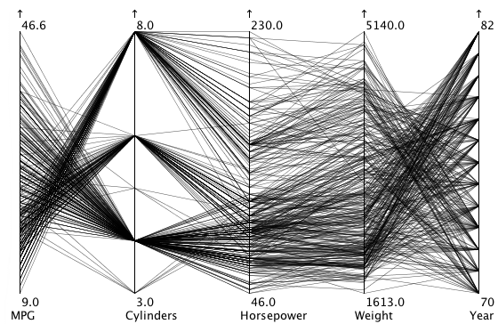

<figcaption>

[Parallel Coordinates | eagereyes](https://eagereyes.org/techniques/parallel-coordinates)

</figcaption>

</figure>

#### 3 つの種のアヤメの花による 4 種類の測定値 (萼弁の長さ、萼弁の幅、花弁の長さ、花弁の幅) 

<figure>

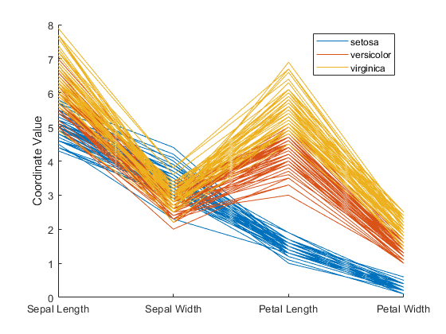

<figcaption>

[parallelcoords | MathWorks](https://jp.mathworks.com/help/stats/parallelcoords.html)

</figcaption>

</figure>

#### 主要研究領域における質の高い論文のシェア推移

一見折れ線グラフにみえますが、これも実はパラレル・コーディネイトなのです。

<figure>

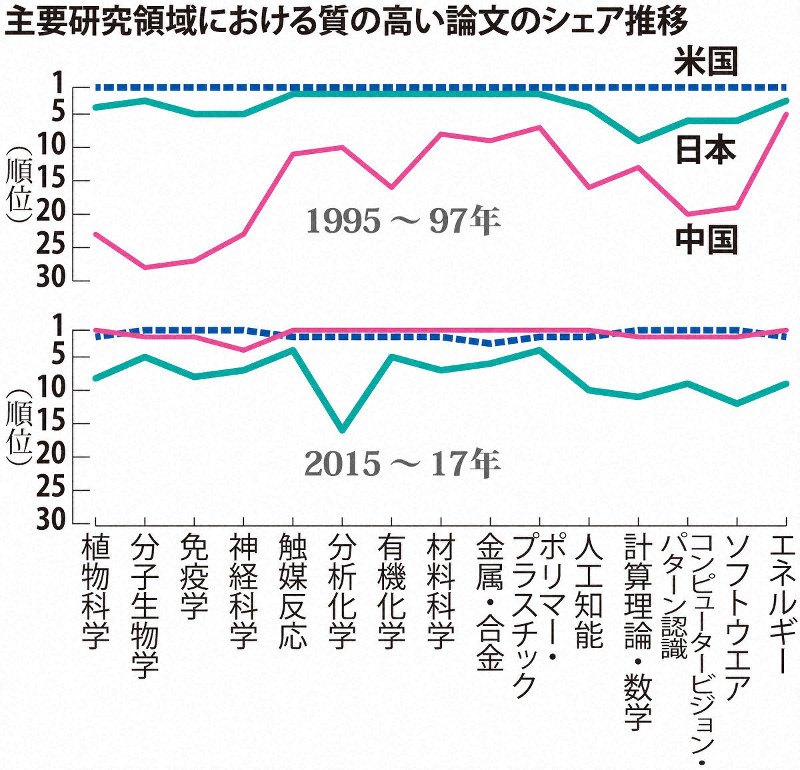

<figcaption>

[中国の科学論文シェア急上昇　米国と「2強」に　日本は急落、3位が2領域だけ](https://mainichi.jp/articles/20190505/k00/00m/040/238000c)

</figcaption>

</figure>

## 問題点

以下のような問題点・課題をかかえています。これらの課題を改善するためのインタラクションが実装されている場合があります。

- 近く、もしくは隣接しない軸同士の直接的な相関がわかりづらい。インタラクションを用いて解決することが提案されています。
- データをすべて、表示に利用すると、線が重なりすぎて視認性を損ねることがあります。
- 出力される画面解像度にも寄りますが、軸の数はせいぜい十数個程度が限界でしょう。

## インタラクション

問題点を解決できるようなインタラクションが提案されていることがあります。

### 軸の並び順と並び替え

軸の並び順ですが、データセットからデータを読みだした際の収録順、類似しているなどなんらかの基準を元にした並び順、属性名の五十音／アルファベット順などが考えられます。

軸を並べ替えることができるようにすれば、ユーザーが知りたいと思う任意の属性を近くに並べることで、相関がわかりやすくなります。ユーザーが手動で行う、軸の性質に応じてなんらかの方法で並び順がシステムから提案されることが考えられます。

### ブラッシング

軸ごとにブラッシングを行うことができるようにして、その範囲でデータをフィルタリングします。これにより探索的なデータ可視化が可能となります。

### 軸の最大値と最小値の入れ替え（軸の上下反転）

[Robert Kosaraさんがブログ記事で可能性として提案](https://eagereyes.org/techniques/parallel-coordinates)しています。

## 歴史的な作例

Alfred Inselbergさんによる論文以前に、作成されたチャートをここでは指すものとします。

#### Henry Gannett “General Summary, Showing the Rank of States, by Ratios, 1880”

<figure>

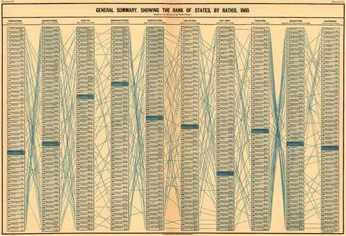

<figcaption>

[Scribner's statistical atlas of the United States, showing by graphic methods their present condition and their political, social and industrial development](https://www.loc.gov/item/a40001834/)

</figcaption>

</figure>

## バリエーション

#### 3D

<figure>

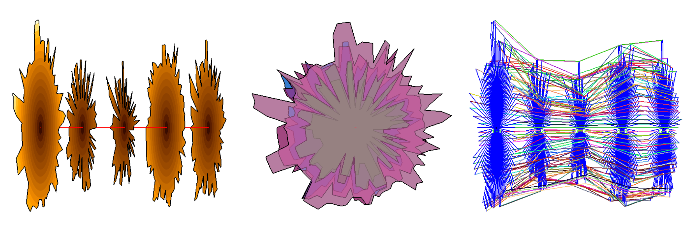

<figcaption>

[3D Parallel Coordinates](https://innovis.cpsc.ucalgary.ca/Research/3DParallelCoordinates)

</figcaption>

</figure>

#### 階層構造を持つ

<figure>

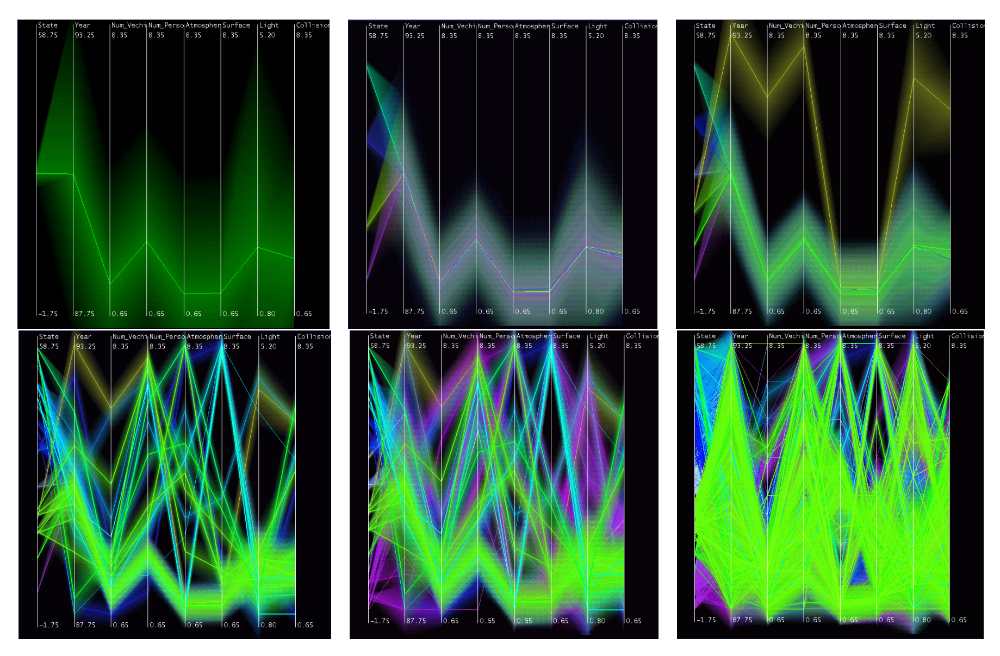

<figcaption>

[Hierarchical Parallel Coordinates for Exploration of Large Datasets](http://davis.wpi.edu/xmdv/docs/vis99_HPC.pdf)

</figcaption>

</figure>

#### ラディアルなレイアウト

軸の配置をラディアルなレイアウトにすると、パラレル・コーディネイトというよりレーダーチャートですね。

<figure>

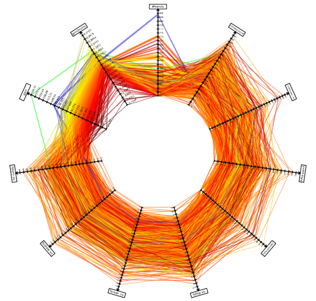

<figcaption>

[Parallel Coordinates (circular layout + straight lines)](https://tulip.labri.fr/TulipDrupal/?q=node/331)

</figcaption>

</figure>

#### フィジカルなインスタレーション

<figure>

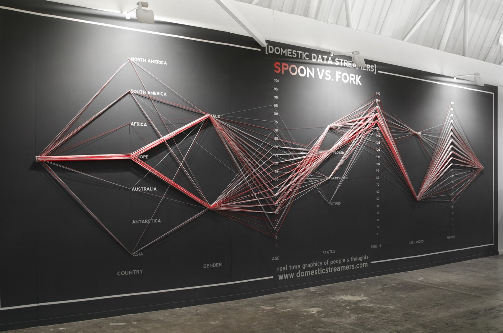

<figcaption>

[Live survey on physical parallel coordinates.](https://datastori.es/data-stories-58-domestic-data-streamers/)

</figcaption>

</figure>

## ほかのチャートとのコンビネーション

#### Force-Directed Parallel Coordinates

<figure>

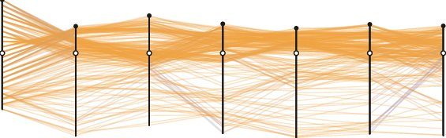

<figcaption>

[Force-Directed Parallel Coordinates](https://www.researchgate.net/publication/260736362_Force-Directed_Parallel_Coordinates)

</figcaption>

</figure>

#### パラレル・コーディネイト + アーク・ダイアグラム

<figure>

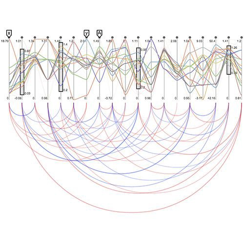

<figcaption>

[パラレル・コーディネイト + アーク・ダイアグラム](http://moebio.com/clients/medde/territoiredurable/)

</figcaption>

</figure>

#### パラレル・コーディネイト + 散布図

<figure>

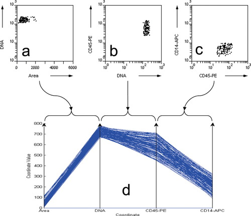

<figcaption>

[パラレル・コーディネイト + 散布図](https://onlinelibrary.wiley.com/doi/full/10.1002/cyto.a.20288)

</figcaption>

</figure>

## 誰が作ったのか？

19世紀から、パラレル・コーディネイトと呼べそうなチャートは存在していました。ただ、コンセプトとして文書化されたものは、1981年、IBM研究者のAlfred Inselbergによるものです。

- A Inselberg. “N-dimensional graphics part I : Lines & hyperplanes”. Technical report, IBM Scientific Center, Los Angeles, CA., 1981.

その後、論文として提案されるのは1990年ですが、同じ年に、統計家が単独で研究した結果を発表しています。

- [A. Inselberg & B. Dimsdale：Parallel coordinates: a tool for visualizing multi-dimensional geometry](https://www.researchgate.net/publication/3505028_Parallel_Coordinates_A_Tool_for_Visualizing_Multi-Dimensional_Geometry)
- [Edward J. Wegman（統計家）による提案：Hyperdimensional Data Analysis Using Parallel Coordinates](https://www.researchgate.net/publication/224285724_Hyperdimensional_Data_Analysis_Using_Parallel_Coordinates)

## 他の呼び名

平行座標

## 参考文献

[A. Inselberg & B. Dimsdale：Parallel coordinates: a tool for visualizing multi-dimensional geometry](https://www.researchgate.net/publication/3505028_Parallel_Coordinates_A_Tool_for_Visualizing_Multi-Dimensional_Geometry)
