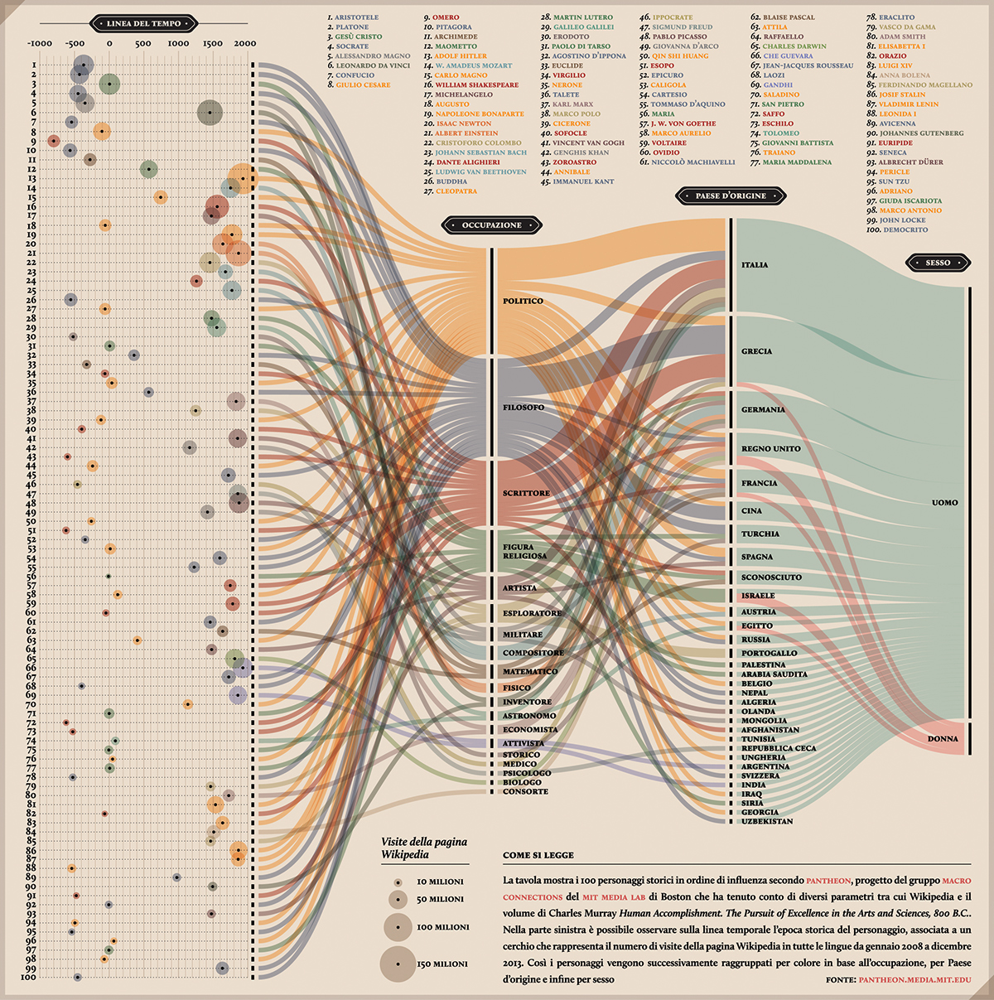

+++
author = "Yuichi Yazaki"
title = "パラレル・セットの利用例紹介"
slug = "parallel-sets-example"
date = "2020-08-02"
description = ""
categories = [
    "chart"
]
tags = [
    "",
]
image = "images/image-15.png"
+++

「パラレル・セット」が利用されている事例を紹介します。

<!--more-->

## 作例

### ミネソタ州（上）とノースカロライナ州（下）の住宅データを比較

[Kosara,Robert，FabianBendix, HelwigHauser(2006): “ParallelSets: Interactive exploration and visual analysis of categorical data”. IEEE Transactions on Visualization and Computer Graphics 12，no.4: 558-568.](https://research.tableau.com/sites/default/files/Kosara_TVCG_2006.pdf)

寒い気候の人々は、暖房燃料として電気よりもガスを好み、移動式の家もあまり好きではありません。南部の住宅は平均的にベッドルーム数がやや少ないが、3ベッドルームの一戸建て住宅は北部よりも多いことがわかります。

### 国民戦線の躍進はフランスの伝統的な政党を揺さぶる｜フィナンシャル・タイムズ

[National Front breakthrough stuns France's traditional parties | Financial Times](https://www.ft.com/content/181619a2-9cba-11e5-b45d-4812f209f861#slide0)

### ピッツバーグの橋梁の構造材別、長さ別、建設年代別、橋梁が架かる河川別の内訳

[Fundamentals of Data Visualization](https://serialmentor.com/dataviz/nested-proportions.html)

### TRACKING THE EARTH'S 300 NANO-SATELLITES

[TRACKING THE EARTH'S 300 NANO-SATELLITES by Valerio Pallegrini](https://www.wired.co.uk/gallery/infoporn-wired-handpicks-the-webs-best-infographics)

### ドローンが空から落下してくるとき | The Washington Post

[When drones fall from the sky | The Washington Post](https://www.washingtonpost.com/sf/investigative/2014/06/20/when-drones-fall-from-the-sky/)

### Rotem Blinder of IBM "Hierarchical Parallel Sets"

[Rotem Blinder - YouTube](https://www.youtube.com/watch?v=P3FAyWbDlI4)

### PANTHEON Corriere della Sera - La Lettura #181

[PANTHEON Corriere della Sera - La Lettura #181](https://www.behance.net/gallery/26338543/PANTHEON-Corriere-della-Sera-La-Lettura-181)

### News Use Across Social Media Platforms

[News Use Across Social Media Platforms](https://www.journalism.org/2013/11/14/news-use-across-social-media-platforms/)

## インタラクション

マウスポインタのホバーなどでユーザーの興味を示すと、該当する面が強調表現（もしくは該当しない箇所の可読性を落とす）ことで、その面がどんなデータを取っているのかが見やすくなります。

> ParSets ではインタラクションが重要な役割を果たしています。ユーザーがマウスカー ソルを重ねると実際の値が表示されるほか、属性や値の並べ替え、値の追加や削除も可能です。また、軸上の各属性は並べ替えることもでき、より大きな属性へと結合させることも可能です。例えば、すべての船室を結合させて船員と比較することができます。
> Beautiful Visualization 12章 表のツリー表現 P183-193

## 参考文献

- Riccardo Mazza「情報を見える形にする技術」 P63
- [Parallel Sets](https://eagereyes.org/parallel-sets)
- [VRVis: Parallel Sets: Visual Analysis of Categorical Data](https://www.vrvis.at/en/publications/PB-VRVis-2005-034)
- [Bendix, Fabian，Robert Kosara，Helwig Hauser(2005): "Parallel Sets: Visual analysis of categorical data". Proceedings of the IEEE Symposium on Information Visualization, 133-140.Los Alamitos, CA: IEEE Press.](http://citeseerx.ist.psu.edu/viewdoc/download?doi=10.1.1.87.9810&rep=rep1&type=pdf)
- [Kosara,Robert，FabianBendix, HelwigHauser(2006): "ParallelSets: Interactive exploration and visual analysis of categorical data". IEEE Transactions on Visualization and Computer Graphics 12，no.4: 558-568.](https://research.tableau.com/sites/default/files/Kosara_TVCG_2006.pdf)