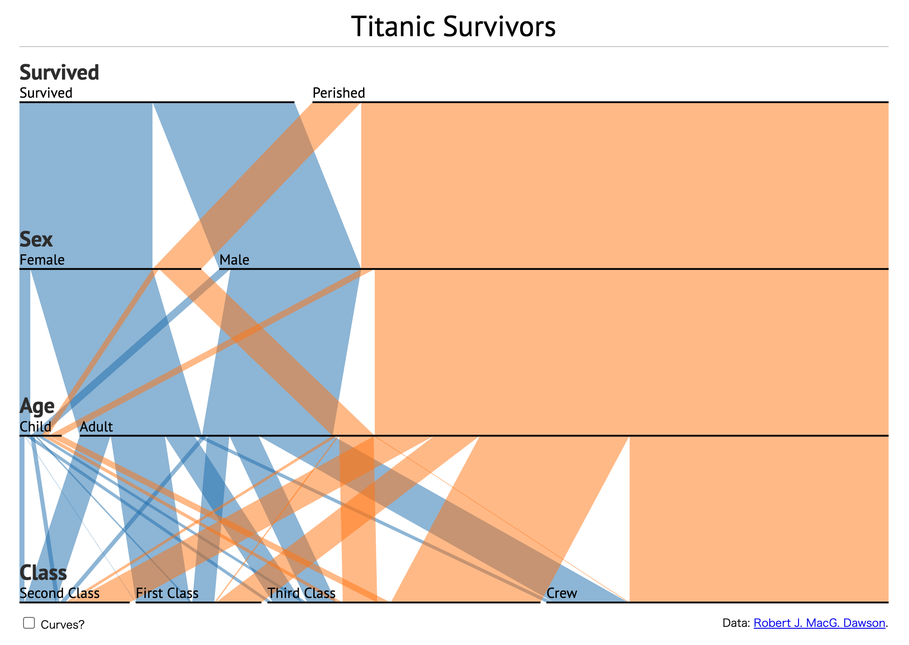
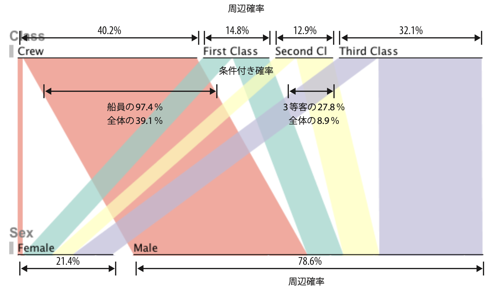

+++
author = "Yuichi Yazaki"
title = "Parallel Sets"
slug = "parallel-sets"
date = "2025-09-28"
description = ""
categories = [
    "chart"
]
tags = [
    "",
]
image = "images/Parallel_Sets.png"
+++

**Parallel sets** visualize multidimensional categorical data. Several categorical variables are arranged as parallel axes, and bands connect categories across adjacent axes. The band width represents frequency or proportion.

The method extends the idea of parallel coordinates from continuous variables to categorical combinations.

<!--more-->

## Background

Parallel sets were developed in the 2000s by visualization researchers **Robert Kosara** and **Jorg Hauser**. Their paper "Parallel Sets: Interactive Exploration and Visual Analysis of Categorical Data" introduced the method as a way to explore contingency-table data across many dimensions.

The method supports interaction such as reordering axes, rearranging categories, and highlighting subsets.

## Data Structure

| Element | Meaning |
|---|---|
| Axis | Categorical variable |
| Block | Category on an axis |
| Band | Combination between adjacent variables |
| Width | Frequency or proportion |

## Purpose

Parallel sets are used to understand relationships among several categorical variables, such as gender, age group, education, occupation, and income. They make multivariate cross-tabulations easier to inspect visually.

## How to Read It

The vertical axes represent variables. Blocks on each axis are categories. Bands connect category combinations, and wider bands indicate more observations.

A key feature is that band width can be read as both:

- a share of the whole dataset
- a conditional share within a category

## Design Notes

- Axis order strongly affects readability.
- Reduce or group categories when there are too many.
- Use consistent color logic.
- Interaction is valuable for filtering and highlighting.

## Alternatives

| Method | Data type | Feature |
|---|---|---|
| Parallel coordinates | Continuous variables | Numeric correlation patterns |
| Sankey diagram | Flows or categories | Directional flow |
| Mosaic plot | Categorical variables | Area-based cross-tabulation |
| Treemap | Hierarchy | Nested category area |

## Difference from Sankey Diagrams

Sankey diagrams usually represent directional flows such as energy, money, or process movement. Parallel sets represent combinations of categories. They are not necessarily directional, and relationships can be read from either side.

## Summary

Parallel sets are powerful for exploring categorical data across many variables. Their clarity depends on careful axis ordering, category reduction, color design, and often interaction.

## References

- [Parallel Sets: Visual Analysis of Categorical Data](https://ieeexplore.ieee.org/document/1532139)
- [Parallel Sets: Visual Analysis of Categorical Data — TVCG](https://doi.org/10.1109/TVCG.2006.76)
- [Robert Kosara — Parallel Sets](http://eagereyes.org/parallel-sets)
- [Wikipedia: Parallel Sets](https://en.wikipedia.org/wiki/Parallel_sets)
- [D3.js Parallel Sets Example](https://www.jasondavies.com/parallel-sets/)
