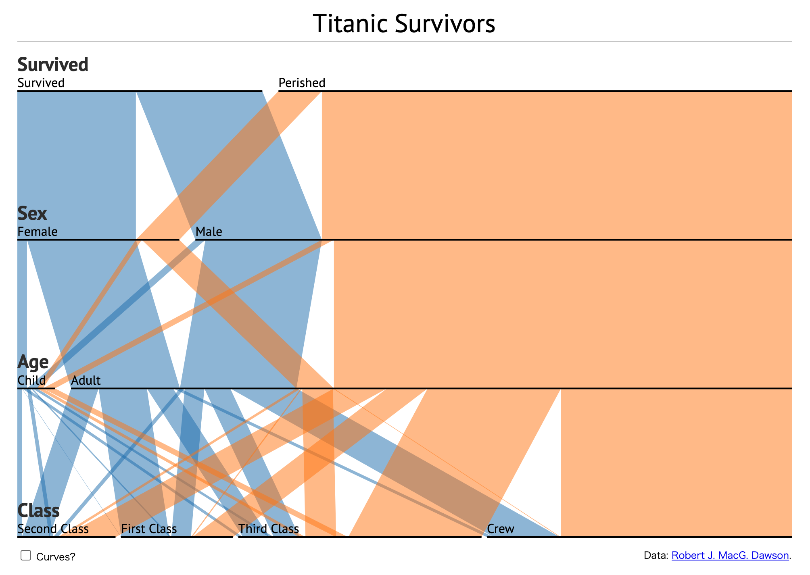
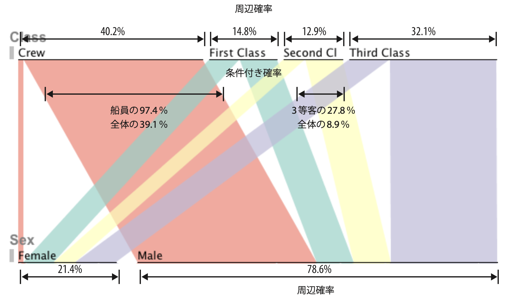

+++
author = "Yuichi Yazaki"
title = "パラレル・セット (Parallel Sets) "
slug = "parallel-sets"
date = "2025-09-28"
description = ""
categories = [
    "chart"
]
tags = [
    "",
]
image = "images/Parallel_Sets.png"
+++

データ可視化の世界では、数値データを扱うグラフやチャートは豊富に存在します。しかし、性別・職業・地域といった **カテゴリデータ（属性データ）** を多次元で扱える手法は意外と限られています。そこで登場したのが パラレル・セット (Parallel Sets 別名 ParSets) です。

<!--more-->

この手法は 2005–2006 年に Robert Kosara, Fabian Bendix, Helwig Hauser によって発表されました。学術論文としては IEEE Transactions on Visualization and Computer Graphics (2006) に掲載され、さらに Kosara 自身による解説記事や『ビューティフル・ビジュアライゼーション』第12章でも詳しく紹介されています。

## パラレル・セットとは？

パラレル・セットは、パラレル・コーディネイト（Parallel Coordinates）から着想を得て開発された手法です。「パラレル・コーディネイトが数値データに強いのに対し、パラレル・セットはカテゴリデータ専用に設計されています。

基本構造

- 1. 縦に並んだ軸：各軸が変数（例：性別、年齢層、職業など）を表す。
- 2. ブロック：軸ごとのカテゴリ値を矩形で示し、幅は該当データ数に比例。
- 3. リボン：隣接する軸のブロックを帯で接続。太さは「その組み合わせの人数／頻度」に対応。

これにより「クロス集計表」を視覚的に把握できるのが最大の特徴です。

さらに重要なのは、リボンの幅が二重の意味を持つという点です。

- **データ全体の中での割合（周辺確率）** を表すと同時に、
- **上位属性が与えられた条件下での割合（条件付き確率）** も表します。

たとえば「1等室の乗客のうち女性は何割か」という情報が、リボンの幅から一目で読み取れます。これは単なる棒グラフやサンキー・ダイアグラムにはない、パラレル・セット独自の特徴です。

## サンキー・ダイアグラムとの違い

パラレル・セットはしばしばサンキー・ダイアグラムと混同されますが、目的は大きく異なります。

- サンキー・ダイアグラム：エネルギーの流れやお金の流れなど、プロセスや時系列を「流れ」として表現する。基本的に一方向のフロー。
- パラレル・セット：カテゴリの組み合わせや集合関係を表現する。フローの概念はなく、どちらの軸からも関係性を読み取れる。

## 論文での位置づけ

Kosara らの論文（2006）では、パラレル・セットは以下のように定義されています。

- カテゴリデータのための新しい可視化
- クロス集計（contingency table）をベースに、部分集合の頻度をリボンで表現
- 軸やカテゴリの並べ替え、部分集合の強調などのインタラクション機能を備える
- 高次元でも有効にパターンを見つけられる

## 記事での補足

『ビューティフル・ビジュアライゼーション』第12章 では、パラレル・セットの「開発舞台裏」や「実装上の工夫」が丁寧に語られています。

- 開発経緯：当初は大規模な消費者調査データを扱うために考案。
- 実装モデル：SQLiteを用いた軽量データベース、ハッシュテーブルによる部分集合管理。OLAPやデータウェアハウスに近い仕組み。
- デザインの進化：棒グラフ＋リボンから木構造的なデザインへ。周辺確率と条件付き確率の同時表現。
- 応用事例：VisWeek 2009 での展示。行政データ、顧客データ、プロセス分析などへの実用。

これにより、パラレル・セットは単なる可視化技法にとどまらず、データモデル設計と視覚表現を統合した手法であることが強調されています。

## まとめ

パラレル・セットは、少数の既存手法しか対応できなかった「多次元のカテゴリデータ」を直感的に理解するための画期的な可視化です。

- サンキー・ダイアグラムとは異なり「流れ」ではなく「集合の関係」に焦点を当てる。
- データベース設計と連携し、インタラクションによって探索性を高められる。
- 学術的な新規性だけでなく、実務に役立つ応用例も豊富。

## 参考・出典

- [Kosara, R., Bendix, F., & Hauser, H. (2006). Parallel Sets: Visual Analysis of Categorical Data. IEEE TVCG](https://doi.org/10.1109/TVCG.2006.76)
- [Bendix, F., Kosara, R., & Hauser, H. (2005). Parallel Sets: Visual Analysis of Categorical Data. IEEE InfoVis](https://ieeexplore.ieee.org/document/1532139)
- [Robert Kosara – Parallel Sets (公式サイト)](http://eagereyes.org/parallel-sets)
- [Jason Davies – D3.js Parallel Sets Demo](https://www.jasondavies.com/parallel-sets/)
- [Springer Encyclopedia of Database Systems – Parallel Sets](https://link.springer.com/referenceworkentry/10.1007/978-1-4899-7993-3_63140-1)
- 『ビューティフル・ビジュアライゼーション』第12章「表のツリー表現 - Parallel Sets の進化-」
