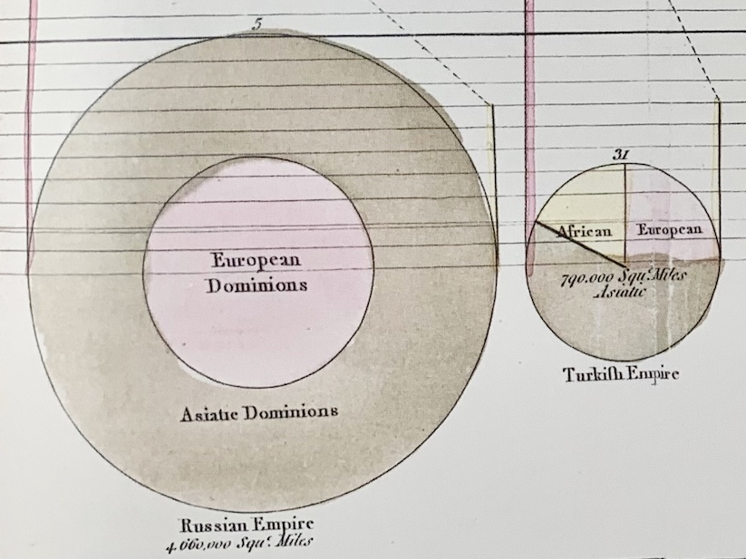

+++
author = "Yuichi Yazaki"
title = "円グラフの発明"
slug = "pie-chart-william-playfair-area"
date = "2025-10-12"
categories = [
    "consume"
]
tags = [
    "",
]
image = "images/cover.png"
+++

この図は、統計グラフの創始者ウィリアム・プレイフェア（William Playfair, 1759–1823）が1801年に刊行した著書『*The Statistical Breviary*』に収録されたものです。

正式タイトルは「*Statistical Chart, showing the Extent, the Population & Revenues of the Principal Nations of Europe, in the order of their Magnitude*」。

ヨーロッパ諸国の**領土面積・人口・国家歳入**という三つの異なる数値を、一つの図で同時に比較するという試みで、これは世界初の多変量可視化（multivariate visualization）の一例とされています。

<!--more-->

## チャートの構造と読み方

一見して凡例は見当たりませんが、プレイフェア本人の解説（『Statistical Breviary』本文）および後世の研究（Friendly, Pritchard, Spence など）から、図の構造は次のように解釈されています。

| 要素 | 視覚的表現 | 内容・意味 |
|------|--------------|-------------|
| 円の面積 | 比例スケール | 各国の総面積（平方マイル） |
| 内側の円 | 外円との比 | ヨーロッパ領土部分（European Dominions） |
| 左側の縦線（実線） | ピンク系 | 人口（左目盛に対応, 単位: 百万人） |
| 右側の縦線（実線） | 黄系 | 国家歳入（右目盛に対応, 単位: 百万ポンド） |
| 両線を結ぶ点線 | 斜線・破線 | 同一国の人口線と歳入線を結ぶ補助線（比較を視覚的に対応づけるため） |

## プレイフェア本人の説明

プレイフェアは原著の本文で次のように述べています。

> “The figures within the circles shew the number of square miles in the countries they represent.  
> The dotted lines drawn between the population and revenue, are merely intended to connect together the lines belonging to the same country.”  
> （『The Statistical Breviary』1801年より）

この記述から、

- **円内の数値＝国土の面積**
- **点線＝人口線と歳入線を「同一国のもの」として結ぶ補助線**

であることが明確にわかります。つまり、点線は新たな変数を表すものではなく **二つのスケールを対比するための導線** として描かれているのです。

## 部分拡大：フランス・スペイン・ブリテンの比較

図の右半分では、フランス（France）、スペイン（Spain）、ブリテンおよびアイルランド（Britain & Ireland）の三国が並びます。

- **円（面積）**  
  フランス149,000平方マイル、スペイン148,000平方マイル、ブリテン105,000平方マイル。  
  面積ではフランスとスペインがほぼ同等、ブリテンはやや小さい。

- **左側の線（人口）**  
  フランス：約2,700万人、スペイン：約1,500万人、ブリテン：約1,000万人。

- **右側の線（歳入）**  
  フランス：約174百万ポンド、スペイン：約74百万ポンド、ブリテン：約210百万ポンド。  
  → 面積・人口で劣るブリテンが、歳入では突出して高い位置に描かれています。

- **点線の傾き**  
  右上がりに描かれることで「人口に対して歳入が多い国」を直感的に示します。  
  フランスとスペインは線がほぼ水平ですが、ブリテンでは右の線（歳入）が極端に高く、急な右上がりの点線が描かれています。  
  これは **少ない人口で多くの収入を得る国＝経済効率が高い国** としてのブリテンの姿を視覚的に表しています。

## 歴史的背景と意義

1801年はナポレオン戦争直前、ヨーロッパ諸国の勢力比較が政治的関心の的となっていた時代です。  
プレイフェアは『Statistical Breviary』において、各国の「国力」を数字だけでなく **視覚的に理解できる形に翻訳** することを目的としていました。

この図では、

- 面積（国土の広さ）
- 人口（人的資源）
- 歳入（財政力）

という三つの要素を重ねて表現することで、「国家の規模と富の関係」を一目で理解できるように設計されています。

この試みは、後世の「バブルチャート」や「複合グラフ」の原型とされ、データ・ビジュアライゼーション史における画期的な発明でした。

## 現代的視点からの再評価

この図は、今日の情報可視化においてもいくつかの重要な教訓を与えます。

1. **異なるスケールの変数を一つの図に統合する方法** ...現代のマルチアクシス・チャートの先駆例
2. **構造的凡例がなくても、視覚的秩序で意味を導く設計** ...情報デザインとしての強い直感性
3. **「傾き」や「高さ」の比較が象徴的なメッセージを持つ** ...定量精度よりも関係性の強調

これらはいずれも、プレイフェアが単に統計を示すのではなく **ストーリーを伝えるための図** を構想していたことを示しています。

## まとめ

ウィリアム・プレイフェアの『Statistical Chart』は、凡例を欠きながらも構造的秩序によって「国土・人口・歳入」という三つの変数を同時に比較させる視覚言語を確立しました。

彼が述べたように点線は単なる「連結線」ですが、それによって三つの尺度が統合され、見る者は**国の規模・人の数・富の力**を一目で感じ取ることができます。

この図は、現代の情報デザインやデータビジュアライゼーションの原点に位置づけられる作品です。

## 参考・出典

- [Google Books – *The Statistical Breviary* (1801, William Playfair)](https://books.google.com/books/about/The_statistical_breviary_shewing_the_res.html?id=Y4wBAAAAQAAJ)
- [David Rumsey Map Collection – Statistical Chart, 1801](https://www.davidrumsey.com/luna/servlet/detail/RUMSEY~8~1~287375~90062410)
- [Friendly, M. – *A History of Data Visualization and Graphic Communication* (Harvard University Press, 2021)](https://dokumen.pub/a-history-of-data-visualization-and-graphic-communication-illustrated-0674975235-9780674975231.html)
- [Pritchard, C. – “Life of Pie: William Playfair and the Impact of the Visual” (Mathematical Association, 2019)](https://m-a.org.uk/resources/PE4LifeofPie.pdf)
- [Branch Collective – Jonathan Sachs, “William Playfair, Statistical Graphics, and the Meaning of an Event”](https://branchcollective.org/?ps_articles=jonathan-sachs-17861801-william-playfair-statistical-graphics-and-the-meaning-of-an-event)