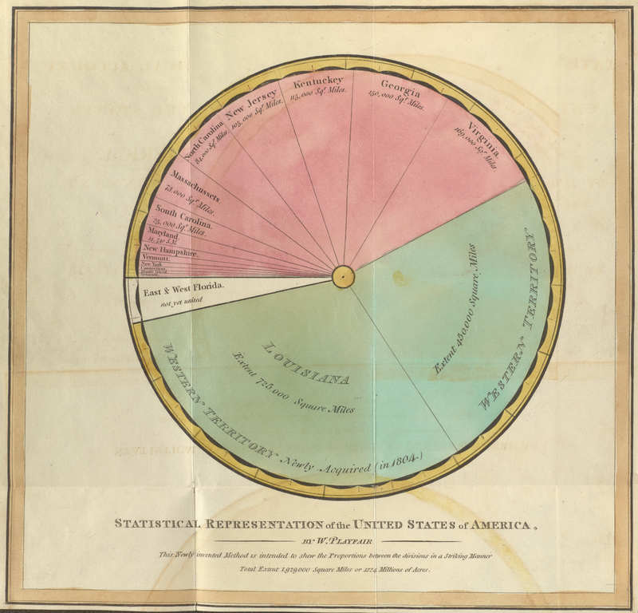

+++
author = "Yuichi Yazaki"
title = "William Playfair's Statistical Representation of the United States of America"
slug = "pie-chart-william-playfair-part"
date = "2025-10-12"
categories = [
    "consume"
]
tags = [
    "",
]
image = "images/cover.png"
+++

This figure is from William Playfair's *Statistical Representation of the United States of America*, created around 1805. Playfair, known as an inventor of statistical graphics, represented the territorial extent of the United States through proportional circular areas. It is one of the early forms related to his invention of the pie chart.

<!--more-->

## Overview

The diagram shows the areas of U.S. states and newly acquired territories such as Louisiana and Florida. The title explains that the proportional method is intended to show the proportion among divisions of a territory.

## Why It Matters

Playfair was not simply drawing decorative diagrams. He was exploring how economic and geographic quantities could be made visible through graphical form. This work sits at the early boundary between statistical charting, cartography, and proportional area representation.

## Summary

Playfair's circular representation of U.S. territory is an important historical example because it shows how early statistical graphics experimented with area, proportion, and geography before chart conventions became standardized.
