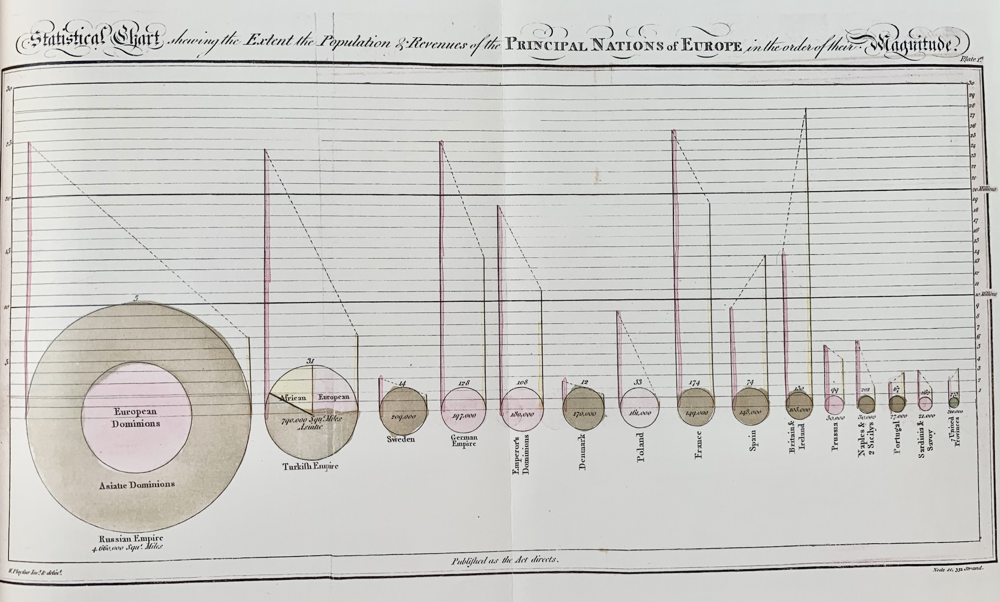
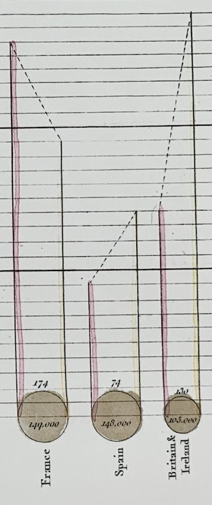

+++
author = "Yuichi Yazaki"
title = "William Playfair Drew Two Different Kinds of Circular Charts"
slug = "pie-chart-william-playfair"
date = "2025-10-12"
categories = [
    "consume"
]
tags = [
    "",
]
image = "images/cover.png"
+++

William Playfair (1759-1823) is often credited with inventing the pie chart, one of the first charts to represent proportions within a circle. His goal was to make economic and geographic data visible and understandable.

But the circular diagrams he actually drew included two different forms. Both appeared in his 1801 book *Statistical Breviary*.

<!--more-->

## 1. The Sector-Based Type: The First Pie Chart

This diagram shows the areas of U.S. states and newly acquired territories such as Louisiana and Florida in proportional form. The title explains that the method is intended to show the proportion among divisions of a territory.

Here, the angles of the sectors correspond to the areas of the states. This is the principle of the modern pie chart.

## 2. The Concentric-Circle Type: A Circle Area Chart

This diagram uses area to compare territorial size. The circle is not divided primarily by angle; it compares quantities through circular area. In modern terms, it is closer to a circle area chart.

Only the Russian Empire and the Turkish, or Ottoman, Empire are broken down internally.

For the Russian Empire, Playfair used a concentric structure: the central circle represents the European territory, and the outer ring represents the Asian territory.

For the Turkish Empire, the territorial breakdown among Europe, Asia, and Africa is shown more like a modern pie chart, using angle as the proportional element.

The reason for using two forms may have been practical rather than theoretical. The charts were hand-colored, and the available space was limited. A large territory such as Russia could accommodate a concentric structure, while a smaller one such as the Ottoman Empire was easier to read when divided radially.

## Summary

| Modern name | Principle | Feature |
|---|---|---|
| Pie chart | Shows proportion by angle | Divides a circle into sectors |
| Circle area chart | Shows quantity by area | Compares circular areas or concentric regions |

Playfair's circular diagrams therefore included both a true pie chart based on angle and a circle area chart based on area. Looking closely at these differences helps clarify the early history of statistical graphics.

## References

- [Life of Pie: William Playfair and the Impact of the Visual](https://m-a.org.uk/resources/PE4LifeofPie.pdf)
- [Pie chart - Wikipedia](https://en.wikipedia.org/wiki/Pie_chart)
- [William Playfair - Wikipedia](https://en.wikipedia.org/wiki/William_Playfair)
- [Playfair's Pie Chart - Lehigh University Exhibits](https://exhibits.lib.lehigh.edu/exhibits/show/data_visualization/case_one/playfair)
- [Playfair's Introduction of Bar and Pie Charts to Represent Data](https://digitalcommons.ursinus.edu/cgi/viewcontent.cgi?article=1005&context=triumphs_statistics)
