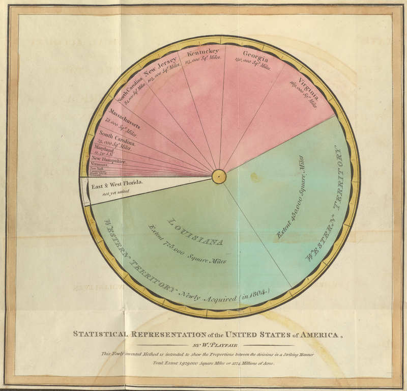
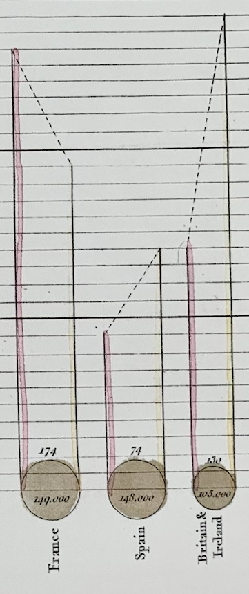

+++
author = "Yuichi Yazaki"
title = "ウィリアム・プレイフェアが描いた「円」グラフは2種類あった"
slug = "pie-chart-william-playfair"
date = "2025-10-12"
categories = [
    "consume"
]
tags = [
    "",
]
image = "images/cover.png"
+++

ウィリアム・プレイフェア（William Playfair, 1759–1823）は、経済データを“見てわかる形”にするために、世界で初めて「割合を円で表す」チャートとして「円グラフ（Pie Chart）」を発明したと言われています。

ところが、彼が実際に描いた円の図には、少し異なる2つの形式があったのです。どちらも1801年の著書『Statistical Breviary（統計摘要）』に登場します。

<!--more-->

## 1. 「扇形で分ける」タイプ —— 世界初の円グラフ（Pie Chart）

この図は、アメリカ合衆国の各州および新たに取得された領土（ルイジアナ、フロリダなど）の面積を比例的に示したものです。タイトル下には「This Proportional Method is intended to shew the Proportion between the divisions of a Territory」（この比例的な方法は領土の区分間の比率を示すことを意図している）と書かれています。

プレイフェアは、経済や地理的規模などの比較を視覚的に理解させるため、データを図として表現することに強い関心を持っていました。この作品では、円の扇形（セクター）の角度が各州の面積に比例しており、現在の円グラフ（Pie Chart）の原理そのものです。

## 2. 「同心円で分ける」タイプ —— 面積で比較する円（Circle Area Chart）

この図では **面積** によって領土の比率を示しています。
つまり、ここでの円は「角度」ではなく「面積」で数量を比較する図であり、
現代でいう **円面積チャート（circle area chart）** の原型です。

ただ、この中で、ロシア帝国とトルコ帝国（オスマン帝国）についてのみ、内訳を示しています。

ロシア帝国は円を **二重構造（同心円）** にして **中心の円をヨーロッパ領、外側の円（環）をアジア領** としました。

トルコ帝国では、現代の円グラフ風に **角度** として **ヨーロッパ・アジア・アフリカという領土の内訳** が示されています。各部分の角度（＝円周の比率）が全体に対する割合を表しています。

なぜ2種類を使い分けたのかについては、プレイフェア自身の意図というよりは、描く都合の違いが大きかったと考えられています。
当時は手描きの彩色版で、図の大きさにも限界がありました。ロシアのように大きい国は円を二重構造にしても描けましたが、トルコ帝国のように小さな国では、放射状に分けたほうが見やすかったのです。つまり、技術的な制約の中で生まれた2種類の円表現だったわけです。

## まとめ

| 現代の呼び方 | 表現原理 | 特徴 |
|---------------|------------|------|
| 円グラフ（Pie Chart） | **角度** で割合を示す  | 円を扇形に分割して、地域ごとの比率を表す。世界初の「円グラフ」。 |
| 円面積チャート（Circle Area Chart） | **面積** で数値を示す  | 同心円の面積で比較する。円グラフとは異なり「面積比較図」。 |

プレイフェアの「円の図」は、ひとつは **角度で割合を見せる円グラフ（Pie Chart）** 、もうひとつは **面積で比較する円面積チャート（Circle Area Chart）** と呼べるものでした。

## 参考・出典

- [Life of Pie: William Playfair and the Impact of the Visual (Mathematical Association)](https://m-a.org.uk/resources/PE4LifeofPie.pdf)
- [Pie chart - Wikipedia](https://en.wikipedia.org/wiki/Pie_chart)
- [William Playfair - Wikipedia](https://en.wikipedia.org/wiki/William_Playfair)
- [Playfair’s Pie Chart - Lehigh University Exhibits](https://exhibits.lib.lehigh.edu/exhibits/show/data_visualization/case_one/playfair)
- [Playfair’s Introduction of Bar and Pie Charts to Represent Data - Digital Commons @ Ursinus](https://digitalcommons.ursinus.edu/cgi/viewcontent.cgi?article=1005&context=triumphs_statistics)
