+++
author = "Yuichi Yazaki"
title = "見えないものを「窓」にする——Giorgia Lupi『Plastic Air』"
slug = "plastic-air"
date = "2026-08-16"
description = "大気中マイクロプラスチックを、近似と想像の窓として見せる Giorgia Lupi / Google Arts & Culture の『Plastic Air』を、データ可視化とスペキュラティブ・デザインの交差から読む。"
categories = [
    "consume"
]
tags = [
    "オリジナルのビジュアル変換",
]
image = "images/cover.jpg"
+++

Giorgia Lupi と Pentagram の Talia Cotton、Phil Cox による『Plastic Air』（2021）は、大気中のマイクロプラスチックを、画面上の「窓」として見せるウェブ体験です。Google Arts & Culture との協働で Earth Day 2021 に公開され、UNFCCC と Google が展開した *Heartbeat of the Earth* の一連の気候実験に含まれます。

ここで重要なのは、本作が完成した科学図ではなく、**未完の知見を「近似と想像の窓」として設計している**点です。Lupi 自身が、体験を *speculative “window” onto a data-driven approximation* と呼び、可視化の方法論そのものが「まだ限られ、推測的な情報」を扱う作業だったと書いています。データ可視化とスペキュラティブ・デザインが交差するのは、この自己規定においてです。

<!--more-->

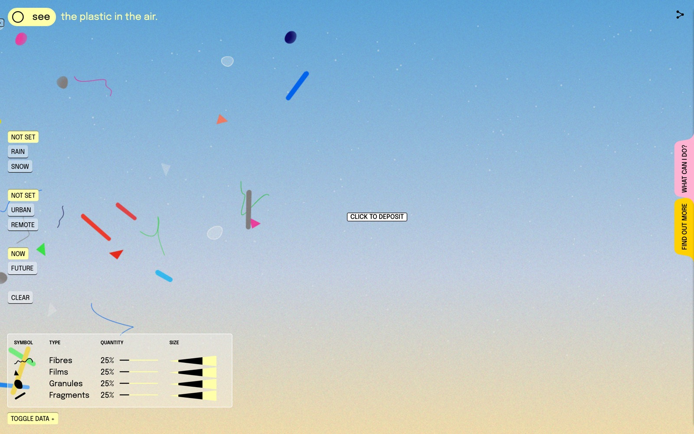

体験は [artsexperiments.withgoogle.com/plasticair](https://artsexperiments.withgoogle.com/plasticair/) で公開されています。

## 現行の公開版について

最初に見えるのは、大きな「PLASTIC / IN THE AIR」と、中央の “You **don’t see** it, but it's there.” です。このスイッチは粒子の切替ではなく、**体験を始める操作**です。スクロールも、ほかのボタンも、この状態では出てきません。`body` が `overflow: hidden` で、本編の操作盤はイントロ中に隠されています。

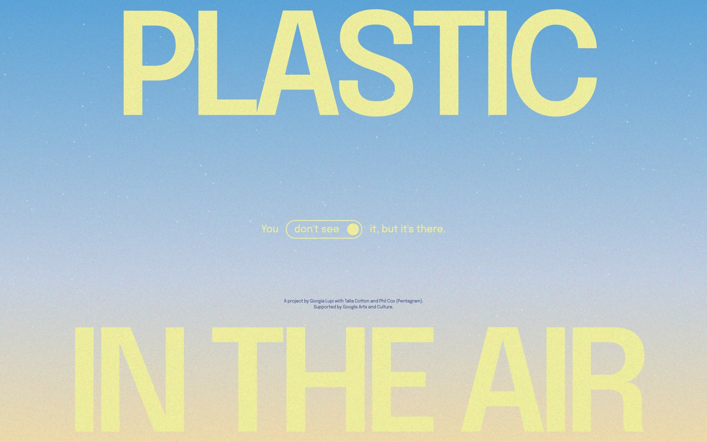

現行実装では、全面の粒子キャンバスがこのスイッチより前面に乗っており、クリックが届きません。見た目は押せるのに画面が変わらない、という状態になります。Chrome 特有というより、公開版の重なり順の不具合です。本編に入るには、コンソールで次を実行するのが確実です。

```javascript
document.body.classList.remove('intro-visible')
```

以降は、この本編に入れたうえでの読みです。

## 画面の構成

本編は、空そのものをキャンバスにした一枚絵です。情報は四隅に寄せられ、中央は粒子の動きに明け渡されています。

- **左上**：see / don’t see のスイッチ。「the plastic in the air.」という文の主語になる
- **左**：天候・場所・時間の条件ボタンと、Clear
- **左下**：凡例テーブル（Symbol / Type / Quantity / Size）と Toggle Data
- **中央**：粒子が漂う空。カーソルに「Click to Deposit」が追従する
- **右端**：Find out More / What can I do? のタブ
- **右上**：共有

マウスを動かすと、カーソル横の小さなラベルが日常行為の名前（Drink a latte、Do my laundry など）を示します。これは堆積（Deposit）の予告です。公式の説明では、空をクリックするとその行為に対応する日用品が分解され、粒子になるとされています。ただし現行の公開版では、その分解はほぼ見えません。理由は次節です。

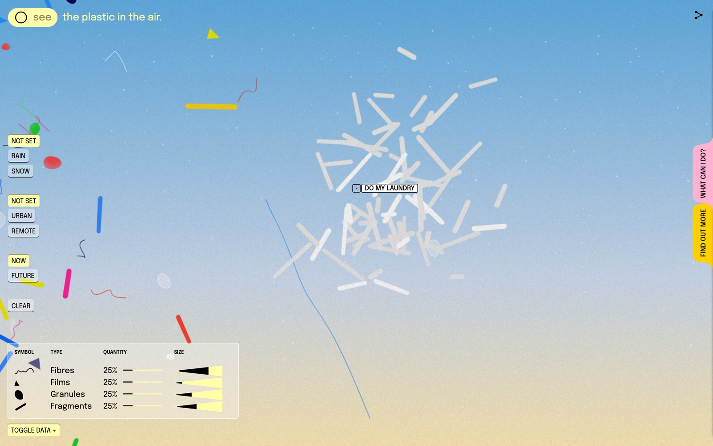

## 操作方法

操作は、見る・寄せる・条件を変える・見ない、の四つです。公式の「About this website」も、Inspect / Deposit / Don’t see の順で説明しています。

### 1. 粒子にマウスを近づける（Inspect）

クリックではなく、**ホバー**です。粒子の中心からおよそ 60px 以内にカーソルが入ると、その粒子だけ動きを止め、白い枠の拡大レンズと属性パネルが出ます。パネルに出るのは次の五つです。

- **Type**：Fibre / Film / Granule / Fragment
- **Composition**：ナイロン、ポリウレタン、ポリスチレンなど、想定される化学組成
- **Possibly from**：セーター、断熱フォーム、買い物袋など、想定される元の製品
- **Size**：マイクロメートル（μm）
- **Distance travelled**：移動距離（km）

出自は「確定」ではなく *possibly from* です。It's Nice That が報告した例（オレンジの三角形＝ポリスチレン／カトラリーの可能性、糸状＝ポリエステル／セーターの可能性）も、このパネルの読み方です。

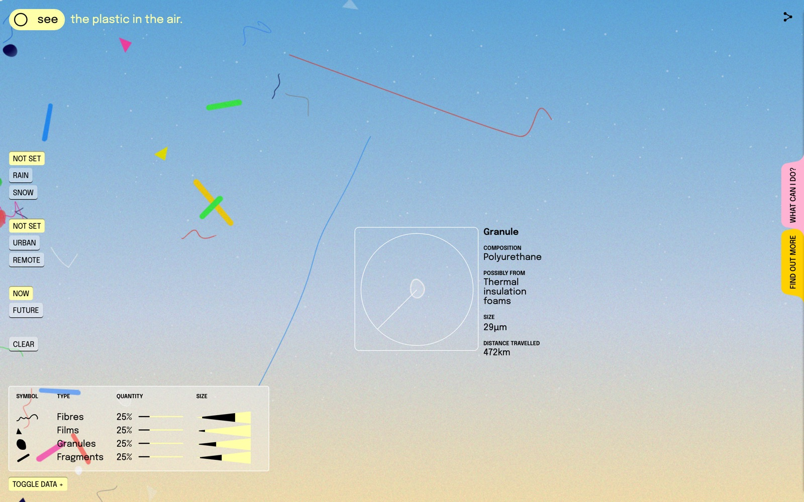

### 2. 空をクリックして堆積させる（Deposit）

公式の「About this website」は、空への堆積をこう説明しています。日常の品が壊れていく様子を、能動的に見られる、と。PRINT Magazine が *American Beauty* の舞う袋に重ねたのも、この分解の瞬間です。

現行の公開版で実際に起きているのは、そこまでではありません。カーソルに追従するラベル（最初は「Click to Deposit」、のちに Do my laundry など）が、空のキャンバスより前面にあります。見える案内をクリックすると、クリックはそのラベルが受け取ります。ラベル側の処理は、押された見た目を足すだけです。製品画像は出ず、同種の粒子も増えません。

分解の処理自体はコードに残っています。キャンバスがクリックを受け取ったときだけ、製品画像をその位置に置き、一瞬で縮小しながら消し、繊維なら繊維、フィルムならフィルムをその点へまとめて足す。ただし画像の指定が縮小開始のあとなので、読み込みが間に合わなければ画像は見えません。粒子の増加も、すでに漂っている空のなかでは判別しにくいです。

いまのサイトで確実に読めるのは、ラベルが次の行為名を予告していること、公式と第三者評がその分解を作品の核として語っていること、の二つです。画面上の紙吹雪として再現されている、と書くのは正確ではありません。

### 3. 左の条件で空の論理を変える

左のボタンは三組です。各組は排他で、選ばれたものだけ黄地になります。ホバーすると、その条件が粒子に何をするかの短い説明が出ます。

| 組 | ボタン | ツールチップが言うこと | 画面で起きること |
|---|---|---|---|
| 天候 | Not Set / Rain / Snow | Rain：粒子が増える（雨粒が運ぶ）。Snow：北極では小さくなり、遠くまで行き、砕ける | 種類の比率とサイズ分布が、対応する研究の論理に差し替わる |
| 場所 | Not Set / Urban / Remote | Urban：繊維が増える（衣類と日用品）。Remote：小さくなり、遠くまで行き、砕ける | 都市は繊維寄り、遠隔地は繊維が多くても他種も残る |
| 時間 | Now / Future | Future：除去手段がなく、2050年までに 120億トン相当が蓄積する、というコピー | 粒子の発生量がおよそ6倍になる |

初期値は Not Set × Not Set × Now です。このとき凡例の Quantity は四種とも 25% です。Urban を選ぶと繊維が 90%、破片が 10%、フィルムと顆粒は 0% に変わります。Remote と Rain を重ねると、繊維 66%、ほか三種が各 11.3% になります。

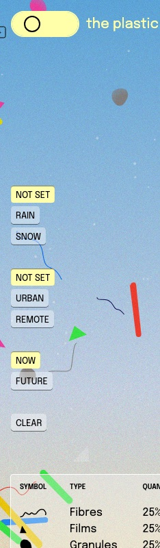

Clear は空を消しません。「本当にそれでうまくいくと思ったのか。プラスチックは耐久性のために作られている。一度そこにあると、消えない」というツールチップが出ます。画面上部の Clear screen リンクも同様です。消えないこと自体が、メッセージです。

空の色は端末の時刻に連動します。公式も、頻度は時刻では変わらないが空は変わる、朝夕の通勤時間に量が増える、と書いています。同じページを別の時間に開くと、空のトーンが違います。

### 4. see / don’t see を切り替える

左上のスイッチが、公式の *seen/unseen dichotomy* です。see は抽象粒子、don’t see は日用品のまま空を漂かせます。Fuorisalone.it は、体験がまず「問題を見たいかどうか」と問う、と要約しました。

現行の公開版では、即時の総入れ替えではありません。don’t see にすると左の操作盤と凡例が隠れ、描画リストが空になったあと、ストローやキャップなどの日用品が画面下から少しずつ入ります。画面中央だけ見ていると、変化が遅れます。下端を数秒見るのが近道です。

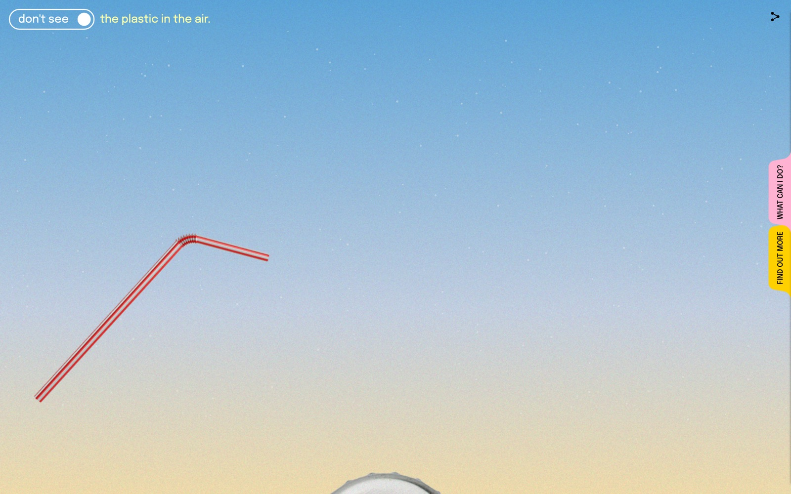

### 5. 右タブで仕組みと行動を読む

右端のタブは二枚です。中身は次のとおりです。

- **Find out More**：マイクロプラスチックとは何か、このサイトの仕組み、粒子の描き方の凡例、参照した論文
- **What can I do?**：最善はプラスチックをやめること、次善は減らすこと、最低限は身の回りのプラスチックに気づくこと。リサイクルは止めるな、しかし頼るな

ただし現行の公開版では、クリックしても開かないことが多いです。二つのパネルは閉じた状態で同じ位置に重なっており、あとから描画される What can I do? が Find out More の上に乗っています。下のタブをクリックしても、クリックは上のパネルが受け取り、Find out More は開きません。上の What can I do? は、タブの文字を正確に押せば白い文書が中央へ滑って出ます。少し左へ外すと空のキャンバスがクリックを受け取り、何も開きません。タブ自体の見た目は、開いても変わりません。

これは Chrome 固有の差ではありません。重ね順とクリックの割り当てが、実装の時点でこうなっているためです。Firefox や Safari でも、同じ重ね順になります。以下の図は、パネルを開いたときに中に書いてある内容です。

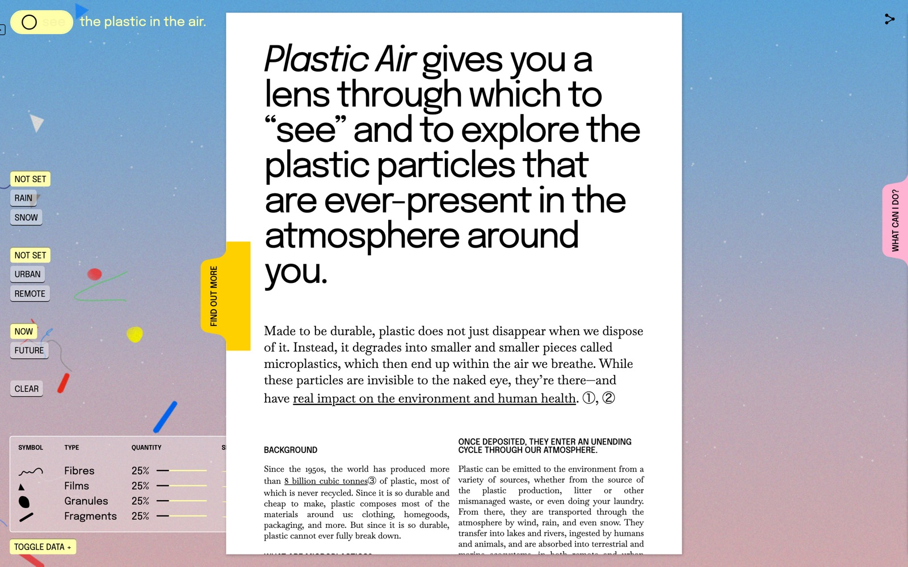

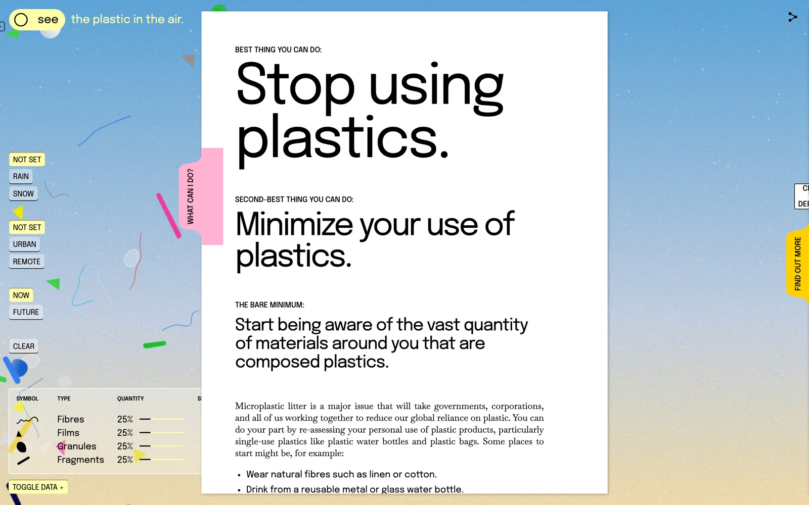

## 凡例の読み方

凡例は二層あります。Find out More 内の **Fig. 2** が、粒子をどう描くかの設計図です。左下の表は、いまの空に対する**現在値**です。

### 設計図（Fig. 2）：形・色・サイズ

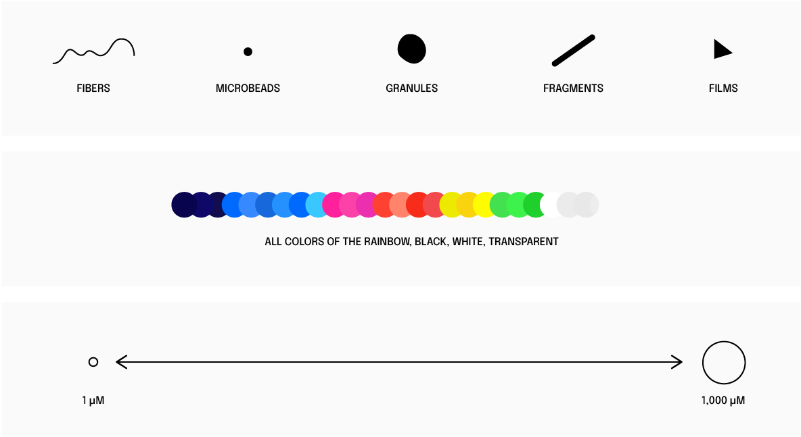

上段の **TYPE** は、顕微鏡分類に対応する形です。

| 形 | 種類 | 画面上の見え方 |
|---|---|---|
| 細い波形 | Fibers（繊維） | 糸、毛、曲がった線 |
| 小さい黒点 | Microbeads（マイクロビーズ） | 設計図にはあるが、現行の発生処理では使われていない |
| いびつな塊 | Granules（顆粒） | 丸みのある斑点、ペブル |
| 太い斜めの棒 | Fragments（破片） | 短いロッド、カプセル |
| 直角三角形 | Films（フィルム） | 三角の面 |

中段の **COLOR** は、虹の全色に黒・白・透明を足したパレットです。色は種類のコードではなく、実際の粒子がさまざまな色で見つかる、という事実の写しです。Lupi は、プラスチックそのもののように明るく光沢がある色を選んだ、と書いています。Cotton の色も、マイクロプラスチック自体の見た目に触発されています。

下段の **SIZE** は、1μm（赤血球ほど）から 1,000μm（1mm）までの連続量です。サイト内の説明では、下限は 10μm 未満、上限は 5mm（マイクロプラスチックの一般的な定義）とも書かれています。画面上の大きさは、その範囲をキャンバス用に圧縮した近似です。

公式の答えは *Yes! Well, sort of.* です。形は顕微鏡分類に基づくが、可視化は抽象である、と。

参考として、サイトが掲げる顕微鏡写真（140μm の繊維と 30μm の粒子。Janice Brahney / Utah State University）を置きます。抽象図形の元になった、実際の見た目です。

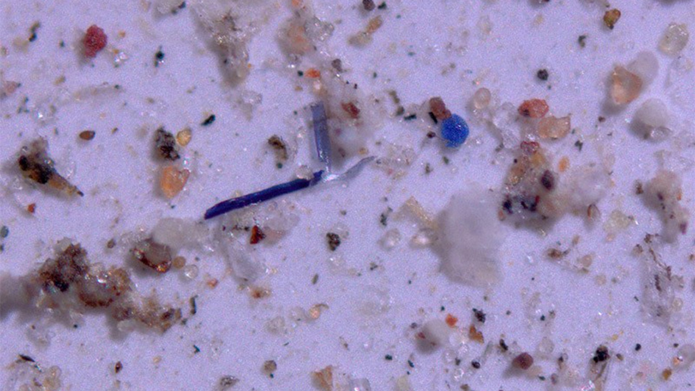

### 左下の表：いまの空の内訳

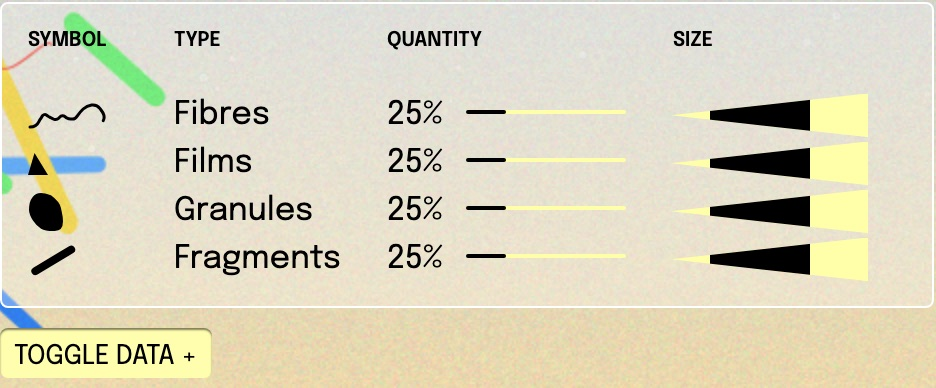

表の列は次のとおりです。

- **Symbol**：上の設計図と同じ形。画面に漂う色つき図形を、種類へ戻す鍵
- **Type**：Fibres / Films / Granules / Fragments。設計図の Microbeads は、この表には出てこない
- **Quantity**：その種類が、いまの条件で何割を占めるか。数字と、黒い線の長さが対応する
- **Size**：その種類のサイズ範囲。左が小さく、右が大きい。黒い楔の位置と幅が、現在の分布の区間

初期状態では Quantity が四種とも 25% です。これは「世界平均が均等」という意味ではなく、場所も天候も選んでいないときの既定値です。

条件を変えると、この表が先に変わり、空の粒子構成がそれに従います。Urban を選ぶと繊維が支配的になります。

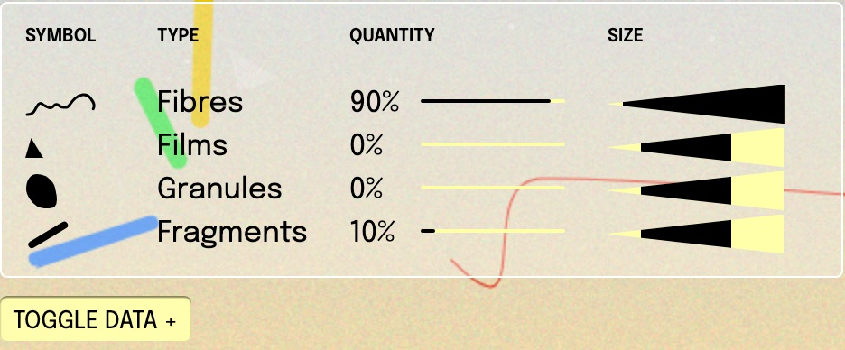

Remote と Rain を重ねると、遠隔地の降雨研究に寄せた比率になります。繊維が過半ですが、フィルム・顆粒・破片も残ります。

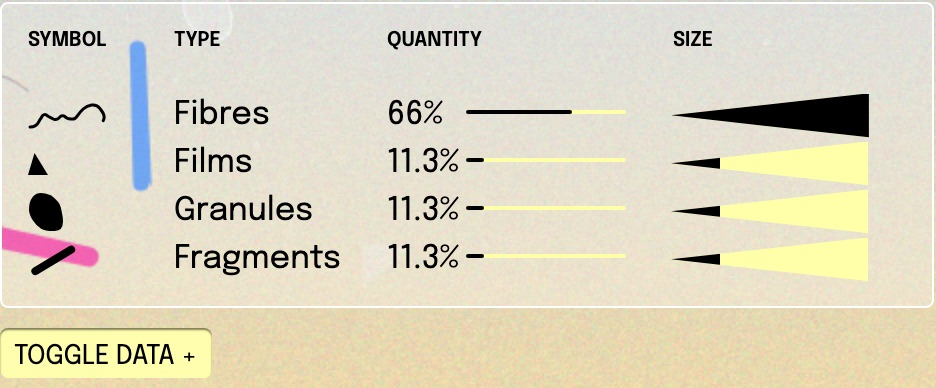

**Toggle Data +** はこの表の表示／非表示です。表を閉じても粒子は残ります。凡例は空の翻訳であり、空そのものではありません。

粒子の属性は、種類ごとに用意された製品リストからランダムに割り当てられます。繊維ならセーター、漁網、ナイロンの歯ブラシ毛。顆粒ならボトル、バンパー、使い捨てカトラリー。フィルムなら買い物袋、シャワーカーテン、ストロー。破片なら CD、床材、キーボード。ホバーで見える「Possibly from」は、そのリストの一文です。

## 一次情報から見える制作条件

Google 側の依頼は、プラスチック汚染の危険を視覚化することでした。制約は二つです。対象が肉眼では見えないこと、大気中マイクロプラスチック研究が当時まだ萌芽期で、単一の決定的データセットがなかったことです。

天候ごとの挙動は、統合データではなく、孤立した研究から論理を組んでいます。雪は Alps〜Arctic の積雪研究（Bergmann et al., 2019）、遠隔地はピレネー（Allen et al., 2019）と米国の保護地域（Brahney et al., 2020）、都市はパリ（Dris et al., 2015）。Experiments with Google は、University of Strathclyde と Utah State University の科学者による scientific validation を明記しています。

つまり本作のデータは、「空全体の真実」ではなく、**地点研究を論理として束ねた近似モデル**です。スペキュラティブであることは、科学を放棄したことではなく、欠損を可視化の前提として引き受けたことです。

## データ可視化 × スペキュラティブ・デザイン

スペキュラティブ・デザインは、完成解を提示するより、「もし〜だったら」という条件を立てて、いま見えていない現実や将来を議論可能にします。本作が自分を *speculative window* と呼ぶとき、窓は装飾ではなく方法です。

**不可視を、選択可能な状態にする。** 気候ストライプや海のプラスチック映像と違い、大気中マイクロプラスチックには直感的に指せる被害画像が乏しい、と Lupi は It's Nice That で述べています。*out of sight, out of mind* が文字どおりなので、plastic disposition の過程を内臓的に語る必要があった、と Communication Arts 向けの制作メモも繰り返します。see / don’t see は認識のスイッチであり、見ないことを選ぶ社会の状態の演技でもあります。冒頭のコピーはそれを先取りしています。「You don’t see it, but it's there.」現行公開版がイントロで止まりやすいことは、意図せずこの文を字義どおりにしています。

**数字を、誰かの習慣に戻す。** Lupi は本作を Data Humanism の実践だと書いています。マニフェストでは「Data-driven は紛れもない真実を意味しない」「可視化は不完全さと近似を引き受けるべきだ」と述べていました。Deposit のプロンプトは、その原則のインタラクション化です。*possibly from* の曖昧さは欠陥ではなく、データが推定を含むことの表示です。

**未来を、予測図ではなくシナリオとして置く。** Now / Future は確定予報ではなく、現行軌道の延長です。体験自身は、最大のリスクは「分かっていないこと」だと書いています。Future は警告の完成形というより、研究不足を含めた不確実性の延長です。

**美しさを、汚染の修辞として使う。** 色は「汚れた公害」の反対で、プラスチックのように明るく光沢がある、と Lupi は書いています。It's Nice That で彼女は、悪いと告げるだけでは人は信じない、興味深い見せ方でリアルにする必要がある、とも述べています。Fast Company によれば、典型的な曇った汚染描写から離れ、滞在したくなる美しさを狙った。魅力は注意を引き、同時にプラスチックがもともと持っていた誘惑——安く、きれいで、便利——を再現します。PRINT の「shitty pollution party」は、その両義性を短い英語で捉えています。

## 第三者による評価・評判

公開直後の報道は、デザインメディアによる受容が中心です。トーンはほぼ一貫して、「美しい／魅惑的」と「深刻／見えない毒」の並置です。

- **It's Nice That**（2021-04-22）は *beautiful yet alarming* と見出し、Lupi への取材で「研究がまだ始まったばかり」「見えないものを可視化するのが抽象的難題」という自己認識を伝えています。
- **Fast Company** は、ラテやテイクアウトと呼吸がつながる、という体験の因果を見出しに使い、粒子が *dance* すると書いています。Cox は研究者と「どんなサイトが認知を上げるか」を詰め、Cotton は色をマイクロプラスチック自体から取った、と役割分担まで記しています。
- **PRINT Magazine** は Data Humanism を「事実と数字を人間化して問題を枠づける」と要約し、*deeply captivating and approachable* と評しつつ、confetti を汚染のパーティーとして皮肉っています。
- **Communication Arts** は WebPicks として、Cotton（designer and developer）、Cox（design and data）、Lupi（information designer）の応答を掲載しています。制作一次資料に近いインタビュー掲載として読むのが正確です。
- **What Design Can Do** は、気候データを不透明でなく、より人間的にする例だと位置づけています。
- **HOVERSTAT.ES**（2021-12-21）は一行で、*Although visually charming, this interactive project highlights the serious problem of airborne microplastics.* と書いています。
- **LSN Global** は、Pentagram の *speculative window* という自己規定をそのまま引用しています。
- **Fuorisalone.it** は、抽象だが実データに基づく、行動喚起は簡潔で率直、と紹介しています。

評価の中心は、再現精度の検証というより、「見えない汚染を、滞在可能な体験として成立させたか」です。Lupi の仕事はもともと、論文の可視化ではなく、人が数字に関われる状態を設計することにあります。本作もその延長で読んだ方が筋が通っています。

Deposit の意図は、責任を遊びへ変換することです。美しさと紙吹雪は、その変換を加速する装置として設計されています。現行の公開版では、そのクリックがラベルに吸われ、紙吹雪としては見えにくい。設計の核と、いま画面で起きることとは、分けて読む必要があります。「What can I do?」は個人の消費削減を最前列に置き、政府と研究資金は希望として後段にあります。リサイクル幻想は否定しているので、単純な啓発サイトではありません。それでも、システムの問題を個人の選択劇として体験させる構造は、スペキュラティブな可視化が抱え込む緊張です。

## まとめ

『Plastic Air』は、当時データが足りず、視覚も持たなかった大気中マイクロプラスチックに対して、科学図の代替物ではなく **「近似の窓」** を設計した作品です。見る／見ない、日常の投下、都市と天候、現在と未来。いずれも、完成した事実の提示というより、条件を変えて考えるためのインターフェイスです。

左下の凡例は、その窓の読み方です。波形は繊維、三角はフィルム、塊は顆粒、短い棒は破片。Quantity はいま選んでいる条件の内訳で、Size はその種類の大きさの区間です。ホバーは一文の物語（何でできて、どこから来て、どれだけ旅したか）を足します。

Data Humanism が言う「データは不完全である」は、ここでは免責ではなく方法です。*Yes! Well, sort of.* と書く正直さが、スペキュラティブな可視化を装飾的フィクションから区別しています。現行の公開版が入口・堆積・右タブでつまずきやすいことは、作品の運命ではなく実装の経年です。左の条件、凡例、ホバーの検査は、いまも窓としての設計を読めます。

## 参考・出典

**一次情報**

- [Plastic Air — Giorgia Lupi](https://giorgialupi.com/plastic-air)
- [Plastic Air（体験本体）](https://artsexperiments.withgoogle.com/plasticair/)
- [Plastic Air — Pentagram](https://www.pentagram.com/work/plastic-air)
- [Plastic Air — Experiments with Google](https://experiments.withgoogle.com/plastic-air)
- Alexander Saier, [Heartbeat of the Earth: interpreting our planet’s data](https://blog.google/company-news/outreach-and-initiatives/arts-culture/heartbeat-of-the-earth-interpreting-our-planets-data/)（UNFCCC / Google, 2021-04-20）
- Giorgia Lupi, [Data Humanism, The Revolution will be Visualized](https://giorgialupi.com/data-humanism-my-manifesto-for-a-new-data-wold)

**第三者**

- [It's Nice That](https://www.itsnicethat.com/news/plastic-air-giorgia-lupi-pentagram-google-arts-and-culture-digital-220421)（2021-04-22）
- [Fast Company](https://www.fastcompany.com/90627950/drink-lattes-order-takeout-youre-breathing-in-invisible-toxins)
- [PRINT Magazine](https://www.printmag.com/web-interactive-design/plastic-air-is-an-interactive-experience-showing-just-how-prevalent-airborne-microplastics-are/)
- [Communication Arts WebPicks](https://www.commarts.com/webpicks/plastic-air)
- [What Design Can Do](https://www.whatdesigncando.com/stories/plastic-in-the-air/)
- [HOVERSTAT.ES](https://www.hoverstat.es/features/plastic-air/)（2021-12-21）
- [LSN Global](https://www.lsnglobal.com/daily-signals/article/26844/pentagram-visualises-the-air-polluting-impact-of-plastic)
- [Fuorisalone.it](https://www.fuorisalone.it/en/magazine/focus/article/508/plastic-air-microplastics)（2021-05-11）
