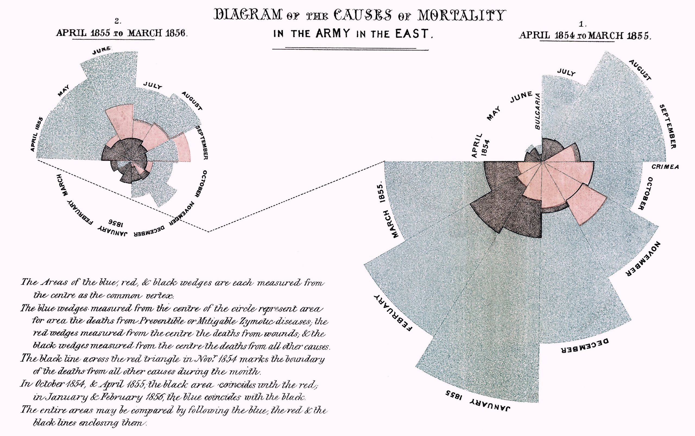

+++
author = "Yuichi Yazaki"
title = "Polar Area Chart"
slug = "polar-area-chart"
date = "2025-09-30"
categories = [
    "chart"
]
tags = [
    "",
]
image = "images/Nightingale-mortality.jpg"
+++

A **polar area chart** represents values by the area of radial sectors. Each sector has the same central angle, while the radius or area changes according to the value.

The best-known historical example is Florence Nightingale's **coxcomb chart**, which visualized causes of mortality among soldiers in the 1850s.

<!--more-->

## Historical Background

In 1858, **Florence Nightingale** created *A Diagram of the Causes of Mortality in the Army in the East*. She used visual statistics to communicate military mortality data to the public and policymakers. The chart is often called the Nightingale Rose Diagram and is considered an important origin of the polar area chart.

Today, polar area charts can be made with libraries such as Matplotlib and D3.js.

## Data Structure

| Element | Meaning |
|---|---|
| Angle axis | Category or time segment |
| Value | Radius or area |
| Category | Sector division |

The format is well suited to cyclical data such as months, hours, seasons, or directions.

## Use Cases

- monthly sales, temperature, or rainfall
- causes of death or accidents
- 24-hour traffic or energy use
- seasonal disease patterns
- weather and natural phenomena

## How to Read It

Values grow outward from the center. Compare the size of each sector to understand relative magnitude. For area-proportional charts, the radius should be scaled by the square root of the value so that area, not radius, encodes the number.

## Strengths and Caveats

Strengths:

- Shows cyclic structure intuitively.
- Has strong visual impact.
- Works well with seasonal or periodic categories.

Caveats:

- Precise comparison is harder than in a bar chart.
- Too many sectors make labels crowded.
- Small differences can be hard to judge.

## Alternatives

| Chart | Difference |
|---|---|
| Pie chart | Uses angle for part-to-whole proportion |
| Bar chart | Better for precise comparison |
| Radar chart | Connects values across radial axes |

## Summary

Polar area charts are useful when data has a circular or periodic structure. Their historical association with Nightingale also shows how visual design can support public argument and reform.

## References

- [Wikipedia: Polar area diagram](https://en.wikipedia.org/wiki/Polar_area_diagram)
