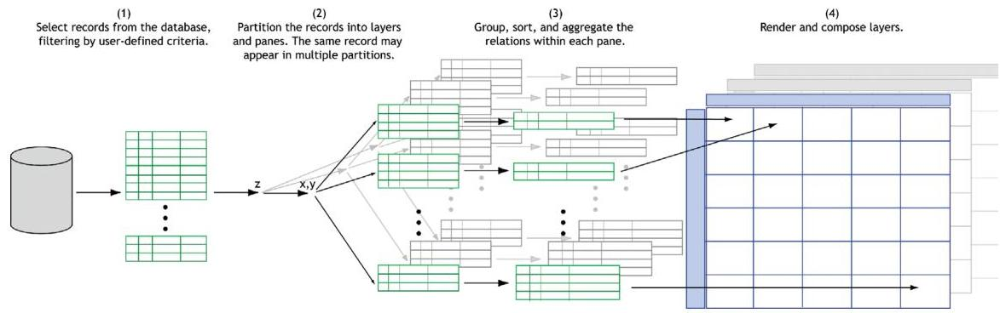
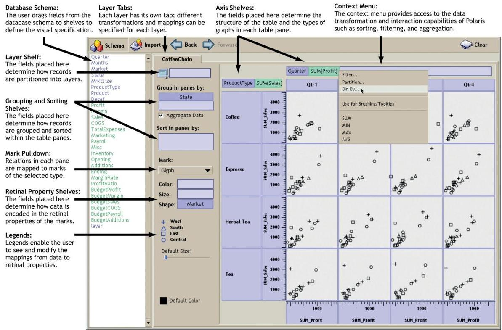
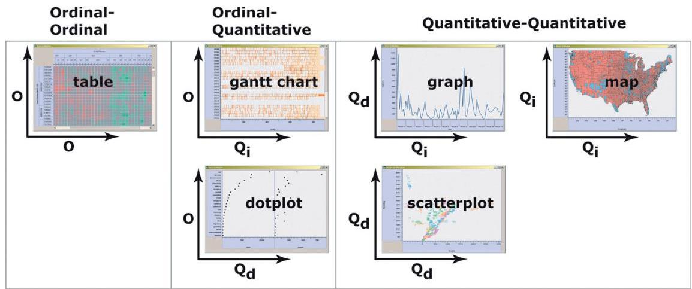
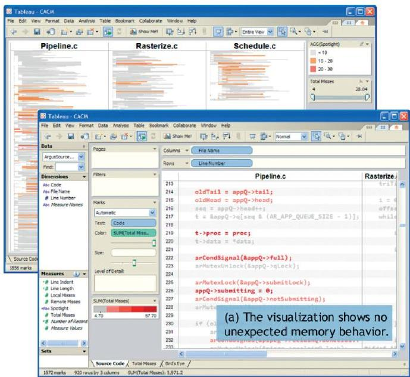
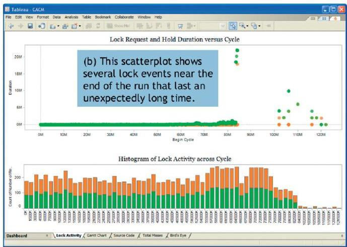
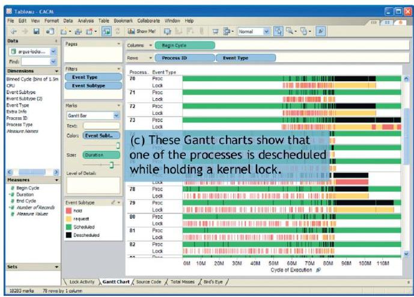

+++
author = "Yuichi Yazaki"
title = "Polarisとは何か"
slug = "polaris"
date = "2026-01-20"
categories = [
    "consume"
]
tags = [
    "",
]
image = "images/30f39bc6-8e1b-42b4-93ca-1603bb3d852b_img-0.jpeg"
+++

Polarisは、多次元データベースに対する探索的分析を支援するために提案された、可視化とクエリを統合的に扱うシステムおよびその形式言語です。2000年代初頭、スタンフォード大学で Chris Stolte と Pat Hanrahan を中心に研究され、その成果は後に Tableau の中核思想として結実しました。

Polarisの最大の特徴は、「可視化を行うこと」そのものを、データベースに対する宣言的なクエリとして定義した点にあります。単なるグラフ描画ツールではなく、分析・集計・視覚表現を一体として扱う枠組みを提示したことが、本研究の本質です。

<!--more-->

## 公式論文（2008年 CACM版）の位置づけ

Polarisを一般向けに理解するうえで最も適しているのが、2008年に *Communications of the ACM* に掲載された論文  
「Polaris: A System for Query, Analysis, and Visualization of Multidimensional Databases」です。

この論文は、2002年にIEEE TVCGで発表された学術論文を基礎としつつ、その後の実運用（Tableauとしての商用化）を踏まえて内容が整理されています。理論の厳密さよりも、問題意識・設計思想・実用上の意義が明確に説明されており、研究者以外にも理解しやすい構成になっています。

## Polarisが解決しようとした課題

当時の多次元データ分析には、以下のような課題がありました。

| 課題 | 従来の問題点 |
|---|---|
| 探索的分析 | 仮説変更のたびにSQLやグラフ設定をやり直す必要があった |
| 可視化の柔軟性 | 用意されたチャート種類に分析が制約されていた |
| 分析と表示の分断 | 集計ロジックと表示ロジックが別々に扱われていた |

Polarisは、これらを「可視化＝クエリ」という統一的な考え方で解決しようとしました。

## 中核概念1：可視化を記述する形式言語

Polarisでは、可視化は形式言語によって厳密に定義されます。具体的には、

- 行・列・レイヤーからなる「表構造」
- 順序尺度・量的尺度といったデータ型
- マーク（点・線・矩形など）と視覚変数（色・大きさ等）

これらを組み合わせることで、可視化仕様が定義されます。この仕様は、そのままデータベースクエリ（SQLに相当）と描画命令の両方にコンパイルされます。

## 中核概念2：表（table）を中心とした多次元表現

Polarisでは、単一のグラフではなく「表」を基本単位として可視化を構成します。行・列・レイヤーに異なるディメンションを割り当てることで、小さなグラフ（small multiples）を体系的に生成できます。

この考え方は、後のTableauにおける Rows / Columns / Pages / Marks といったUI構造にそのまま引き継がれています。

## 中核概念3：チャートは選ぶものではなく導かれるもの

Polarisでは、「棒グラフ」「散布図」といったチャート名を直接指定しません。代わりに、

- 軸に割り当てたデータの型（順序 × 量、量 × 量など）
- 使用するマークの種類

から、結果として適切なグラフ表現が自動的に決まります。この考え方は、後に Show Me（自動チャート推薦機能）として発展しました。

## 2002年版Polaris論文との関係

2002年にIEEE TVCGで発表された論文は、Polarisの理論的起点です。table algebra（表を生成するための代数）などの形式的定義は、こちらの論文で最も厳密に述べられています。

一方、2008年CACM版は、それらの理論を背景に持ちながら、

- なぜこの仕組みが必要だったのか
- 実際の分析でどのように役立ったのか
- 商用化を通じて何が検証されたのか

を説明する「総括・普及版」として位置づけられます。

## Tableauへの継承

Polarisの研究成果は、そのままTableauの基盤技術へとつながりました。

| Polarisでの概念 | Tableauでの姿 |
|---|---|
| 可視化クエリ言語 | VizQL |
| 表構造による多次元表現 | Rows / Columns / Pages |
| 軸とマークによる自動決定 | Show Me |
| 良いデフォルトの重視 | 初心者でも破綻しにくい操作性 |

この流れを見ると、TableauはPolarisの思想を実務レベルまで磨き上げた存在であることがわかります。

論文では、ソフトウェア解析のケーススタディとして複数ビューを組み合わせた分析例も示されています。

## 参考・出典

- [Polaris: A System for Query, Analysis, and Visualization of Multidimensional Databases (Tableau Research)](https://www.tableau.com/research/publications/polaris-system-query-analysis-and-visualization-multidimensional-databases) 
- [Polaris Extended Paper (Stanford PDF)](https://graphics.stanford.edu/papers/polaris_extended/polaris.pdf)
- [VizQL: a language for query, analysis and visualization (SIGMOD 2006)](https://researchr.org/publication/Hanrahan06)
- [Show Me: Automatic Presentation for Visual Analysis (IEEE TVCG 2007)](https://dl.acm.org/doi/10.1109/TVCG.2007.70594)
