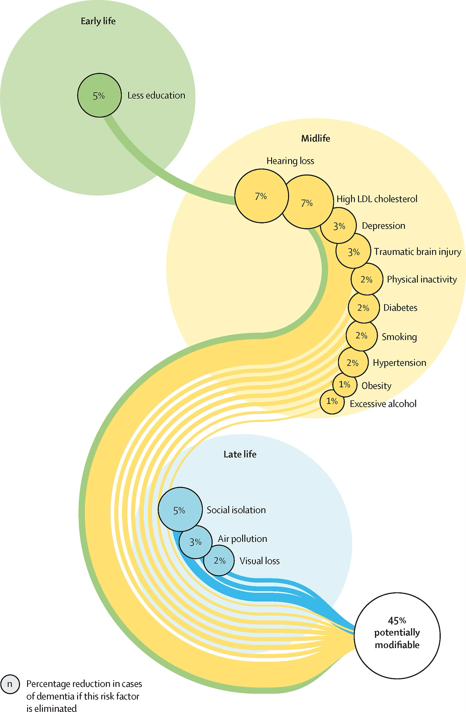

+++
author = "Yuichi Yazaki"
title = "Up to 45% of Dementia Risk May Be Preventable: Visualizing Risk Factors Across the Life Course"
slug = "population-attributable-fraction"
date = "2025-10-09"
categories = [
    "consume"
]
tags = [
    "",
]
image = "images/cover.png"
+++

This figure summarizes dementia risk factors from the **2020 report of The Lancet Commission on Dementia Prevention, Intervention, and Care**.

<!--more-->

The report synthesizes evidence from medicine, social policy, education, and urban health to propose ways to delay or prevent dementia. The graphic presents modifiable risk factors across three stages of life: **early life**, **midlife**, and **late life**.

Its central message is that as much as **45% of dementia cases may be preventable or delayable** if these risk factors are reduced.

## Context

The figure appears in the section on potentially modifiable risk factors for dementia across the life course. It visually supports an important policy message: dementia is not only an inevitable result of aging, and prevention can begin long before old age.

## How to Read It

The diagram is best understood as a life-course causal map rather than as a conventional statistical chart. It arranges risk factors along a continuous path from early life to late life and sizes them according to their **population attributable fraction**.

| Life stage | Main risk factors | Approximate contribution | Color group |
|---|---|---|---|
| Early life | Less education | around 5% | Green |
| Midlife | Hearing loss, high LDL cholesterol, depression, head injury, physical inactivity, diabetes, smoking, hypertension, obesity, excessive alcohol consumption | around 7% to 1% | Yellow |
| Late life | Social isolation, air pollution, visual impairment | around 5% to 2% | Blue |

- Circle size is proportional to estimated contribution.
- Connecting lines emphasize prevention across the whole life course.
- The "45% potentially modifiable" label summarizes the combined estimate.

## Significance

The 2020 report expanded the earlier 2017 framework by adding factors such as environmental risk and social isolation. This broadened dementia prevention from a purely biomedical issue into a social, educational, and environmental one.

Hearing loss is especially important, with one of the largest estimated contributions. The figure therefore supports practical interventions such as hearing support and hearing-aid access, while also showing the role of education, air quality, and social connection.

## Design Features

- Life-course timeline combined with risk magnitude
- Area encoding for contribution size
- Color groups for early-life, midlife, and late-life factors
- Curved flow that makes prevention feel continuous rather than isolated

## Summary

This figure turns a complex body of public-health evidence into a shared visual language. It frames dementia not only as an individual medical condition, but also as a social and environmental challenge that can be addressed across the whole life course.

## References

- [Dementia prevention, intervention, and care: 2020 report of the Lancet Commission](https://doi.org/10.1016/S0140-6736(20)30367-6)
- [Lancet Commission on dementia prevention](https://www.thelancet.com/commissions/dementia2020)
- [World Health Organization: Risk reduction of cognitive decline and dementia](https://www.who.int/publications/i/item/risk-reduction-of-cognitive-decline-and-dementia)
