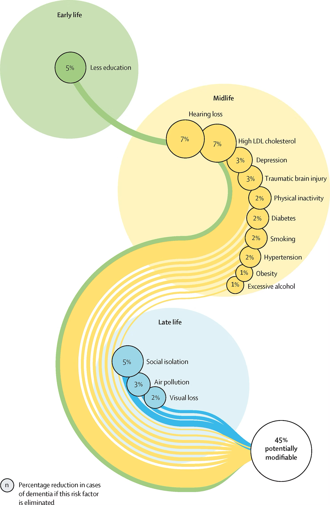

+++
author = "Yuichi Yazaki"
title = "認知症リスクの45％は予防可能：ライフステージ別リスク要因の可視化"
slug = "population-attributable-fraction"
date = "2025-10-09"
categories = [
    "consume"
]
tags = [
    "",
]
image = "images/cover.png"
+++

この図は **『The Lancet Commission on Dementia Prevention, Intervention, and Care（ランセット認知症予防・介入・ケア委員会報告書）2020年版』** に掲載された、認知症リスク要因の総覧図です。  

<!--more-->

この報告書は、医学・社会・教育・都市政策の観点から **認知症の発症を遅らせ、予防するための実証的エビデンス** を体系化した国際的な政策提言文書であり、世界保健機関（WHO）や各国の国民保健指針に強い影響を与えています。

図は、人生の三段階（ **Early life・Midlife・Late life** ）にわたる12の修正可能なリスク要因を示し、これらを取り除くことで **最大45％の認知症症例が予防可能** であることを示唆しています。

### 図のコンテクスト
この図は、報告書の中核セクションである **“Potentially modifiable risk factors for dementia across the life course”** に含まれており、「認知症は加齢によって必ず発症するものではない」というメッセージを、科学的根拠に基づき示した象徴的なビジュアルです。

報告書では、次のように説明されています：

> “Modifiable risk factors account for around 45% of dementia cases, suggesting that nearly half of global dementia burden could be prevented or delayed.”  
> （修正可能なリスク要因は全体の約45％を占め、世界的な認知症負担のほぼ半分は予防または遅延が可能である。）

このビジュアルは論文の本文中だけでなく、WHOやOECDの政策資料、各国の公衆衛生ガイドラインにおいても引用されています。

### 図解の見方

この図は、**ライフコース視点の因果連鎖を可視化した図** と分類できます。  
一般的な散布図や円グラフとは異なり、「人生の流れ（early → mid → late）」という **時間軸を連続的に描きながら、リスク要因を重ね合わせる** 構造になっています。

| ライフステージ | 主なリスク要因 | 寄与率（Population Attributable Fraction, %） | 色区分 |
|----------------|----------------|----------------------------------------------|--------|
| **Early life（幼少期）** | 低教育（Less education） | 約 5% | 緑 |
| **Midlife（中年期）** | 難聴（Hearing loss）、高LDLコレステロール（High LDL cholesterol）、うつ病（Depression）、頭部外傷（Head injury）、運動不足（Physical inactivity）、糖尿病（Diabetes）、喫煙（Smoking）、高血圧（Hypertension）、肥満（Obesity）、過度の飲酒（Excessive alcohol consumption） | 約 7〜1% | 黄 |
| **Late life（老年期）** | 社会的孤立（Social isolation）、大気汚染（Air pollution）、視覚障害（Visual impairment） | 約 5〜2% | 青 |

- 各円の **大きさは寄与率（%）に比例** し、リスクの重みを表す。  
- 線は各ステージを結び、「生涯を通じた連続的な予防の重要性」を示唆する。  
- 右下の「45% potentially modifiable」は、これら要因を除外した場合の **全体的なリスク減少の推計値** である。

### 背景と意義
この報告書は、2017年版（9因子）から2020年版（12因子）に更新されたもので、環境要因や社会的孤立など、従来の生物学的因子だけでなく **社会・環境的リスク** を含む点が画期的でした。

とくに中年期の「難聴（Hearing loss）」は、単独で7%の寄与を持つ最大のリスクとされ **聴覚補助や補聴器利用** が認知症予防策として重要であることを強調しています。  
また教育水準の向上は幼少期の「認知予備能（cognitive reserve）」形成に寄与し、老年期の発症リスクを緩和すると説明されています。

さらに2020年版では、「大気汚染（Air pollution）」が新たに追加され、環境政策も認知症対策に組み込むべきだと明示されました。

### 図表デザインの特徴

- **情報構造**：ライフコース時系列 × リスク強度の可視化  
- **目的**：数量的比較と時系列的関係を同時に示す  
- **デザイン特徴**：  
  - カラーコーディング（緑＝初期教育、黄＝中年期健康、青＝社会・環境要因）  
  - 面積比率による寄与率の表現  
  - 曲線的なフローによる「生涯連続性」の強調

このような手法は、因果モデルの理解を補助するための **説明型インフォグラフィックス（Explanatory Infographic）** として位置づけられます。

### まとめ

この図は、科学的根拠と社会的メッセージを融合したデータビジュアライゼーションの好例です。  
認知症を「個人の病」ではなく「社会構造・教育・環境・生活全体にまたがる課題」として可視化することにより、研究者・政策立案者・一般市民が共通の理解を持つための「共通言語」として機能しています。
その意味で、本図は単なるチャートを超えた「社会的設計図（social blueprint）」とも言えます。

## 参考・出典

- [Dementia prevention, intervention, and care: 2020 report of the Lancet Commission (Livingston et al., 2020)](https://doi.org/10.1016/S0140-6736(20)30367-6)
- [Lancet infographic summary – Dementia prevention (Lancet.com, accessed 2025-10-09)](https://www.thelancet.com/commissions/dementia2020)
- [World Health Organization: Risk reduction of cognitive decline and dementia](https://www.who.int/publications/i/item/risk-reduction-of-cognitive-decline-and-dementia)