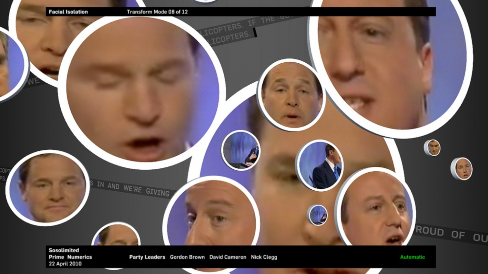

+++
author = "Yuichi Yazaki"
title = "Prime Numerics"
slug = "prime-numerics "
date = "2026-01-04"
categories = [
    "consume"
]
tags = [
    "",
]
image = "images/da_sosolimited-4545260255_07e9441dcc_b.jpg"
+++

Prime Numerics（2010）は、イギリス総選挙におけるテレビ討論を対象に、政治家の発言をリアルタイムで解析・可視化したライブ・データビジュアライゼーション作品です。本作は、Eric Gunther、Justin Manor、John Rothenbergによる制作ユニット Sosolimited によって手がけられました。

討論番組の映像を入力として、自然言語処理による分析結果をその場で再挿入し、観客の前で「変化し続ける可視化」として提示する点に特徴があります。完成されたチャートを鑑賞するのではなく、データが生成・変形されるプロセスそのものを体験させる作品です。

<!--more-->

## 経緯

2010年のイギリス総選挙は、米国型のテレビ討論が本格的に導入された初めての選挙でした。討論番組は単なる政策説明の場ではなく、候補者の話し方や言葉の選び方が世論形成に大きな影響を与えるメディア・イベントとなっていました。

Prime Numerics は、この状況に対して「誰が正しいことを言っているか」を評価するのではなく、「政治家がどのような言語パターンで話しているのか」を可視化することで、政治とメディアの関係を問い直す試みとして制作されました。

本作は、マンチェスターで開催された FutureEverything フェスティバルにおいて、公開ライブ・パフォーマンスとして発表されています。

## データ構造

本作で扱われるデータは、主に以下の要素から構成されています。

| データ種別 | 内容 |
|---|---|
| 音声データ | テレビ討論中の候補者の発言 |
| テキストデータ | 音声から抽出された発言内容 |
| 言語特徴量 | 単語頻度、抽象語、代名詞、感情語など |
| 映像データ | BBCの討論番組映像 |
| 時系列情報 | 討論の進行に伴う変化 |

これらのデータは自然言語処理によってリアルタイムに解析され、映像表現へと変換されます。

## 目的

Prime Numerics の目的は、政治的主張の正誤や候補者の優劣を示すことではありません。

本作が目指しているのは、

- 政治的言説がどのような言葉の構造で成り立っているのか
- 抽象的で曖昧な語がどの程度使われているのか
- 感情的な表現がどのように現れるのか

といった、言語の使われ方そのものを観客に可視化し、体験させることです。これは政治批評であると同時に、メディアリテラシーへの問いかけでもあります。

## ユースケース

Prime Numerics は、以下のような文脈で位置づけることができます。

- データ可視化とメディアアートの融合事例
- リアルタイム可視化の先駆的実践
- 政治コミュニケーションの分析手法
- メディアリテラシー教育のための教材的参照例

## 特徴

本作の大きな特徴は、完成されたインフォグラフィックではなく、ライブ性を重視している点にあります。

- 討論をその場で解析するリアルタイム性
- 観客の前で変化し続けるビジュアル
- 正確な数値提示よりも傾向や構造を強調する設計

これにより、分析結果は「情報」としてではなく「出来事」として提示されます。

## 作品の見方

画面上には、討論番組の映像を背景に、複数の視覚要素が重ねて表示されます。

まず注目すべきは、候補者ごとに色分けされた単語やラベルです。これにより、どの候補者がどの話題や言葉を多用しているのかを直感的に把握できます。

次に、画面下部に描かれるワイヤーフレーム状の地形は、単語頻度や話題の盛り上がりを「起伏」として表現しています。ここでは正確な数値を読むことよりも、議論の流れや偏りを感じ取ることが重要です。

さらに、顔のクローズアップや感情検出の表示は、発言内容だけでなく、表情や感情といった非言語的要素も含めて政治的言説を捉える視点を提示しています。

## デザイン上の注意点

Prime Numerics のビジュアルは、あえて情報を整理しすぎない設計になっています。

単語が重なり合い、読みづらく感じられる場面もありますが、これは討論番組が持つ情報過多やノイズ感を視覚的に再現するための意図的な表現です。

この作品を参考にする際には、「わかりやすさ」だけでなく、「体験としての違和感」も重要なデザイン要素であることに注意する必要があります。

## 応用例

本作のアプローチは、現代の以下のような分野に応用可能です。

- SNS上の言説分析の可視化
- 会議や議論のリアルタイムフィードバック
- 感情分析を用いたメディア研究
- インタラクティブ展示やライブパフォーマンス

## 代替例

Prime Numerics と比較できる事例としては、完成された静的インフォグラフィックや、ダッシュボード型の政治分析ツールが挙げられます。

それらが「理解」や「比較」を主目的とするのに対し、本作は「気づき」や「体験」を重視している点で大きく異なります。

## まとめ

Prime Numerics は、データを説明するための可視化ではなく、データが持つ構造や偏りを体験させるための可視化作品です。

政治、言語、感情、メディアという複数の要素を重ね合わせることで、私たちが日常的に接している政治的言説を、別の角度から捉え直す視点を提供しています。現代のデータビジュアライゼーションを考えるうえで、今なお重要な参照点となる作品です。

## 参考・出典

- [Sosolimited](https://www.sosolimited.com/)
- [FutureEverything](https://futureeverything.org/)
- [ImaginationLancaster - The Design Led Research Centre at Lancaster University.](https://imagination.lancaster.ac.uk/update/prime-numerics-data-visualisation-by-sosolimited/)
- [poptronics ' Sosolimited s'invite dans le débat électoral anglais](https://poptronics.fr/Sosolimited-s-invite-dans-le-debat)

