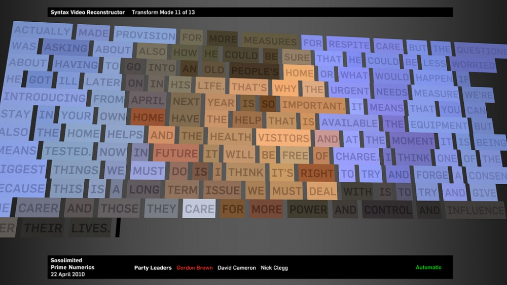
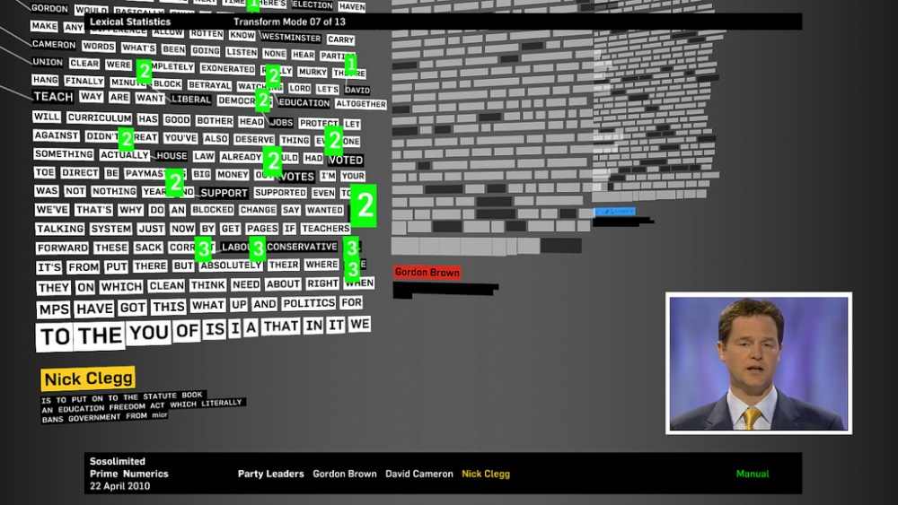
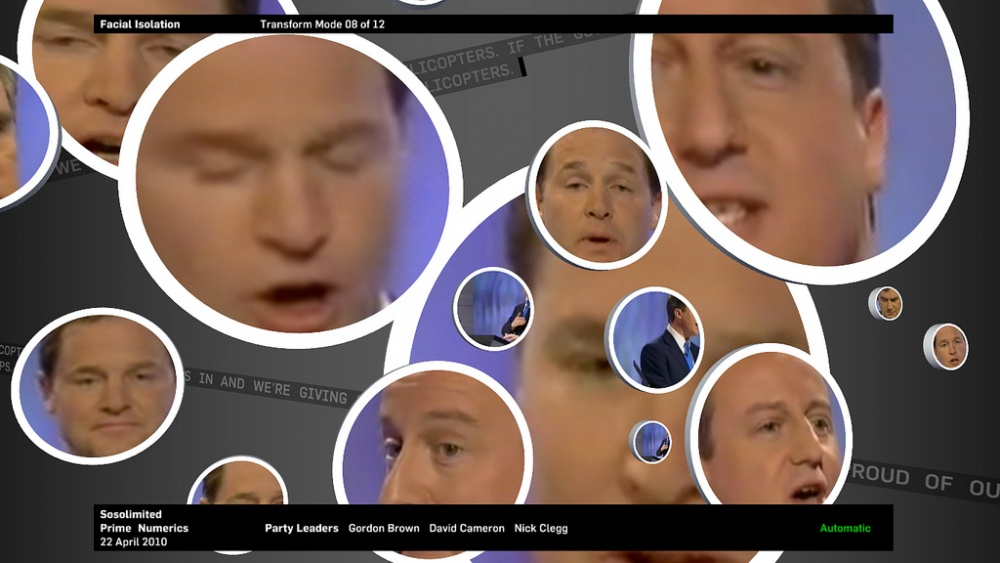

+++
author = "Yuichi Yazaki"
title = "Prime Numerics"
slug = "prime-numerics-2010"
date = "2026-01-04"
categories = [
    "consume"
]
tags = [
    "データ物質化",
]
image = "images/da_sosolimited-4545260255_07e9441dcc_b.jpg"
+++

Prime Numerics (2010) is a live data visualization work by Sosolimited, the studio of Eric Gunther, Justin Manor, and John Rothenberg. It analyzed and visualized politicians' speech during televised debates in the UK general election.

Rather than presenting a finished chart, the work reinserts real-time natural language processing results into the broadcast experience, letting viewers watch data emerge and transform live.

<!--more-->

## Background

Prime Numerics belongs to a line of Sosolimited works that treat political broadcasts as data material. Speech, rhythm, repetition, and performance are analyzed as live signals.

## Why It Matters

The work highlights the performative structure of political communication. By transforming debate language in real time, it makes visible patterns that ordinary viewing may miss.

## Summary

Prime Numerics is a live visualization of political speech. It demonstrates how visualization can be a performance process rather than only a static analytical artifact.
